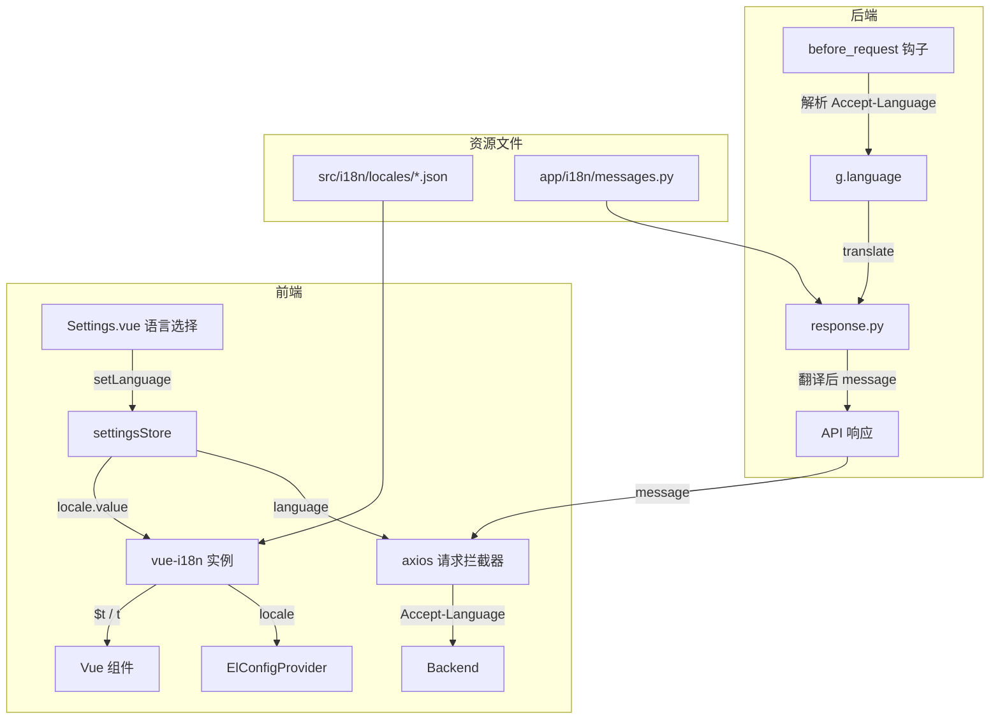

## 产品概述

为 SmartTable（Vue 3 + Flask 全栈多维表格系统）搭建多语言（i18n）框架骨架，实现中英文双语支持，并预留日文、繁体中文等扩展能力。本次仅搭建基础设施与示范文案，不逐文件替换全部中文文案。

## 核心功能

- 前端 i18n 引擎初始化：集成 vue-i18n，创建 i18n 实例并注册到 Vue 应用
- 语言切换机制：复用已有 Settings.vue 中的语言选择 UI 和 settingsStore 的 language 字段，接入 vue-i18n 实现实时切换
- 语言持久化：通过 settingsStore 的 localStorage 机制持久化用户语言偏好
- 前后端语言同步：axios 请求拦截器自动注入 Accept-Language header，后端据此返回对应语言的 message
- Element Plus locale 联动：语言切换时同步更新 Element Plus 组件库的 locale
- 后端 i18n 基础设施：建立翻译消息字典，改造 response.py 的默认消息为可翻译 key，通过请求上下文传递当前语言
- 路由标题 i18n：router meta.title 支持 i18n key，titleGuard 动态翻译
- 资源目录与命名规范：前后端各自建立结构化资源目录，按模块组织翻译条目
- 扩展语言预留：目录结构与类型定义支持未来添加 ja、zh-TW 等语言

## Tech Stack

### 前端

- **i18n 框架**: vue-i18n@9 (Vue 3 官方推荐，Composition API 支持)
- **Element Plus locale**: 内置 locale 机制，`ElConfigProvider` 包裹根组件
- **持久化**: 复用 settingsStore 的 localStorage（key: `smart-table-settings`）
- **构建**: Vite 8 + unplugin-auto-import（需将 vue-i18n API 加入自动导入）

### 后端

- **i18n 机制**: 纯 Python 字典翻译 + Flask `g` 对象传递语言，零外部依赖
- **消息改造**: `response.py` 的默认 message 参数改为 i18n key，通过 `translate()` 函数查找翻译

## Implementation Approach

### 整体策略

采用"前端全量 i18n 引擎 + 后端轻量翻译层"的双轨方案：

- **前端**: vue-i18n 管理所有 UI 文案，`$t()` / `t()` 函数翻译
- **后端**: 仅对 API 响应的 `message` 字段做翻译，通过 Accept-Language header 确定语言，用 error code 作为翻译 key

### 前端关键设计

**1. vue-i18n 初始化**
创建 `src/i18n/index.ts`，使用 `createI18n` 创建实例，`legacy: false` 启用 Composition API 模式，`fallbackLocale: 'zh-CN'`。语言资源按模块拆分 JSON 文件，通过 Vite 的 `import.meta.glob` 懒加载。

**2. 语言切换联动**
settingsStore 的 `setLanguage()` 改造：调用 `i18n.global.locale.value = lang` 同时更新 Element Plus locale。在 App.vue 中用 `<el-config-provider :locale="elementLocale">` 包裹根组件。

**3. Accept-Language 注入**
在 `api/client.ts` 的请求拦截器中（第42-54行），读取 settingsStore 的 language 值注入 `Accept-Language` header。

**4. 路由标题 i18n**
router/index.ts 的 meta.title 改为 i18n key（如 `title: "route.login"`），titleGuard 中调用 `i18n.global.t()` 翻译。

**5. API 错误消息处理**
client.ts 中 `ElMessage.error(errorData.message)` 保持不变 -- 后端将返回对应语言的 message。对于 client.ts 自身的 fallback 消息（如第146行 `"登录已过期，请重新登录"`），改用 `t()` 函数。

### 后端关键设计

**1. 翻译字典**
创建 `app/i18n/` 模块，`messages.py` 定义 `MESSAGES` 字典，结构为 `{lang: {key: text}}`。key 复用现有 `error` 字段的机器码（如 `validation_error`、`not_found`、`unauthorized`）加模块前缀。

**2. 请求语言解析**
在 `app/__init__.py` 的 `before_request` 钩子中（已有 `generate_request_id`），新增 `parse_language()` 解析 Accept-Language header，存入 `g.language`，默认 `zh-CN`。

**3. response.py 改造**
`success_response`/`error_response` 等函数的默认 message 参数从硬编码中文改为 i18n key（如 `'operation_success'`），函数内部调用 `translate(key, g.language)` 查找翻译。保留 message 参数覆盖能力，向后兼容。

**4. 渐进式迁移**
后端路由中 800+ 处 `error_response('中文消息')` 调用暂不改动。`error_response` 函数检测：若 message 参数在翻译字典中有对应 key 则翻译，否则原样返回。这样已改造的默认消息自动翻译，未改造的硬编码消息保持中文。

### 性能与可靠性

- 前端语言 JSON 文件按需加载，首次切换语言时才 import 对应文件，避免首屏加载全量翻译
- 后端翻译字典为内存中的 Python dict，O(1) 查找，零 IO 开销
- vue-i18n 的 `locale.value` 赋值是响应式的，切换语言后所有 `t()` 调用自动更新，无需刷新页面

### 避免技术债

- 复用已有 settingsStore 的 language 字段和 Settings.vue 的 UI，不新建 store
- 复用已有 `src/i18n/locales/` 目录壳
- 后端复用已有 `before_request` 钩子和 `g` 对象，不引入新中间件
- 翻译 key 命名与后端 error code 对齐，避免两套体系

## Architecture Design



## Directory Structure

### 前端文件结构

```
smart-table/
├── src/
│   ├── i18n/
│   │   ├── index.ts              # [NEW] vue-i18n 实例创建与配置。createI18n({legacy: false, locale, fallbackLocale, messages})，导出 i18n 实例供 main.ts 注册
│   │   ├── types.ts              # [NEW] 语言类型定义。导出 SupportedLocale 类型（'zh-CN' | 'en-US' | 'ja-JP' | 'zh-TW'），LanguageOption 接口（label/value/flag）
│   │   └── locales/
│   │       ├── zh-CN/
│   │       │   ├── common.json   # [NEW] 通用文案（确认/取消/保存/删除/操作成功/操作失败等）
│   │       │   ├── route.json    # [NEW] 路由标题（登录/注册/首页/设置等，对应 router meta.title）
│   │       │   ├── auth.json     # [NEW] 认证模块文案
│   │       │   └── settings.json # [NEW] 设置页面文案
│   │       ├── en-US/
│   │       │   ├── common.json   # [NEW] 英文通用文案，结构与 zh-CN 对齐
│   │       │   ├── route.json    # [NEW] 英文路由标题
│   │       │   ├── auth.json     # [NEW] 英文认证模块文案
│   │       │   └── settings.json # [NEW] 英文设置页面文案
│   │       ├── ja-JP/            # [NEW] 日文目录占位（空 JSON 壳，预留扩展）
│   │       └── zh-TW/            # [NEW] 繁体中文目录占位（空 JSON 壳，预留扩展）
│   ├── main.ts                   # [MODIFY] 导入并 app.use(i18n)，在 app.use(ElementPlus) 之前注册
│   ├── App.vue                   # [MODIFY] 用 ElConfigProvider 包裹根组件，绑定 :locale
│   ├── stores/settingsStore.ts   # [MODIFY] language 类型扩展为 SupportedLocale，setLanguage 中同步 i18n.global.locale.value
│   ├── api/client.ts             # [MODIFY] 请求拦截器注入 Accept-Language header；fallback 消息改用 t() 翻译
│   ├── router/index.ts           # [MODIFY] meta.title 值改为 i18n key（如 'route.login'）
│   ├── router/guards.ts          # [MODIFY] titleGuard 中用 i18n.global.t() 翻译 title
│   ├── views/Settings.vue        # [MODIFY] 语言选项从硬编码改为遍历 LanguageOption 数组，文案用 $t()
│   └── vite.config.ts            # [MODIFY] unplugin-auto-import imports 中加入 'vue-i18n/auto'（如有需要）
```

### 后端文件结构

```
smarttable-backend/
├── app/
│   ├── i18n/                     # [NEW] i18n 模块
│   │   ├── __init__.py           # [NEW] 模块初始化，导出 translate 函数和 get_current_language
│   │   ├── messages.py           # [NEW] 翻译消息字典。MESSAGES = {'zh-CN': {...}, 'en-US': {...}}，key 为 message code
│   │   └── utils.py              # [NEW] translate(key, lang=None) 函数，解析语言、查找翻译、fallback 逻辑
│   ├── __init__.py               # [MODIFY] create_app 中 before_request 新增 parse_language 钩子
│   ├── utils/
│   │   └── response.py           # [MODIFY] 默认 message 参数改为 i18n key，调用 translate() 翻译
│   └── errors/
│       └── handlers.py           # [MODIFY] 错误处理器的中文 message 改为 i18n key
```

## Key Code Structures

### 前端 i18n 类型定义 (`src/i18n/types.ts`)

```typescript
/** 支持的语言列表 */
export type SupportedLocale = 'zh-CN' | 'en-US' | 'ja-JP' | 'zh-TW';

/** 语言选项接口 */
export interface LanguageOption {
  label: string;
  value: SupportedLocale;
  flag: string;
}

/** 可用语言列表（UI 遍历用） */
export const AVAILABLE_LANGUAGES: LanguageOption[] = [
  { label: '简体中文', value: 'zh-CN', flag: 'CN' },
  { label: 'English', value: 'en-US', flag: 'US' },
  // { label: '日本語', value: 'ja-JP', flag: 'JP' },  // 预留
  // { label: '繁體中文', value: 'zh-TW', flag: 'TW' }, // 预留
];

/** 当前已启用的语言（未填充翻译资源的语言不启用） */
export const ENABLED_LANGUAGES: SupportedLocale[] = ['zh-CN', 'en-US'];
```

### 后端翻译函数签名 (`app/i18n/utils.py`)

```python
def translate(key: str, lang: str = None, **kwargs) -> str:
    """
    翻译消息 key 为指定语言的文本
    
    Args:
        key: 消息 key（如 'operation_success', 'validation_error'）
        lang: 语言代码，None 时从 g.language 获取，默认 'zh-CN'
        **kwargs: 模板参数（用于 {field} 等占位符替换）
    
    Returns:
        翻译后的文本；若 key 不存在于翻译字典，原样返回 key
    """
```

### 后端 response.py 改造后的函数签名

```python
def success_response(
    data: Any = None,
    message: str = 'operation_success',  # 改为 i18n key
    code: int = 200,
    meta: Optional[Dict] = None
) -> Response:
    # 内部调用 translate(message) 翻译
```

## Implementation Notes

### 性能注意事项

- 前端 locale JSON 文件使用 `import.meta.glob` 静态收集，Vite 会自动 code-split，首次切换语言时按需加载对应 JSON chunk，不影响首屏性能
- 后端 MESSAGES 字典在模块加载时构建一次，运行时 O(1) dict 查找，无性能瓶颈
- vue-i18n locale 切换是响应式更新，Vue 组件自动 re-render，无需手动刷新页面

### 向后兼容（Blast Radius 控制）

- `response.py` 的 `translate()` 采用"key 优先、原文兜底"策略：若传入的 message 在翻译字典中找到则返回翻译，找不到则原样返回。这确保 800+ 处未改造的 `error_response('中文消息')` 调用继续正常工作
- settingsStore 的 language 字段类型从 `"zh-CN" | "en-US"` 扩展为 `SupportedLocale`，但默认值仍为 `"zh-CN"`，已有 localStorage 数据兼容
- Element Plus locale 通过 `ElConfigProvider` 动态绑定，不影响已注册的全局组件

### 日志注意

- 后端 `before_request` 的 `parse_language` 不输出日志，避免每个请求产生日志噪音
- 翻译失败（key 未找到）时静默返回 key 原文，不输出 warning，因为渐进式迁移期间大量 key 未填充是正常状态

### 命名规范约定

- **前端 locale JSON key**: 小驼峰，按模块分组，如 `common.confirmButton`、`route.login`、`auth.loginSuccess`
- **后端 message key**: 蛇形命名，与 error code 风格一致，如 `operation_success`、`validation_error`、`resource_not_found`
- **语言目录命名**: BCP 47 标准，如 `zh-CN`、`en-US`、`ja-JP`、`zh-TW`