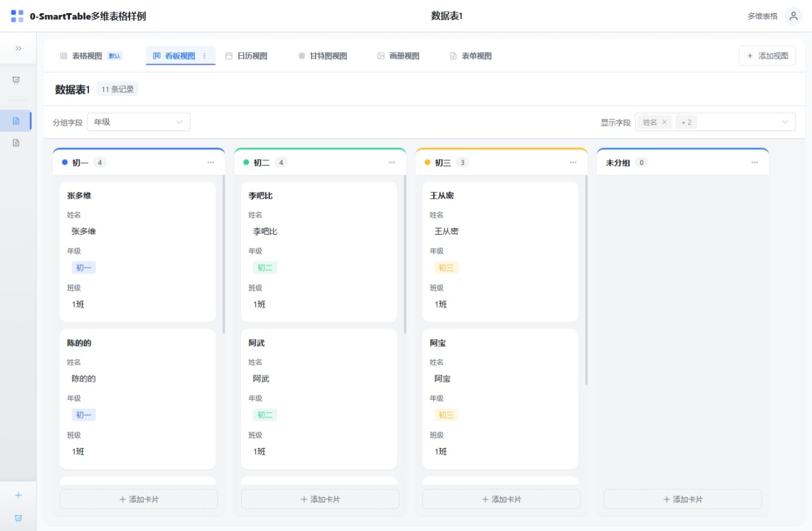
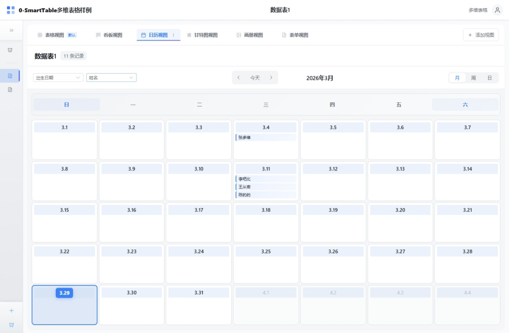
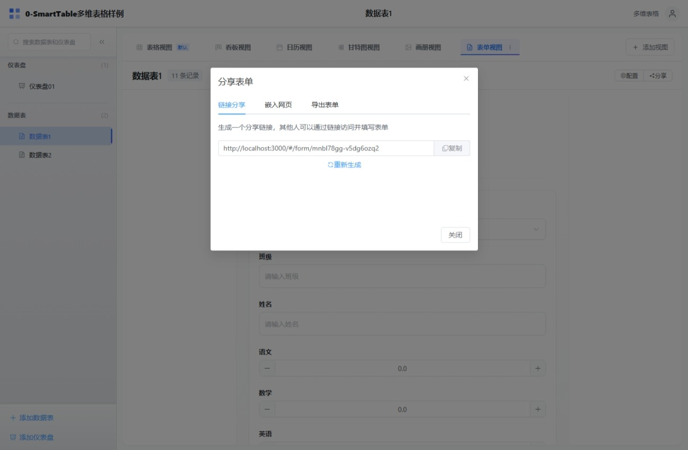
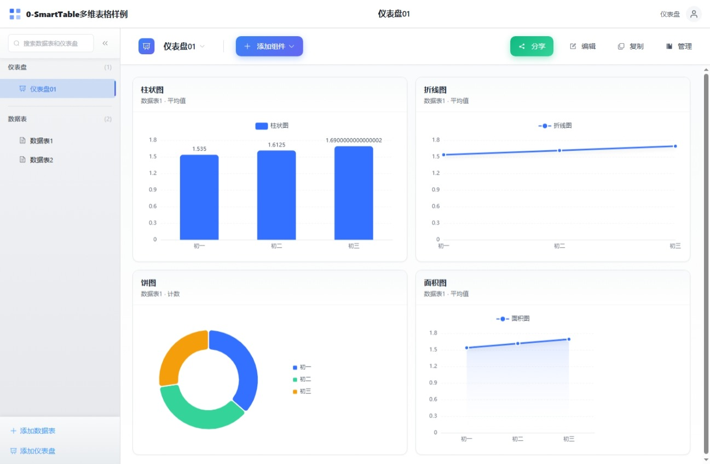

# Smart Table

[中文](README.md) | English

A smart multi-dimensional table system based on Vue 3 + TypeScript + Pinia, supporting both pure frontend (IndexedDB) and backend (PostgreSQL) deployment modes, similar to Airtable or Lark Base.

## Features

### Core Features

- Base Management - Create, edit, delete, star multi-dimensional tables, member management
- Table Management - Support multiple tables with drag-sort, rename, delete, and duplicate
- Field Management - Support 22 field types with configuration, sorting, and visibility control
- Record Management - CRUD operations, batch actions, and detail drawer
- View Management - 6 view types with filter, sort, group, and view switching

### Supported Field Types (22 Types)

| Category | Field Type    | Status |
| -------- | ------------- | ------ |
| Basic    | Text          | ✅     |
| Basic    | Number        | ✅     |
| Basic    | Date          | ✅     |
| Basic    | Single Select | ✅     |
| Basic    | Multi Select  | ✅     |
| Basic    | Checkbox      | ✅     |
| Contact  | Member        | ✅     |
| Contact  | Phone         | ✅     |
| Contact  | Email         | ✅     |
| Contact  | URL           | ✅     |
| Media    | Attachment    | ✅     |
| Computed | Formula       | ✅     |
| Computed | Link          | ✅     |
| Computed | Lookup        | ✅     |
| System   | Created By    | ✅     |
| System   | Created Time  | ✅     |
| System   | Updated By    | ✅     |
| System   | Updated Time  | ✅     |
| System   | Auto Number   | ✅     |
| Others   | Rating        | ✅     |
| Others   | Progress      | ✅     |
| Others   | URL           | ✅     |

### Supported View Types (6 Types)

| View Type     | Description                                                 | Status |
| ------------- | ----------------------------------------------------------- | ------ |
| Table View    | Classic table display with virtual scroll and column freeze | ✅     |
| Kanban View   | Card-based display with drag sorting                        | ✅     |
| Calendar View | Time-based display                                          | ✅     |
| Gantt View    | Project timeline display                                    | ✅     |
| Form View     | Data collection form with sharing                           | ✅     |
| Gallery View  | Image card display                                          | ✅     |

### Advanced Features

- Data Filtering - Multi-condition combined filtering with AND/OR logic, multiple operators
- Data Sorting - Multi-field sorting with ascending/descending order, drag to adjust priority
- Data Grouping - Group by field with multi-level grouping (up to 3 levels) and statistics
- Data Import - Support Excel, CSV, JSON formats with multi-sheet support
- Data Export - Support Excel, CSV, JSON formats with custom field selection
- Formula Engine - 43 built-in functions for math, text, date, logic, and statistics
- Drag Sorting - Drag to sort tables, fields, views, and Kanban cards
- Star Feature - Quick access to frequently used tables and dashboards
- Search Feature - Quick search for tables and records
- Dashboard - Support multiple chart components (number cards, charts, real-time data, etc.)

## Feature Preview

| Feature     | Preview                               | Feature       | Preview                                   |
| ----------- | ------------------------------------- | ------------- | ----------------------------------------- |
| Home        |               | Home          |              |
| Table View  |    | Table View    |   |
| Kanban View |  | Calendar View |  |
| Gantt View  |    | Form View     |          |
| Form View   |      | Dashboard     |         |

## Tech Stack

### Frontend Tech Stack

| Category             | Technology              | Version  |
| -------------------- | ----------------------- | -------- |
| Frontend Framework   | Vue 3                   | ^3.5.30  |
| Language             | TypeScript              | ~5.9.3   |
| State Management     | Pinia                   | ^2.3.1   |
| Router               | Vue Router              | ^4.6.4   |
| UI Component Library | Element Plus            | ^2.13.6  |
| Table Component      | vxe-table               | ^4.18.7  |
| Charts               | echarts + vue-echarts   | ^5.6.0   |
| Date Processing      | dayjs                   | ^1.11.20 |
| Drag Sorting         | sortablejs              | ^1.15.7  |
| Utilities            | lodash-es, @vueuse/core | -        |
| Build Tool           | Vite                    | ^8.0.1   |
| Testing              | Vitest                  | ^3.2.4   |

### Data Storage Options

| Mode               | Technology         | Description                                                           |
| ------------------ | ------------------ | --------------------------------------------------------------------- |
| Pure Frontend Mode | Dexie (IndexedDB)  | Data stored in browser locally, no server required                    |
| Backend Mode       | SQLite + Flask     | Default SQLite, supports PostgreSQL via environment variable          |

### Backend Tech Stack (Optional)

| Category             | Technology                           | Version           |
| -------------------- | ------------------------------------ | ----------------- |
| Framework            | Flask                                | 3.0.0             |
| Database             | SQLite (Default) / PostgreSQL        | 3.x / 16          |
| ORM                  | SQLAlchemy                           | 2.0               |
| Database Migration   | Alembic (Flask-Migrate)              | -                 |
| Authentication       | JWT (Flask-JWT-Extended)             | 4.6.0             |
| Security & Encryption| Flask-Bcrypt, bcrypt                 | 1.0.1 / 4.1.2     |
| Caching              | Flask-Caching (+ Redis Optional)     | 2.1.0             |
| WebSocket            | Flask-SocketIO, eventlet             | 5.3.6 / 0.33.3    |
| Data Serialization   | marshmallow, marshmallow-sqlalchemy  | 3.20.1 / 0.29.0   |
| Import/Export        | pandas, openpyxl, xlrd               | 2.1.4 / 3.1.2     |
| Image Processing     | Pillow                               | 10.1.0            |
| Deployment           | Gunicorn, Docker                     | 21.2.0            |

## Quick Start

### Requirements

- Node.js >= 18
- npm >= 9

### Frontend Development

#### Install Dependencies

```bash
cd smart-table
npm install
```

#### Development Mode

```bash
npm run dev
```

#### Build for Production

```bash
npm run build
```

#### Preview Production Build

```bash
npm run preview
```

#### Run Tests

```bash
# Run all tests
npm run test

# Run tests in watch mode
npm run test:watch

# Generate test coverage report
npm run test:coverage
```

### Backend Service (Optional)

#### Using Docker Compose

```bash
cd smarttable-backend

# Configure environment variables
cp .env.example .env
# Edit .env file to configure database connection (default uses SQLite)

# Start services (development mode, using SQLite)
docker-compose up -d

# Or use PostgreSQL (optional)
docker-compose -f docker-compose.dev.yml up -d

# Run database migrations
docker-compose --profile migrate run --rm migrate

# Access API
# http://localhost:5000/api
```

#### Local Development

```bash
cd smarttable-backend

# Create virtual environment
python -m venv venv
source venv/bin/activate  # Windows: venv\Scripts\activate

# Install dependencies
pip install -r requirements.txt

# Configure environment variables
cp .env.example .env
# Default uses SQLite, no need to modify DATABASE_URL

# Initialize database
flask db upgrade

# Start development server
flask run --reload
```

#### Backend Features

- **Default Database**: SQLite (lightweight, no additional installation required)
- **Optional Database**: PostgreSQL (configurable via environment variables)
- **Authentication**: JWT Token authentication with refresh token support
- **Permission Management**: Role-based access control
- **Database Migration**: Alembic migration tool
- **API Documentation**: Complete RESTful API

## Project Structure

### Frontend Project Structure

```
smart-table/
├── src/
│   ├── assets/              # Static assets
│   │   └── styles/          # SCSS style files
│   ├── components/          # Vue components
│   │   ├── common/          # Common components (AppHeader, AppSidebar, Toast, etc.)
│   │   ├── dialogs/         # Dialog components (FieldDialog, FilterDialog, ImportDialog, etc.)
│   │   ├── fields/          # 22 field type components
│   │   ├── filters/         # Filter components
│   │   ├── groups/          # Group components
│   │   ├── sorts/           # Sort components
│   │   └── views/           # 6 view components
│   ├── composables/         # Composable functions
│   ├── db/                  # Database layer (IndexedDB)
│   │   ├── services/        # Data services (base/table/field/record/view/dashboard)
│   │   ├── schema.ts        # Dexie database schema
│   │   └── __tests__/       # Test files
│   ├── layouts/             # Layout components (MainLayout, BlankLayout)
│   ├── router/              # Vue Router config
│   ├── services/api/        # API service layer
│   ├── stores/              # Pinia state management
│   │   ├── baseStore.ts     # Base state
│   │   ├── tableStore.ts    # Table state
│   │   ├── viewStore.ts     # View state
│   │   ├── authStore.ts     # Authentication state
│   │   └── ...
│   ├── types/               # TypeScript type definitions
│   │   ├── fields.ts        # Field type definitions
│   │   ├── views.ts         # View type definitions
│   │   ├── filters.ts       # Filter type definitions
│   │   └── attachment.ts    # Attachment type definitions
│   ├── utils/               # Utility functions
│   │   ├── export/          # Export functionality
│   │   ├── formula/         # Formula engine (43 functions)
│   │   ├── filter.ts        # Filter logic
│   │   ├── sort.ts          # Sort logic
│   │   ├── group.ts         # Group logic
│   │   └── validation.ts    # Data validation
│   └── views/               # Page views (Home, Base, Dashboard, FormShare, etc.)
├── package.json
├── vite.config.ts
├── tsconfig.json
└── README.md
```

### Backend Project Structure

```
smarttable-backend/
├── app/
│   ├── __init__.py          # Application factory
│   ├── config.py            # Configuration
│   ├── extensions.py        # Extensions initialization
│   ├── models/              # Data models
│   │   ├── user.py          # User model
│   │   ├── base.py          # Base model
│   │   ├── table.py         # Table model
│   │   ├── field.py         # Field model
│   │   ├── record.py        # Record model
│   │   ├── view.py          # View model
│   │   ├── dashboard.py     # Dashboard model
│   │   └── attachment.py    # Attachment model
│   ├── services/            # Business logic layer
│   │   ├── auth_service.py
│   │   ├── base_service.py
│   │   ├── table_service.py
│   │   ├── field_service.py
│   │   ├── record_service.py
│   │   ├── view_service.py
│   │   ├── formula_service.py
│   │   ├── dashboard_service.py
│   │   └── attachment_service.py
│   ├── routes/              # Routes layer
│   │   ├── auth.py
│   │   ├── bases.py
│   │   ├── tables.py
│   │   ├── fields.py
│   │   ├── records.py
│   │   ├── views.py
│   │   ├── dashboards.py
│   │   └── attachments.py
│   └── utils/               # Utility modules
├── migrations/              # Database migrations
├── tests/                   # Test directory
├── requirements.txt         # Python dependencies
├── run.py                   # Application entry point
└── docker-compose.yml       # Docker composition
```

## Data Models

### Base (Multi-dimensional Table)

- Base unit for multi-dimensional tables
- Support starring, custom icon and color

### Table

- Contains field definitions and record data
- Support drag sorting and starring

### Field

- Define column types and properties
- Support 22 field types

### Record

- Data row
- Support CRUD and batch operations

### View

- Data display method
- Support filter, sort, and group configuration

## Formula Engine

### Formula Usage Examples

```
// Calculate total price
{Unit Price} * {Quantity}

// Calculate discounted price
{Original Price} * (1 - {Discount})

// Conditional judgment
IF({Score} >= 90, "Excellent", IF({Score} >= 60, "Pass", "Fail"))

// Text concatenation
CONCAT({First Name}, {Last Name})

// Date calculation
DATEDIF({Start Date}, {End Date}, "D")
```

### Supported Functions (43 Total)

#### Math Functions (11)

`SUM`, `AVG`, `MAX`, `MIN`, `ROUND`, `CEILING`, `FLOOR`, `ABS`, `MOD`, `POWER`, `SQRT`

#### Text Functions (10)

`CONCAT`, `LEFT`, `RIGHT`, `LEN`, `UPPER`, `LOWER`, `TRIM`, `SUBSTITUTE`, `REPLACE`, `FIND`

#### Date Functions (10)

`TODAY`, `NOW`, `YEAR`, `MONTH`, `DAY`, `HOUR`, `MINUTE`, `SECOND`, `DATEDIF`, `DATEADD`

#### Logic Functions (7)

`IF`, `AND`, `OR`, `NOT`, `IFERROR`, `IFS`, `SWITCH`

#### Statistical Functions (5)

`COUNT`, `COUNTA`, `COUNTIF`, `SUMIF`, `AVERAGEIF`

## Browser Support

- Chrome >= 90
- Firefox >= 88
- Safari >= 14
- Edge >= 90

## Development Roadmap

### Implemented Features ✅

#### Data Management

- [x] Base CRUD (Create, Edit, Delete, Star)
- [x] Table CRUD (Create, Edit, Delete, Duplicate, Sort)
- [x] Field Management (22 types with configuration, sorting, visibility control)
- [x] Record Management (CRUD, batch operations, detail drawer)
- [x] Member Management (Base-level member list, add members)

#### View System

- [x] 6 View Support (Table, Kanban, Calendar, Gantt, Form, Gallery)
- [x] View Switching and Configuration Persistence
- [x] View-level Field Control (Hidden, Frozen)
- [x] Form View Sharing (Share link, configure submission options)

#### Data Processing

- [x] Data Filtering (Multi-condition, AND/OR logic, multiple operators)
- [x] Data Sorting (Multi-field, drag to adjust priority)
- [x] Data Grouping (Multi-level up to 3 levels, group statistics)
- [x] Formula Engine (43 functions, field references, nested calculations)

#### Data Exchange

- [x] Data Import (Excel/CSV/JSON, multi-sheet support)
- [x] Data Export (Excel/CSV/JSON, custom field selection)

#### User Experience

- [x] Drag Sorting (Tables, fields, views, Kanban cards)
- [x] Star Feature (Tables and dashboards)
- [x] Search Feature (Table names, record content)
- [x] Keyboard Shortcuts (Common operations)
- [x] Theme Switching (Light/Dark themes)
- [x] Responsive Design (Mobile adaptation)

#### Field Features

- [x] Field Required Attribute
- [x] Field Validation Rules (Required, Number, Email, Phone, URL)
- [x] Attachment Field Upload/Download/Delete (IndexedDB Blob storage)
- [x] Link Field (Support one-to-one, one-to-many, many-to-many)
- [x] Lookup Field (Cross-table query, aggregation)

#### Dashboard

- [x] Dashboard Basic Features (Create, Edit, Delete)
- [x] Multiple Chart Components (Number cards, clock, date, real-time charts, etc.)
- [x] Dashboard Templates (Save as template)

### Planned Features 📋

#### Field Enhancements

- [ ] Field Default Values Configuration
- [ ] Attachment Field Preview (Images, Documents, Videos, etc.)
- [ ] New Field Types (Text Area, ID Card, Geolocation)
- [ ] Formula Engine Documentation

#### View Enhancements

- [ ] Form View Enhancements (Field Linkage, Background Image, Description, Collector Info)
- [ ] Global Filter
- [ ] Field Linkage
- [ ] Dashboard Grid Configuration Optimization
- [ ] Table View Column Freeze (Frontend supported, needs UI improvement)
- [ ] Table View Field Filter
- [ ] Group Mode Field Display Style Improvements

#### Sharing & Collaboration

- [ ] Base Sharing
- [ ] Single Table Sharing
- [ ] Single View Sharing
- [ ] Sharing Content Configuration
- [ ] Sharing Menu (My Shares / Shared with Me)
- [ ] Real-time Collaboration (Based on WebRTC/WebSocket)
- [ ] Operation History Log
- [ ] Comment & Annotation Features

#### Permission Management

- [ ] User Authentication System (Backend mode)
- [ ] Role Permissions (Admin/Editor/Viewer)
- [ ] Field-level Permission Control
- [ ] Sharing Permission Settings

#### AI Features

- [ ] AI Form Builder (Build business tables with natural language)
- [ ] AI Form Assistant
- [ ] Data Q&A with Visualization

#### Workflow & Extensions

- [ ] Workflow Designer
- [ ] Automation Workflows
- [ ] Script Extension Support
- [ ] Plugin System

#### Open APIs

- [ ] REST API Improvements
- [ ] MCP Interface

#### Documentation Features

- [ ] Document CRUD
- [ ] Rich Text Editor
- [ ] Document Sharing & Version Management

#### Others

- [ ] Mobile Adaptation Optimization
- [ ] User Manual Documentation

## Contributing

Welcome to submit Issues and Pull Requests!

1. Fork the repository
2. Create a feature branch (`git checkout -b feature/AmazingFeature`)
3. Commit your changes (`git commit -m 'Add some AmazingFeature'`)
4. Push to the branch (`git push origin feature/AmazingFeature`)
5. Create a Pull Request

## License

[MIT](LICENSE) © 2026 Smart Table Contributors
