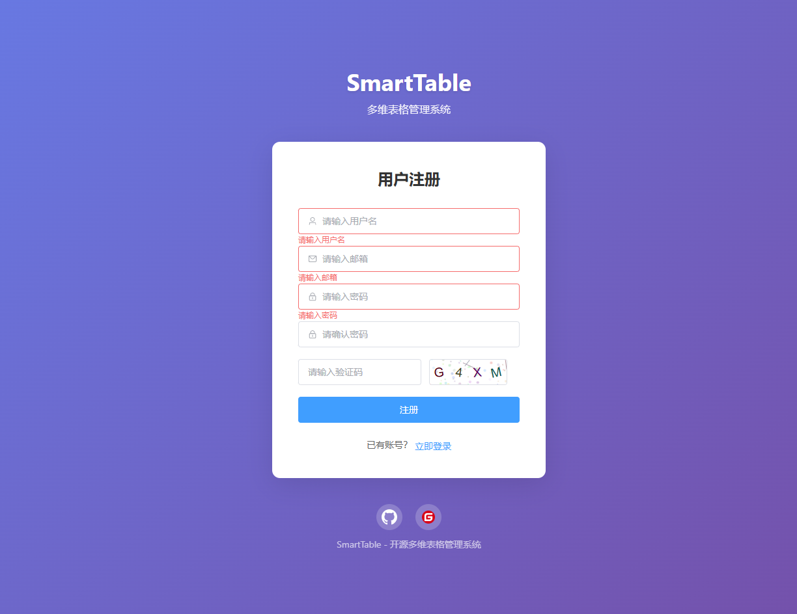
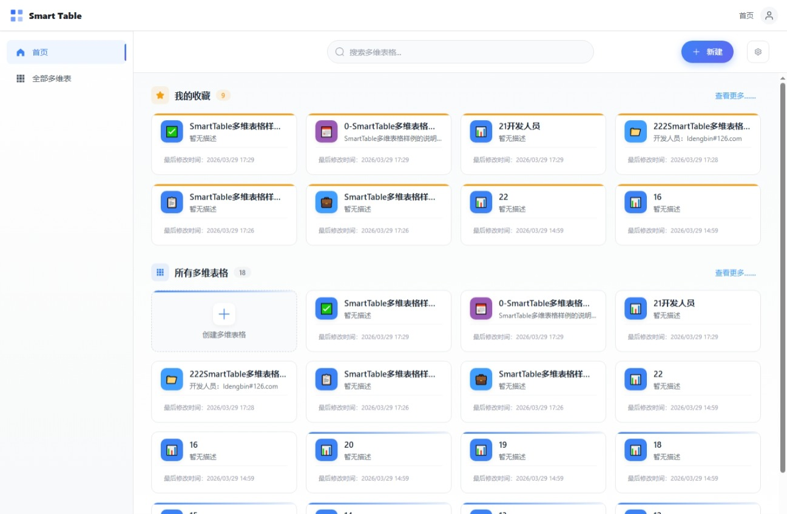
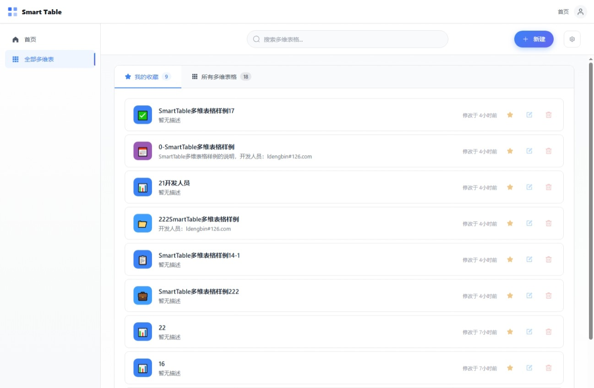
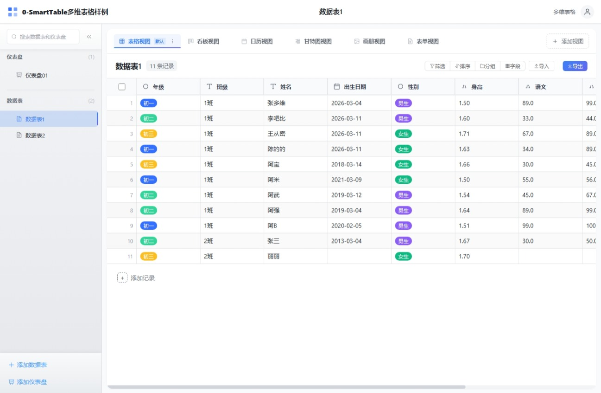
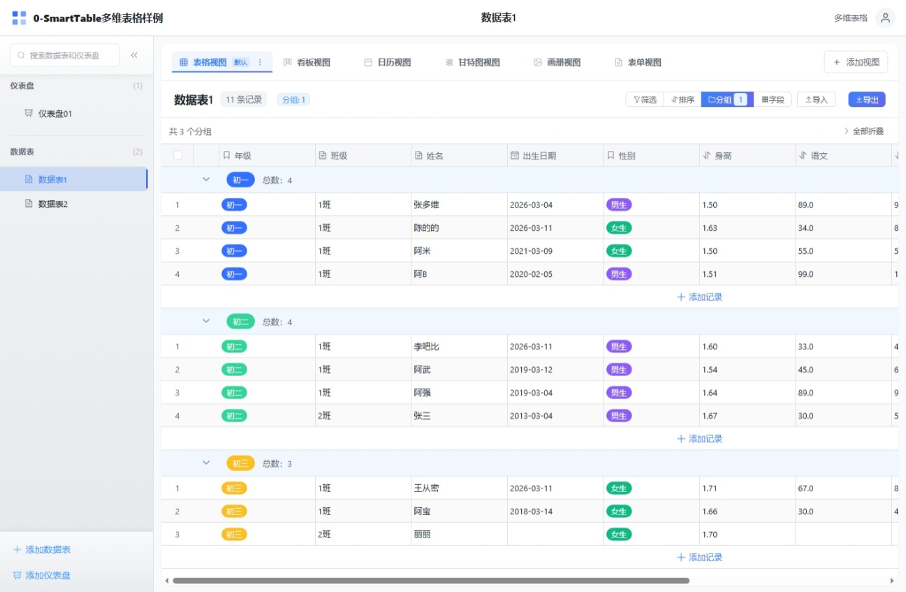
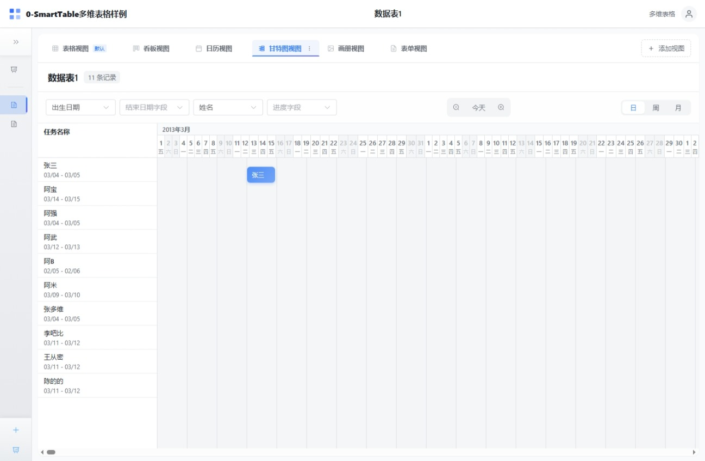

# Smart Table

中文 | [English](README.en.md)

一个基于 Vue 3 + TypeScript + Pinia 的智能多维表格系统，支持纯前端（IndexedDB）和后端（PostgreSQL）两种部署模式，类似于 Airtable 或飞书多维表格。

## 功能特性

### 核心功能

- 多维表格管理 - 创建、编辑、删除、收藏多维表格，支持成员管理
- 数据表管理 - 支持多个数据表，拖拽排序、重命名、删除、复制
- 字段管理 - 支持 22 种字段类型，包含字段配置、排序、显示隐藏
- 记录管理 - 增删改查、批量操作、记录详情抽屉
- 视图管理 - 6 种视图类型，支持筛选、排序、分组、视图切换

### 支持的字段类型（22 种）

| 类别   | 字段类型 | 状态   |
| ---- | ---- | ---- |
| 基础类型 | 文本   | ✅    |
| 基础类型 | 数字   | ✅    |
| 基础类型 | 日期   | ✅    |
| 基础类型 | 单选   | ✅    |
| 基础类型 | 多选   | ✅    |
| 基础类型 | 复选框  | ✅    |
| 联系类型 | 成员   | ✅    |
| 联系类型 | 电话   | ✅    |
| 联系类型 | 邮箱   | ✅    |
| 联系类型 | 链接   | ✅    |
| 媒体类型 | 附件   | ✅    |
| 计算类型 | 公式   | ✅    |
| 计算类型 | 关联   | ✅    |
| 计算类型 | 查找   | ✅    |
| 系统类型 | 创建人  | ✅    |
| 系统类型 | 创建时间 | ✅    |
| 系统类型 | 更新人  | ✅    |
| 系统类型 | 更新时间 | ✅    |
| 系统类型 | 自动编号 | ✅    |
| 其他   | 评分   | ✅    |
| 其他   | 进度   | ✅    |
| 其他   | URL  | ✅    |

### 支持的视图类型（6 种）

| 视图类型  | 功能描述              | 状态   |
| ----- | ----------------- | ---- |
| 表格视图  | 经典表格展示，支持虚拟滚动、列冻结 | ✅    |
| 看板视图  | 卡片式展示，支持拖拽排序      | ✅    |
| 日历视图  | 时间维度展示            | ✅    |
| 甘特图视图 | 项目进度展示            | ✅    |
| 表单视图  | 数据收集表单，支持分享       | ✅    |
| 画廊视图  | 图片卡片展示            | ✅    |

### 高级功能

- 数据筛选 - 多条件组合筛选，支持 AND/OR 逻辑，多种操作符
- 数据排序 - 多字段排序，支持升序/降序，拖拽调整优先级
- 数据分组 - 按字段分组展示，支持多级分组（最多 3 级）、分组统计
- 数据导入 - 支持 Excel、CSV、JSON 格式，支持多 Sheet
- 数据导出 - 支持 Excel、CSV、JSON 格式，自定义导出字段
- 公式引擎 - 43 个内置函数，支持数学、文本、日期、逻辑、统计计算
- 拖拽排序 - 表格、字段、视图拖拽排序，看板卡片拖拽
- 收藏功能 - 快速访问常用表格和仪表盘
- 搜索功能 - 快速搜索表格和记录
- 仪表盘 - 支持多种图表组件（数字卡片、图表、实时数据等）
- 分享协作 - Base 级别分享，支持分享链接和成员管理
- 实时协作 - 基于 WebSocket 的多人实时协作，支持在线状态、单元格锁定、冲突解决
- 权限管理 - 基于角色的权限控制（所有者/管理员/编辑者/评论者/查看者）
- 变更历史 - 记录变更历史追踪与查看功能

## 功能预览

| 功能    | 预览图                                | 功能   | 预览图                                    |
| ----- | ---------------------------------- | ---- | -------------------------------------- |
| 登录    |            | 注册   |             |
| 首页    |          | 首页   |         |
| 表格视图  |   | 表格视图 |  |
| 看板视图  |  | 日历视图 |    |
| 甘特图视图 |  | 表单视图 |        |
| 表单视图  |    | 仪表盘  |        |

## 技术栈

### 前端技术栈

| 类别     | 技术                      | 版本       |
| ------ | ----------------------- | -------- |
| 前端框架   | Vue 3                   | ^3.5.30  |
| 语言     | TypeScript              | \~5.9.3  |
| 状态管理   | Pinia                   | ^2.3.1   |
| 路由     | Vue Router              | ^4.6.4   |
| UI 组件库 | Element Plus            | ^2.13.6  |
| 表格组件   | vxe-table               | ^4.18.7  |
| 图表库    | echarts + vue-echarts   | ^5.6.0   |
| 日期处理   | dayjs                   | ^1.11.20 |
| 拖拽排序   | sortablejs              | ^1.15.7  |
| 工具库    | lodash-es, @vueuse/core | -        |
| 构建工具   | Vite                    | ^8.0.1   |
| 测试     | Vitest                  | ^3.2.4   |

### 数据存储方案

| 模式    | 技术                | 说明                                     |
| ----- | ----------------- | -------------------------------------- |
| 纯前端模式 | Dexie (IndexedDB) | 数据存储在浏览器本地，无需服务端                       |
| 后端模式  | SQLite + Flask    | 默认使用 SQLite，支持通过环境变量配置 PostgreSQL 等数据库 |

### 后端技术栈（可选）

| 类别        | 技术                                  | 版本                    |
| --------- | ----------------------------------- | --------------------- |
| 框架        | Flask                               | 3.0.0                 |
| 数据库       | SQLite (默认) / PostgreSQL (可选)       | 3.x / 16              |
| ORM       | SQLAlchemy                          | 2.0                   |
| 数据库迁移     | Alembic (Flask-Migrate)             | -                     |
| 认证        | JWT (Flask-JWT-Extended)            | 4.6.0                 |
| 安全加密      | Flask-Bcrypt, bcrypt                | 1.0.1 / 4.1.2         |
| 缓存        | Flask-Caching (+ Redis 可选)          | 2.1.0                 |
| WebSocket | Flask-SocketIO, eventlet            | 5.3.6 / 0.33.3        |
| 实时通信      | socket.io-client                    | ^4.8.1                |
| 数据序列化     | marshmallow, marshmallow-sqlalchemy | 3.20.1 / 0.29.0       |
| 导入导出      | pandas, openpyxl, xlrd              | 2.1.4 / 3.1.2 / 2.0.1 |
| 图片处理      | Pillow                              | 10.1.0                |
| 部署        | Gunicorn, Docker                    | 21.2.0                |

## 快速开始

### 环境要求

- Node.js >= 18
- npm >= 9

### 前端开发

#### 安装依赖

```bash
cd smart-table
npm install
```

#### 开发模式

```bash
npm run dev
```

#### 构建生产版本

```bash
npm run build
```

#### 预览生产版本

```bash
npm run preview
```

#### 运行测试

```bash
# 运行所有测试
npm run test

# 监听模式运行测试
npm run test:watch

# 生成测试覆盖率报告
npm run test:coverage
```

### 后端服务（可选）

#### 使用 Docker Compose

```bash
cd smarttable-backend

# 配置环境变量
cp .env.example .env
# 编辑 .env 文件配置数据库连接等（默认使用 SQLite）

# 启动服务（开发模式，使用 SQLite）
docker-compose up -d

# 或使用 PostgreSQL（可选）
docker-compose -f docker-compose.dev.yml up -d

# 执行数据库迁移
docker-compose --profile migrate run --rm migrate

# 访问 API
# http://localhost:5000/api
```

#### 本地开发

```bash
cd smarttable-backend

# 创建虚拟环境
python -m venv venv
source venv/bin/activate  # Windows: venv\Scripts\activate

# 安装依赖
pip install -r requirements.txt

# 配置环境变量
cp .env.example .env
# 默认使用 SQLite，无需修改 DATABASE_URL

# 初始化数据库
flask db upgrade

# 启动开发服务器（默认不启用实时协作）
flask run --reload

# 或使用 run.py 启动
python run.py

# 启用实时协作功能
python run.py --enable-realtime
# 或使用短参数
python run.py -r
```

#### 后端特性

- **默认数据库**: SQLite（轻量级，无需额外安装）
- **可选数据库**: PostgreSQL（通过环境变量配置）
- **认证系统**: JWT Token 认证，支持刷新 Token
- **权限管理**: 基于角色的权限控制
- **数据迁移**: Alembic 数据库迁移工具
- **API 文档**: 完整的 RESTful API
- **实时协作**: 可选的 WebSocket 实时协作功能（通过 `--enable-realtime` 启用）

## 项目结构

### 前端项目结构

```
smart-table/
├── src/
│   ├── assets/              # 静态资源
│   │   └── styles/          # SCSS 样式文件
│   ├── components/          # Vue 组件
│   │   ├── common/          # 通用组件（AppHeader, AppSidebar, Toast 等）
│   │   ├── collaboration/   # 协作组件（OnlineUsers, CellEditingIndicator, ConflictDialog 等）
│   │   ├── dialogs/         # 对话框组件（FieldDialog, FilterDialog, ImportDialog 等）
│   │   ├── fields/          # 22 种字段类型组件
│   │   ├── filters/         # 筛选功能组件
│   │   ├── groups/          # 分组功能组件
│   │   ├── sorts/           # 排序功能组件
│   │   └── views/           # 6 种视图组件
│   ├── composables/         # 组合式函数
│   │   └── useRealtimeCollaboration.ts  # 实时协作组合式函数
│   ├── db/                  # 数据库层（IndexedDB）
│   │   ├── services/        # 数据服务（base/table/field/record/view/dashboard）
│   │   ├── schema.ts        # Dexie 数据库定义
│   │   └── __tests__/       # 测试文件
│   ├── layouts/             # 布局组件（MainLayout, BlankLayout）
│   ├── router/              # Vue Router 配置
│   ├── services/api/        # API 服务层
│   ├── services/realtime/   # 实时协作服务层（Socket.IO 客户端、事件类型、事件总线）
│   ├── stores/              # Pinia 状态管理
│   │   ├── baseStore.ts     # 多维表格状态
│   │   ├── tableStore.ts    # 数据表状态
│   │   ├── viewStore.ts     # 视图状态
│   │   ├── authStore.ts     # 认证状态
│   │   ├── collaborationStore.ts  # 协作状态（在线用户、锁定单元格、离线队列）
│   │   └── ...
│   ├── types/               # TypeScript 类型定义
│   │   ├── fields.ts        # 字段类型定义
│   │   ├── views.ts         # 视图类型定义
│   │   ├── filters.ts       # 筛选类型定义
│   │   └── attachment.ts    # 附件类型定义
│   ├── utils/               # 工具函数
│   │   ├── export/          # 导出功能
│   │   ├── formula/         # 公式引擎（43 个函数）
│   │   ├── filter.ts        # 筛选逻辑
│   │   ├── sort.ts          # 排序逻辑
│   │   ├── group.ts         # 分组逻辑
│   │   └── validation.ts    # 数据验证
│   └── views/               # 页面视图（Home, Base, Dashboard, FormShare 等）
├── package.json
├── vite.config.ts
├── tsconfig.json
└── README.md
```

### 后端项目结构

```
smarttable-backend/
├── app/
│   ├── __init__.py          # 应用工厂
│   ├── config.py            # 配置文件
│   ├── extensions.py        # 扩展初始化
│   ├── models/              # 数据模型
│   │   ├── user.py          # 用户模型
│   │   ├── base.py          # Base 模型
│   │   ├── table.py         # 表格模型
│   │   ├── field.py         # 字段模型
│   │   ├── record.py        # 记录模型
│   │   ├── view.py          # 视图模型
│   │   ├── dashboard.py     # 仪表盘模型
│   │   ├── attachment.py    # 附件模型
│   │   └── collaboration_session.py  # 协作会话模型
│   ├── services/            # 业务逻辑层
│   │   ├── auth_service.py
│   │   ├── base_service.py
│   │   ├── table_service.py
│   │   ├── field_service.py
│   │   ├── record_service.py
│   │   ├── view_service.py
│   │   ├── formula_service.py
│   │   ├── dashboard_service.py
│   │   ├── attachment_service.py
│   │   └── collaboration_service.py  # 协作服务（房间管理、在线状态、单元格锁定、广播）
│   ├── routes/              # 路由层
│   │   ├── auth.py
│   │   ├── bases.py
│   │   ├── tables.py
│   │   ├── fields.py
│   │   ├── records.py
│   │   ├── views.py
│   │   ├── dashboards.py
│   │   ├── attachments.py
│   │   └── realtime.py      # 实时协作状态 API（/api/realtime/status）
│   └── utils/               # 工具模块
├── migrations/              # 数据库迁移
├── tests/                   # 测试目录
├── requirements.txt         # Python 依赖
├── run.py                   # 应用入口
└── docker-compose.yml       # Docker 编排
```

## 数据模型

### Base（多维表格）

- 多维表格基础单元
- 支持收藏、自定义图标和颜色

### Table（数据表）

- 包含字段定义和记录数据
- 支持拖拽排序、收藏

### Field（字段）

- 定义数据列的类型和属性
- 支持 22 种字段类型

### Record（记录）

- 数据行
- 支持增删改查、批量操作

### View（视图）

- 数据展示方式
- 支持筛选、排序、分组配置

### CollaborationSession（协作会话）

- 实时协作会话追踪
- 记录用户加入/离开、活跃状态
- 仅在启用实时协作功能时使用

## 公式引擎

### 公式使用方法

```
// 计算总价
{单价} * {数量}

// 计算折扣后价格
{原价} * (1 - {折扣})

// 条件判断
IF({成绩} >= 90, "优秀", IF({成绩} >= 60, "及格", "不及格"))

// 文本拼接
CONCAT({姓}, {名})

// 日期计算
DATEDIF({开始日期}, {结束日期}, "D")
```

### 支持的函数（43 个）

#### 数学函数（11 个）

`SUM`, `AVG`, `MAX`, `MIN`, `ROUND`, `CEILING`, `FLOOR`, `ABS`, `MOD`, `POWER`, `SQRT`

#### 文本函数（10 个）

`CONCAT`, `LEFT`, `RIGHT`, `LEN`, `UPPER`, `LOWER`, `TRIM`, `SUBSTITUTE`, `REPLACE`, `FIND`

#### 日期函数（10 个）

`TODAY`, `NOW`, `YEAR`, `MONTH`, `DAY`, `HOUR`, `MINUTE`, `SECOND`, `DATEDIF`, `DATEADD`

#### 逻辑函数（7 个）

`IF`, `AND`, `OR`, `NOT`, `IFERROR`, `IFS`, `SWITCH`

#### 统计函数（5 个）

`COUNT`, `COUNTA`, `COUNTIF`, `SUMIF`, `AVERAGEIF`

## 浏览器支持

- Chrome >= 90
- Firefox >= 88
- Safari >= 14
- Edge >= 90

## 实时协作配置

实时协作功能默认关闭，可通过启动参数或环境变量启用。

### 启动参数

```bash
# 启用实时协作
python run.py --enable-realtime
# 或使用短参数
python run.py -r

# 不启用实时协作（默认行为）
python run.py
```

### 环境变量

```env
# 启用实时协作
ENABLE_REALTIME=true

# SocketIO 消息队列（使用 Redis 时推荐）
SOCKETIO_MESSAGE_QUEUE=redis://localhost:6379/1

# SocketIO 心跳配置
SOCKETIO_PING_TIMEOUT=60
SOCKETIO_PING_INTERVAL=25
```

### Docker 部署

在 `docker-compose.yml` 或 `.env` 文件中添加：

```yaml
environment:
  - ENABLE_REALTIME=true
```

### 功能说明

| 功能    | 说明                    |
| ----- | --------------------- |
| 在线状态  | 显示当前正在编辑同一表格的用户       |
| 视图同步  | 实时同步其他用户的视图切换和滚动位置    |
| 单元格锁定 | 正在编辑的单元格自动锁定，防止冲突     |
| 冲突检测  | 基于乐观锁的冲突检测，返回 409 状态码 |
| 离线队列  | 断线时操作自动缓存，重连后自动重放     |
| 优雅降级  | 实时协作不可用时自动降级为普通模式     |

### API 端点

| 端点                         | 说明         |
| -------------------------- | ---------- |
| `GET /api/realtime/status` | 查询实时协作服务状态 |

### Socket.IO 事件

| 事件类别 | 事件名称                                     | 说明         |
| ---- | ---------------------------------------- | ---------- |
| 房间   | `room:join` / `room:leave`               | 加入/离开协作房间  |
| 在线状态 | `presence:view_changed` / `presence:cell_selected` | 视图切换/单元格选中 |
| 在线状态 | `presence:user_joined` / `presence:user_left` | 用户加入/离开通知  |
| 锁定   | `lock:acquire` / `lock:release`          | 获取/释放单元格锁  |
| 锁定   | `lock:acquired` / `lock:released`        | 锁定/解锁通知    |
| 数据   | `data:record_updated` / `data:record_created` / `data:record_deleted` | 记录变更推送     |
| 数据   | `data:field_updated` / `data:field_created` / `data:field_deleted` | 字段变更推送     |
| 数据   | `data:view_updated` / `data:table_updated` / `data:table_created` / `data:table_deleted` | 视图/表格变更推送  |

## 开发计划

### 已实现功能 ✅

### 数据管理

- [x] 多维表格 CRUD（创建、编辑、删除、收藏）
- [x] 数据表 CRUD（创建、编辑、删除、复制、排序）
- [x] 字段管理（22 种类型，支持配置、排序、显示隐藏）（待完善）
- [x] 记录管理（增删改查、批量操作、详情抽屉）
- [x] 成员管理（Base 级别成员列表、添加成员）

### 视图系统

- [x] 6 种视图支持（表格、看板、日历、甘特图、表单、画廊）
- [x] 视图切换与配置持久化
- [x] 视图级别字段控制（隐藏、冻结）
- [x] 表单视图分享（支持分享链接、配置提交选项）

### 数据处理

- [x] 数据筛选（多条件组合，AND/OR 逻辑，多种操作符）
- [x] 数据排序（多字段排序，拖拽调整优先级）
- [x] 数据分组（多级分组，最多 3 级，分组统计）
- [x] 公式引擎（43 个函数，支持字段引用、嵌套计算）（待完善）

### 数据交换

- [x] 数据导入（Excel/CSV/JSON，支持多 Sheet）
- [x] 数据导出（Excel/CSV/JSON，自定义字段）

### 用户体验

- [x] 拖拽排序（表格、字段、视图、看板卡片）
- [x] 收藏功能（表格、todo仪表盘收藏）
- [x] 搜索功能（表格名称、todo:记录内容搜索）
- [ ] 快捷键支持（常用操作键盘快捷键）
- [ ] 主题切换（明暗主题）
- [ ] 响应式设计（适配移动端）

### 字段功能

- [x] 字段必填属性
- [x] 字段校验规则（必填、数字、邮箱、手机号、URL）
- [x] 附件字段上传/下载/删除（IndexedDB Blob 存储）（待完善）
- [ ] 关联字段（支持一对一、一对多、多对多）（待完善）
- [ ] 查找字段（跨表查询、聚合计算）

### 仪表盘

- [x] 仪表盘基础功能（创建、编辑、删除）
- [x] 多种图表组件（数字卡片、时钟、日期、实时图表等）
- [ ] 仪表盘模板（支持保存为模板）

### 待实现功能 📋

#### 字段功能完善

- [ ] 字段默认值配置
- [ ] 附件字段预览功能（图片、文档、视频等）
- [ ] 新增字段类型（文本框、身份证、地理位置）
- [ ] 公式功能完善与文档

#### 视图功能丰富化

- [ ] 表单视图增强（字段联动、背景图、说明文字、收集填写人信息）
- [ ] 全局筛选器
- [ ] 字段之间联动
- [x] 仪表盘网格配置优化
- [x] 表格视图列冻结
- [x] 表格视图字段筛选
- [x] 分组模式下字段显示样式完善

#### 分享与协作

- [x] 多维表分享 ✅
- [ ] 单个数据表分享
- [ ] 单个视图分享
- [x] 分享内容配置 ✅
- [x] 分享菜单（我的分享/分享给我） ✅
- [x] 实时协作（基于 WebSocket，支持在线状态、单元格锁定、冲突解决） ✅
- [x] 操作历史记录 ✅
- [ ] 评论批注功能

#### 权限管理

- [x] 用户认证系统（后端模式） ✅
- [x] 角色权限（所有者/管理员/编辑者/评论者/查看者） ✅
- [ ] 字段级权限控制
- [x] 分享权限设置 ✅

#### AI 功能

- [ ] AI 表单搭建（一句话搭建业务表格）
- [ ] 表单辅助填写
- [ ] 数据问答与可视化

#### 流程与扩展

- [ ] 流程设计器
- [ ] 自动化工作流
- [ ] 脚本扩展支撑
- [ ] 插件系统

#### 开放接口

- [ ] REST API 接口完善
- [ ] MCP 接口

#### 文档功能

- [ ] 文档 CRUD
- [ ] 富文本编辑器
- [ ] 文档分享与版本管理

#### 其他

- [ ] 移动端适配优化
- [ ] 操作手册编写（待完善）
- [ ] 帮助中心（待完善）
- [ ] 反馈机制（待完善）
- [ ] 性能优化（待完善）
- [ ] 安全加固（待完善）
- [ ] 性能测试（待完善）
- [ ] 性能监控（待完善）

## 贡献指南

欢迎提交 Issue 和 Pull Request！

1. Fork 本仓库
2. 创建特性分支 (`git checkout -b feature/AmazingFeature`)
3. 提交更改 (`git commit -m 'Add some AmazingFeature'`)
4. 推送到分支 (`git push origin feature/AmazingFeature`)
5. 创建 Pull Request

## 许可证

[MIT](LICENSE) © 2026 Smart Table Contributors
