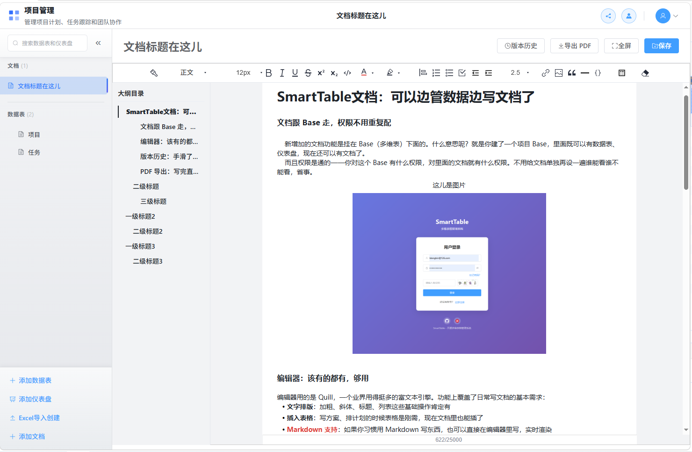

# Smart Table

中文 | [English](README.en.md)

一个基于 Vue 3 + Flask 的智能多维表格系统，类似于 Airtable 或飞书多维表格。支持多种视图（表格视图、分组视图、看板视图、日历视图、甘特视图、表单视图、仪表盘等），拥有丰富的字段类型；支持markdown编写富文本文档。

## ✨ 功能特性

### 🎯 核心功能

- **多维表格管理** - 创建、编辑、删除、收藏多维表格，支持成员管理和分享协作
- **数据表管理** - 支持多个数据表，拖拽排序、重命名、删除、复制
- **字段管理** - 支持 **26 种字段类型**，包含字段配置、排序、显示隐藏、默认值设置
- **记录管理** - 增删改查、批量操作、记录详情抽屉、变更历史追踪
- **视图管理** - **6 种视图类型**，支持筛选、排序、分组、视图切换、列冻结
- **文档管理** - 文档创建编辑、富文本编辑（Quill）、Markdown 支持、PDF 导出、版本历史管理

### 📝 支持的字段类型（26 种）

| 类别       | 字段类型        | 说明                      | 状态 |
| -------- | ----------- | ----------------------- | -- |
| **文本类型** | 单行文本        | 短文本输入，支持验证规则            | ✅  |
| **文本类型** | 多行文本        | 长文本输入，支持多行编辑            | ✅  |
| **文本类型** | 富文本         | HTML富文本编辑器，支持格式化        | ✅  |
| **数值类型** | 数字          | 整数/小数，支持格式化（数字/货币/百分比）  | ✅  |
| **日期类型** | 日期          | 日期选择器，支持多种日期格式          | ✅  |
| **日期类型** | 日期时间        | 日期时间选择器，精确到秒            | ✅  |
| **选择类型** | 单选          | 下拉单选，支持自定义选项和颜色         | ✅  |
| **选择类型** | 多选          | 标签式多选，支持自定义选项           | ✅  |
| **选择类型** | 复选框         | 布尔值开关                   | ✅  |
| **人员类型** | 成员          | 用户选择，支持当前用户默认值          | ✅  |
| **联系方式** | 电话          | 电话号码输入和格式化显示            | ✅  |
| **联系方式** | 邮箱          | 邮箱地址输入和验证               | ✅  |
| **联系方式** | 链接 (URL)    | URL链接，支持点击跳转            | ✅  |
| **媒体类型** | 附件          | 文件上传下载，支持图片预览和缩略图       | ✅  |
| **计算类型** | 公式          | 43个内置函数，支持字段引用和嵌套计算     | ✅  |
| **关联类型** | 关联 (Link)   | 表间关联，支持一对一/一对多/多对多关系    | ✅  |
| **查找类型** | 查找 (Lookup) | 跨表查询，支持聚合计算（求和/平均值/计数等） | ✅  |
| **系统类型** | 创建人         | 自动记录记录创建者               | ✅  |
| **系统类型** | 创建时间        | 自动记录创建时间戳               | ✅  |
| **系统类型** | 更新人         | 自动记录最后修改者               | ✅  |
| **系统类型** | 更新时间        | 自动记录最后修改时间              | ✅  |
| **系统类型** | 自动编号        | 自增编号，支持前缀/后缀/日期格式/补零    | ✅  |
| **其他**   | 评分          | 星级评分组件                  | ✅  |
| **其他**   | 进度          | 进度条/百分比显示               | ✅  |

### 🎨 支持的视图类型（6 种）

| 视图类型      | 功能描述                   | 状态 |
| --------- | ---------------------- | -- |
| **表格视图**  | 经典表格展示，支持虚拟滚动、列冻结、字段筛选 | ✅  |
| **分组视图**  | 按字段分组展示，支持多级分组统计和筛选    | ✅  |
| **看板视图**  | 卡片式展示，支持拖拽排序和分组        | ✅  |
| **日历视图**  | 时间维度展示，按日期分组显示         | ✅  |
| **甘特图视图** | 项目进度时间线展示，支持任务依赖       | ✅  |
| **表单视图**  | 数据收集表单，支持公开分享和自定义配置    | ✅  |
| **画廊视图**  | 图片卡片网格展示，适合媒体内容        | ✅  |

### 🚀 高级功能

#### 数据处理

- **数据筛选** - 多条件组合筛选，支持 AND/OR 逻辑，20+ 种操作符
- **数据排序** - 多字段排序，支持升序/降序，拖拽调整优先级
- **数据分组** - 按字段分组展示，支持多级分组（最多 3 级）、分组统计
- **公式引擎** - **43 个内置函数**，支持数学、文本、日期、逻辑、统计计算
- **流式数据加载** - 万级数据首屏秒级渲染，异步加载剩余页，非阻塞式操作
- **数据导入** - 支持 Excel、CSV、JSON 格式，支持多 Sheet，可导入创建新表
- **数据导出** - 支持 Excel、CSV、JSON 格式，自定义导出字段

#### 协作与分享

- **Base 分享** - 多维表级别分享，支持链接分享和权限控制
- **表单分享** - 表单视图公开分享，支持配置提交选项
- **仪表盘分享** - 仪表盘公开分享，支持实时数据展示
- **成员管理** - Base 级别成员列表、添加成员、角色分配
- **实时协作** - 基于 WebSocket 的多人实时协作（可选启用）
  - 在线状态显示
  - 视图同步（滚动位置、视图切换）
  - 单元格锁定（防止冲突编辑）
  - 冲突检测与解决（基于乐观锁）
  - 离线队列（断线自动缓存，重连自动重放）
  - 优雅降级（实时不可用时自动切换为普通模式）
- **请求追踪系统** - 请求 ID 全链路追踪、统一错误处理、标准化 API 响应格式
- **本地缓存体系** - 协作状态缓存、用户认证缓存、系统配置缓存，配置请求减少 90%+

#### 权限与安全

- **用户认证** - JWT Token 认证，支持刷新 Token、邮箱验证、密码重置
- **角色权限** - 基于角色的访问控制（RBAC）
  - 所有者（Owner）- 完全控制权限
  - 管理员（Admin）- 管理权限（除删除外）
  - 编辑者（Editor）- 编辑权限
  - 评论者（Commenter）- 评论和查看权限
  - 查看者（Viewer）- 只读权限
- **安全配置管理** - 动态密码强度规则、注册开关、会话超时配置、公开配置接口
- **敏感信息保护** - 30+ 修复点的日志脱敏，密码/Token/手机号/邮箱自动遮蔽
- **安全防护** - XSS 防护、CSRF 保护、安全响应头、API 速率限制、文件上传安全验证
- **操作日志** - 完整的操作审计日志

#### 用户体验

- **拖拽排序** - 表格、字段、视图、看板卡片拖拽排序
- **收藏功能** - 快速访问常用的表格和仪表盘
- **搜索功能** - 快速搜索表格名称和记录内容
- **Element Plus 图标** - 统一的图标系统，提升视觉一致性
- **快捷键支持** - 常用操作的键盘快捷键

#### 仪表盘系统

- **多种图表组件** - 数字卡片、时钟组件、日期组件、KPI 卡片、跑马灯、实时图表等
- **仪表盘模板** - 支持保存和复用仪表盘配置模板
- **网格布局** - 灵活的网格布局系统，支持自定义行列配置
- **实时数据** - 支持实时数据更新和动态图表
- **分享功能** - 仪表盘公开分享，支持嵌入外部网站

#### 邮件系统（可选）

- **SMTP 配置** - 支持自定义 SMTP 服务器
- **邮件模板** - 可自定义邮件模板（注册验证、密码重置等）
- **邮件队列** - 异步邮件发送队列，支持重试机制
- **邮件日志** - 完整的邮件发送日志和统计
- **管理员面板** - 邮件配置管理和监控界面

#### 📄 文档管理（v1.4.0 新增）

- **文档 CRUD** - 支持文档创建、编辑、删除、查询，与 Base 关联权限控制
- **富文本编辑器** - 基于 Quill，支持加粗/斜体/列表/链接/表格等格式化功能
- **Markdown 编写** - 支持 Markdown 语法实时渲染
- **版本历史** - 版本记录与回溯，版本对比查看，创建者追踪
- **PDF 导出** - 文档内容导出为 PDF，DOM 直接解析确保样式准确

## 📸 功能预览

| 功能   | 预览图                                     | 功能    | 预览图                                    |
| ---- | --------------------------------------- | ----- | -------------------------------------- |
| 登录   |                 | 注册    |             |
| 首页   |               | 全部首页  |         |
| 表格视图 |        | 分组表格  |  |
| 表格字段 |  | 看板视图  |      |
| 日历视图 |     | 甘特图视图 |      |
| 表单视图 |         | 仪表盘   |        |
| 分享功能 |             | 文档管理  |         |

## 🛠️ 技术栈

### 前端技术栈

| 类别        | 技术                      | 版本              | 说明                |
| --------- | ----------------------- | --------------- | ----------------- |
| 前端框架      | Vue 3                   | ^3.5.30         | Composition API   |
| 语言        | TypeScript              | \~5.9.3         | 类型安全              |
| 状态管理      | Pinia                   | ^2.3.1          | 轻量级状态管理           |
| 路由        | Vue Router              | ^4.6.4          | SPA 路由            |
| UI 组件库    | Element Plus            | ^2.13.6         | 企业级 UI 组件         |
| 表格组件      | vxe-table               | ^4.18.7         | 高性能虚拟滚动表格（v1.4 及更早）  |
| 表格组件      | vtable                  | ^1.26.1         | 高性能 canvas 表格（v1.5 及更新） |
| 图表库       | echarts + vue-echarts   | ^5.6.0 / ^6.7.3 | 数据可视化             |
| 日期处理      | dayjs                   | ^1.11.20        | 轻量级日期库            |
| 拖拽排序      | sortablejs              | ^1.15.7         | 拖拽功能              |
| HTTP 客户端  | axios                   | ^1.14.0         | HTTP 请求           |
| 本地数据库     | Dexie                   | ^3.2.7          | IndexedDB 封装      |
| WebSocket | socket.io-client        | ^4.8.3          | 实时通信              |
| 工具库       | lodash-es, @vueuse/core | -               | 工具函数集             |
| 富文本       | tinyeditor              | ^4.0.0          | 富文本编辑器(1.4+)      |
| 电子表格      | xlsx                    | ^0.18.5         | Excel 解析生成        |
| 构建工具      | Vite                    | ^8.0.1          | 极速构建工具            |
| 测试框架      | Vitest                  | ^3.2.4          | 单元测试              |

### 后端技术栈（可选）

| 类别        | 技术                         | 版本                    | 说明            |
| --------- | -------------------------- | --------------------- | ------------- |
| 框架        | Flask                      | 3.0.0                 | Python Web 框架 |
| 数据库       | SQLite (默认) / PostgreSQL   | 3.x / 16+             | 关系型数据库        |
| ORM       | SQLAlchemy                 | 2.0.23                | Python ORM    |
| 数据库迁移     | Alembic (Flask-Migrate)    | 4.0.5                 | 数据库版本管理       |
| 认证        | JWT (Flask-JWT-Extended)   | 4.6.0                 | Token 认证      |
| 密码加密      | Flask-Bcrypt, bcrypt       | 1.0.1 / 4.1.2         | 密码哈希          |
| 表单验证      | Flask-WTF                  | 1.2.1                 | CSRF 保护       |
| CORS      | Flask-CORS                 | 4.0.0                 | 跨域支持          |
| 缓存        | Flask-Caching (+ Redis 可选) | 2.1.0                 | 缓存加速          |
| WebSocket | Flask-SocketIO             | 5.3.6                 | 实时通信          |
| 异步支持      | eventlet                   | 0.36.1                | 异步处理          |
| 数据序列化     | marshmallow                | 3.20.1                | 数据验证序列化       |
| 导入导出      | pandas, openpyxl, xlrd     | 2.1.4 / 3.1.2 / 2.0.1 | 数据处理          |
| 图片处理      | Pillow                     | 10.4.0                | 图片缩略图         |
| 对象存储      | MinIO (可选)                 | -                     | 文件对象存储        |
| 加密        | cryptography               | 42.0.5                | 加密算法          |
| API 文档    | Flasgger                   | 0.9.7b2               | Swagger UI    |
| WSGI 服务器  | Eventlet WSGI Server       | 0.36.1                | 生产服务器         |
| 部署        | Docker, Nginx              | -                     | 容器化部署         |

### 数据存储方案

| 模式       | 技术                 | 说明                         |
| -------- | ------------------ | -------------------------- |
| *前端*\*   | Dexie (IndexedDB)  | 数据存储在浏览器本地作为缓存             |
| **后端**   | SQLite + Flask     | 默认使用 SQLite，轻量级无需额外安装数据库   |
| **生产模式** | PostgreSQL + Flask | 支持 PostgreSQL，适合多用户并发和生产环境 |

## 🚀 快速开始

### 一键启动（推荐）

下载最新release版本下的一键启动包，解压之后一键启动：

```bash
# Windows PowerShell
.\start.bat

# Linux/macOS
./start.sh
```

<br />

> 该一键启动包无需依赖任何外部环境，双击即可启动。
>
> **无需安装任何依赖，无需手工创建账号。**
>
> 启动后会自动打开浏览器，然后试用控制台打印的账号邮箱和密码登录即可试用。

### docker启动

使用官方docker镜像启动（自动适配架构）：

```bash
docker run -d \
  --name smarttable \
  -p 80:80 \
  -v smarttable_data:/app/data \
  -v smarttable_uploads:/app/uploads \
  -v smarttable_redis:/data/redis \
  ygbinac/smarttable:latest
```

- 或者使用 docker compose ，只需创建以下 docker-compose.yml ：：

```bash
services:
  smarttable:
    image: ygbinac/smarttable:latest
    container_name: smarttable
    ports:
      - "80:80"
    volumes:
      - smarttable_data:/app/data
      - smarttable_uploads:/app/uploads
      - smarttable_redis:/data/redis
    restart: unless-stopped

volumes:
  smarttable_data:
  smarttable_uploads:
  smarttable_redis:
```

## 开发环境

### 环境要求

- Node.js >= 18
- npm >= 9
- Python >= 3.11 （仅后端模式需要）

### 前端开发

#### 安装依赖

```bash
cd smart-table
npm install
```

#### 开发模式

```bash
npm run dev
```

访问 <http://localhost:5173>

#### 构建生产版本

```bash
npm run build
```

#### 预览生产版本

```bash
npm run preview
```

#### 运行测试

```bash
# 运行所有测试
npm run test

# 监听模式运行测试（开发时使用）
npm run test:watch

# 生成测试覆盖率报告
npm run test:coverage
```

### 后端服务（可选）

#### 使用 Docker Compose（推荐）

```bash
cd smarttable-backend

# 复制环境变量配置文件
cp .env.example .env
# 编辑 .env 文件配置数据库连接等（默认使用 SQLite）

# 启动所有服务（SQLite 模式）
docker-compose up -d

# 或使用 PostgreSQL + Redis（适合生产环境）
# v1.4.0 优化：Docker 部署内嵌 Redis，无需额外启动 Redis 容器
docker-compose -f docker-compose.dev.yml up -d

# 执行数据库迁移
docker-compose exec backend flask db upgrade

# 查看日志
docker-compose logs -f backend

# 访问 API 文档
# http://localhost:5000/api/docs  (Swagger UI)
# http://localhost:5000/api/apidoc  (ReDoc)
```

#### 本地开发

```bash
cd smarttable-backend

# 创建虚拟环境
python -m venv venv

# 激活虚拟环境
# Windows:
venv\Scripts\activate
# Linux/macOS:
source venv/bin/activate

# 安装依赖
pip install -r requirements.txt

# 复制环境变量配置文件
cp .env.example .env
# 默认使用 SQLite，无需修改 DATABASE_URL

# 初始化数据库
flask db upgrade

# 启动开发服务器（默认不启用实时协作）
flask run --reload

# 或使用 run.py 启动（支持更多选项）
python run.py

# 启用实时协作功能
python run.py --enable-realtime
> 或者通过修改 .env 的 `ENABLE_REALTIME=True` 来配置协同编辑功能

```

#### 后端特性

✅ **默认数据库**: SQLite（轻量级，无需额外安装）\
✅ **可选数据库**: PostgreSQL（通过环境变量 `DATABASE_URL` 配置）\
✅ **认证系统**: JWT Token 认证，支持刷新 Token、邮箱验证\
✅ **权限管理**: 基于角色的权限控制（RBAC）\
✅ **数据迁移**: Alembic 数据库迁移工具\
✅ **API 文档**: 完整的 Swagger/OpenAPI 文档（Flasgger）\
✅ **实时协作**: 可选的 WebSocket 实时协作功能（通过 `--enable-realtime` 启用）\
✅ **邮件系统**: 可选的 SMTP 邮件发送功能\
✅ **对象存储**: 可选的 MinIO 文件存储\
✅ **安全防护**: XSS 防护、速率限制、安全响应头

## 🗄️ 数据模型

### 核心实体关系

```
User (用户)
  ├── owns many Base (多维表格)
  ├── is member of many Base (通过 BaseMember)
  └── has many OperationLog (操作日志)

Base (多维表格)
  ├── has many Table (数据表)
  ├── has many Dashboard (仪表盘)
  ├── has many BaseShare (分享链接)
  ├── has many BaseMember (成员)
  └── has many CollaborationSession (协作会话)

Table (数据表)
  ├── has many Field (字段)
  ├── has many Record (记录)
  ├── has many View (视图)
  ├── has many LinkRelation (关联关系)
  └── belongs to Base

Field (字段)
  ├── has options (字段配置)
  └── belongs to Table

Record (记录)
  ├── has many RecordHistory (变更历史)
  ├── has values for each Field
  └── belongs to Table

View (视图)
  ├── has filter/sort/group configs
  └── belongs to Table
```

### 主要模型说明

#### User（用户）

- 用户认证信息（用户名、邮箱、密码哈希）
- 邮箱验证状态
- 角色权限（普通用户/管理员）
- 头像和个人资料

#### Base（多维表格）

- 多维表格基础单元
- 支持收藏、自定义图标和颜色
- 成员管理和权限控制
- 分享设置（公开/私有/密码保护）

#### Table（数据表）

- 包含字段定义和记录数据
- 支持拖拽排序、收藏
- 关联关系配置

#### Field（字段）

- 定义数据列的类型和属性
- 支持 26 种字段类型
- 丰富的字段选项（验证规则、默认值、格式化等）

#### Record（记录）

- 数据行，存储各字段的值
- 支持增删改查、批量操作
- 完整的变更历史追踪

#### View（视图）

- 数据展示方式（6 种视图类型）
- 独立的筛选、排序、分组配置
- 视图级别字段控制（隐藏、冻结、宽度）

#### Document（文档）（v1.4.0 新增）

- 文档存储与管理，关联到 Base
- 支持富文本和 Markdown 内容
- 权限继承自所属 Base

#### DocumentVersion（文档版本）（v1.4.0 新增）

- 文档版本历史追踪
- 记录每次保存的快照和创建者
- 支持版本回溯和对比

#### CollaborationSession（协作会话）

- 实时协作会话追踪
- 记录用户加入/离开、活跃状态
- 仅在启用实时协作功能时使用

## 🔢 公式引擎

### 公式使用方法

```javascript
// 数学计算
{单价} * {数量}

// 折扣计算
{原价} * (1 - {折扣})

// 条件判断（嵌套 IF）
IF({成绩} >= 90, "优秀", IF({成绩} >= 60, "及格", "不及格"))

// 文本拼接
CONCAT({姓}, {名})

// 日期计算
DATEDIF({开始日期}, {结束日期}, "D")

// 统计计算
SUMIF({部门}, "销售部", {销售额})

// 查找引用
LOOKUP({关联表.相关记录}, {目标字段})
```

### 支持的函数（43 个）

#### 📊 数学函数（11 个）

| 函数        | 说明   | 示例                  |
| --------- | ---- | ------------------- |
| `SUM`     | 求和   | `SUM({字段1}, {字段2})` |
| `AVG`     | 平均值  | `AVG({分数})`         |
| `MAX`     | 最大值  | `MAX({年龄})`         |
| `MIN`     | 最小值  | `MIN({价格})`         |
| `ROUND`   | 四舍五入 | `ROUND({数值}, 2)`    |
| `CEILING` | 向上取整 | `CEILING({数值})`     |
| `FLOOR`   | 向下取整 | `FLOOR({数值})`       |
| `ABS`     | 绝对值  | `ABS({差值})`         |
| `MOD`     | 取余   | `MOD({数值}, 2)`      |
| `POWER`   | 幂运算  | `POWER({底数}, 2)`    |
| `SQRT`    | 平方根  | `SQRT({数值})`        |

#### 📝 文本函数（10 个）

| 函数           | 说明   | 示例                           |
| ------------ | ---- | ---------------------------- |
| `CONCAT`     | 连接文本 | `CONCAT({姓}, {名})`           |
| `LEFT`       | 左侧截取 | `LEFT({文本}, 3)`              |
| `RIGHT`      | 右侧截取 | `RIGHT({文本}, 3)`             |
| `LEN`        | 文本长度 | `LEN({描述})`                  |
| `UPPER`      | 转大写  | `UPPER({文本})`                |
| `LOWER`      | 转小写  | `LOWER({文本})`                |
| `TRIM`       | 去除空格 | `TRIM({文本})`                 |
| `SUBSTITUTE` | 替换文本 | `SUBSTITUTE({文本}, "旧", "新")` |
| `REPLACE`    | 替换位置 | `REPLACE({文本}, 1, 3, "新")`   |
| `FIND`       | 查找位置 | `FIND("子串", {文本})`           |

#### 📅 日期函数（10 个）

| 函数        | 说明   | 示例                         |
| --------- | ---- | -------------------------- |
| `TODAY`   | 今天日期 | `TODAY()`                  |
| `NOW`     | 当前时间 | `NOW()`                    |
| `YEAR`    | 提取年份 | `YEAR({日期})`               |
| `MONTH`   | 提取月份 | `MONTH({日期})`              |
| `DAY`     | 提取日期 | `DAY({日期})`                |
| `HOUR`    | 提取小时 | `HOUR({时间})`               |
| `MINUTE`  | 提取分钟 | `MINUTE({时间})`             |
| `SECOND`  | 提取秒数 | `SECOND({时间})`             |
| `DATEDIF` | 日期差  | `DATEDIF({开始}, {结束}, "D")` |
| `DATEADD` | 日期加减 | `DATEADD({日期}, 7, "D")`    |

#### 🧠 逻辑函数（7 个）

| 函数        | 说明    | 示例                              |
| --------- | ----- | ------------------------------- |
| `IF`      | 条件判断  | `IF({条件}, "真值", "假值")`          |
| `AND`     | 逻辑与   | `AND({条件1}, {条件2})`             |
| `OR`      | 逻辑或   | `OR({条件1}, {条件2})`              |
| `NOT`     | 逻辑非   | `NOT({条件})`                     |
| `IFERROR` | 错误处理  | `IFERROR({公式}, "默认值")`          |
| `IFS`     | 多条件判断 | `IFS({条件1}, {值1}, {条件2}, {值2})` |
| `SWITCH`  | 多值匹配  | `SWITCH({字段}, "A", 1, "B", 2)`  |

#### 📈 统计函数（5 个）

| 函数          | 说明   | 示例                            |
| ----------- | ---- | ----------------------------- |
| `COUNT`     | 计数   | `COUNT({字段})`                 |
| `COUNTA`    | 非空计数 | `COUNTA({字段})`                |
| `COUNTIF`   | 条件计数 | `COUNTIF({字段}, ">100")`       |
| `SUMIF`     | 条件求和 | `SUMIF({类别}, "A", {金额})`      |
| `AVERAGEIF` | 条件平均 | `AVERAGEIF({部门}, "研发", {薪资})` |

## 🌐 RESTful API 接口

### API 基础信息

- **Base URL**: `http://localhost:5000/api`
- **认证方式**: Bearer Token (JWT)
- **数据格式**: JSON
- **API 文档**:
  - Swagger UI: `http://localhost:5000/apidocs`

##

## ⚡ 实时协作配置

实时协作功能基于 WebSocket (Socket.IO) 实现，支持多人同时编辑同一表格。

### 启动参数

```bash
# 启用实时协作
python run.py --enable-realtime
# 或使用短参数
python run.py -r
> 或通过修改 .env 的 `ENABLE_REALTIME=True` 来配置协同编辑功能

# 不启用实时协作（默认行为）
python run.py
```

### 环境变量

```env
# 启用实时协作
ENABLE_REALTIME=true

# SocketIO 消息队列（使用 Redis 时推荐，用于多进程部署）
SOCKETIO_MESSAGE_QUEUE=redis://localhost:6379/1

# SocketIO 心跳配置
SOCKETIO_PING_TIMEOUT=60
SOCKETIO_PING_INTERVAL=25
```

### Docker 部署

在 `docker-compose.yml` 或 `.env` 文件中添加：

```yaml
environment:
  - ENABLE_REALTIME=true
  - SOCKETIO_MESSAGE_QUEUE=redis://redis:6379/1
```

### 功能特性

| 功能        | 说明                                    |
| --------- | ------------------------------------- |
| **在线状态**  | 显示当前正在编辑同一表格的用户及其光标位置                 |
| **视图同步**  | 实时同步其他用户的视图切换和滚动位置                    |
| **单元格锁定** | 正在编辑的单元格自动锁定，防止多人同时编辑冲突               |
| **冲突检测**  | 基于乐观锁的冲突检测机制，返回 409 Conflict 状态码      |
| **离线队列**  | 断网时操作自动缓存在本地，重新连接后自动按顺序重放             |
| **优雅降级**  | 当 WebSocket 连接不可用时，自动降级为普通的 HTTP 轮询模式 |

### Socket.IO 事件

| 事件类别      | 事件名称                              | 说明        |
| --------- | --------------------------------- | --------- |
| **房间管理**  | `room:join` / `room:leave`        | 加入/离开协作房间 |
| **在线状态**  | `presence:view_changed`           | 视图切换通知    |
| <br />    | `presence:cell_selected`          | 单元格选中通知   |
| <br />    | `presence:user_joined`            | 用户加入通知    |
| <br />    | `presence:user_left`              | 用户离开通知    |
| **单元格锁定** | `lock:acquire` / `lock:release`   | 获取/释放单元格锁 |
| <br />    | `lock:acquired` / `lock:released` | 锁定/解锁广播通知 |
| **数据同步**  | `data:record_updated`             | 记录更新推送    |
| <br />    | `data:record_created`             | 记录创建推送    |
| <br />    | `data:record_deleted`             | 记录删除推送    |
| <br />    | `data:field_updated`              | 字段更新推送    |
| <br />    | `data:view_updated`               | 视图更新推送    |
| <br />    | `data:table_updated`              | 表格更新推送    |
| <br />    | `data:table_created`              | 表格创建推送    |
| <br />    | `data:table_deleted`              | 表格删除推送    |

## 🐳 Docker 部署

### 快速部署（官方镜像一键启动，自动适配架构）

直接启动：

```bash
docker run -d \
  --name smarttable \
  -p 80:80 \
  -v smarttable_data:/app/data \
  -v smarttable_uploads:/app/uploads \
  -v smarttable_redis:/data/redis \
  ygbinac/smarttable:latest
```

- 或者使用 docker compose ，只需创建以下 docker-compose.yml ：：

```bash
services:
  smarttable:
    image: ygbinac/smarttable:latest
    container_name: smarttable
    ports:
      - "80:80"
    volumes:
      - smarttable_data:/app/data
      - smarttable_uploads:/app/uploads
      - smarttable_redis:/data/redis
    restart: unless-stopped

volumes:
  smarttable_data:
  smarttable_uploads:
  smarttable_redis:
```

### 源码部署

```bash
# 克隆项目
git clone https://github.com/ldbinac/smart_table.git
cd smart-table-spec

# 复制环境变量配置
cp .env.example .env
# 编辑 .env 文件，根据实际情况修改配置

# 一键启动所有服务（前端 + 后端 + 数据库）
docker-compose up -d

# 查看服务状态
docker-compose ps

# 查看日志
docker-compose logs -f
```

访问地址：

- 前端应用: <http://localhost>
- 后端 API: <http://localhost:5000/api>
- API 文档: <http://localhost:5000/apidocs>

### 生产环境部署（PostgreSQL + Redis）

```bash
# 使用生产环境配置
docker-compose -f docker-compose.full.yml up -d

# 或分别启动
docker-compose -f docker-compose.dev.yml up -d
```

### Docker Compose 服务架构

```
smart-table-spec/
├── docker-compose.yml              # 开发环境（SQLite）
├── docker-compose.full.yml         # 生产环境（PostgreSQL + Redis + MinIO）
├── docker-compose.dev.yml          # 开发环境（PostgreSQL + Redis）
├── Dockerfile                      # 前端构建 + Nginx
├── smarttable-backend/
│   ├── Dockerfile                  # 后端应用
│   └── docker-compose.yml          # 后端独立编排
└── docker/
    ├── nginx/
    │   └── nginx.conf              # Nginx 配置
    └── supervisor/
        └── supervisord.conf        # 进程管理配置
```

### 环境变量配置说明

详见 [.env.example](.env.example) 和 [smarttable-backend/.env.example](smarttable-backend/.env.example)

关键配置项：

| 变量名               | 说明       | 默认值                       | 必填        |
| ----------------- | -------- | ------------------------- | --------- |
| `SECRET_KEY`      | Flask 密钥 | -                         | ✅ 生产环境    |
| `JWT_SECRET_KEY`  | JWT 密钥   | -                         | ✅ 生产环境    |
| `DATABASE_URL`    | 数据库连接    | sqlite:///smarttable.db   | ❌         |
| `REDIS_URL`       | Redis 地址 | redis\://localhost:6379/0 | ❌         |
| `ENABLE_REALTIME` | 启用实时协作   | false                     | ❌         |
| `MAIL_SERVER`     | SMTP 服务器 | -                         | ❌（邮件功能需要） |
| `MINIO_ENDPOINT`  | MinIO 地址 | -                         | ❌（对象存储需要） |

## 🌍 浏览器支持

| 浏览器     | 最低版本  |
| ------- | ----- |
| Chrome  | >= 90 |
| Firefox | >= 88 |
| Safari  | >= 14 |
| Edge    | >= 90 |

> 💡 **提示**: 推荐使用最新版本的 Chrome 或 Edge 以获得最佳体验

## 🤝 贡献指南

欢迎提交 Issue 和 Pull Request！

### 开发流程

1. Fork 本仓库
2. 创建特性分支 (`git checkout -b feature/AmazingFeature`)
3. 进行开发和测试
4. 提交更改 (`git commit -m 'feat: Add some AmazingFeature'`)
5. 推送到分支 (`git push origin feature/AmazingFeature`)
6. 创建 Pull Request 并填写详细的描述

### Commit Message 规范

我们使用 [Conventional Commits](https://www.conventionalcommits.org/) 规范：

- `feat`: 新功能
- `fix`: Bug 修复
- `docs`: 文档更新
- `style`: 代码格式调整（不影响功能）
- `refactor`: 代码重构（既不是新功能也不是修复）
- `perf`: 性能优化
- `test`: 测试相关
- `chore`: 构建/工具/辅助工具的变动

### 代码规范

- 前端遵循 ESLint + Prettier 配置
- 后端遵循 PEP 8 规范
- 提交前确保通过所有测试：`npm run test` (前端) / `pytest` (后端)
- 确保 TypeScript 类型检查通过：`vue-tsc --noEmit`

## 📄 许可证

本项目采用 [MIT License](LICENSE) 开源协议。

***

## 🙏 致谢

感谢所有为本项目做出贡献的开发者和用户！

特别感谢：

- Vue.js 团队提供优秀的前端框架
- Element Plus 团队提供完善的 UI 组件库
- Flask 社区提供灵活的后端框架
- TinyEditor 团队提供功能强大的文本编辑器组件
- Vxe-Table 团队提供高性能的虚拟滚动表格组件
- Vtable 团队提供高性能的 canvas 表格组件
- 所有 Issue 提交者和 Pull Request 贡献者

***

## 📞 联系我们

- 📧 Email: <ldengbin@126.com>
- 💬 Issues: [GitHub Issues](https://github.com/ldbinac/smart_table/issues)
- 📖 Documentation: [User-Manual](https://github.com/ldbinac/smart_table/blob/main/doc/Smart-Table-User-Manual.md)
- 关注作者：
  

***

**⭐ 如果这个项目对你有帮助，请给我们一个 Star！⭐**

**Made with ❤️ by Smart Table Team**
