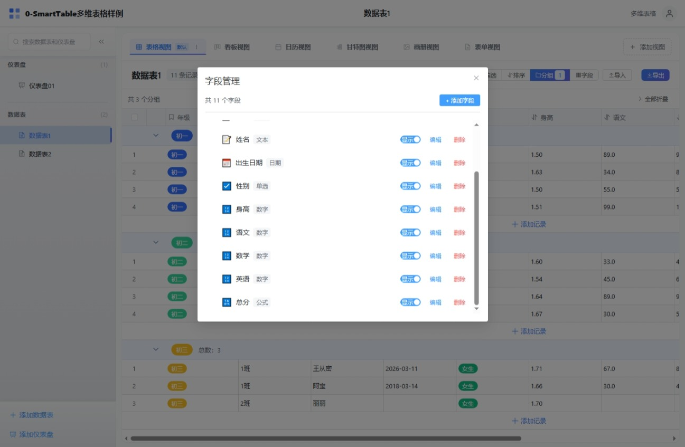
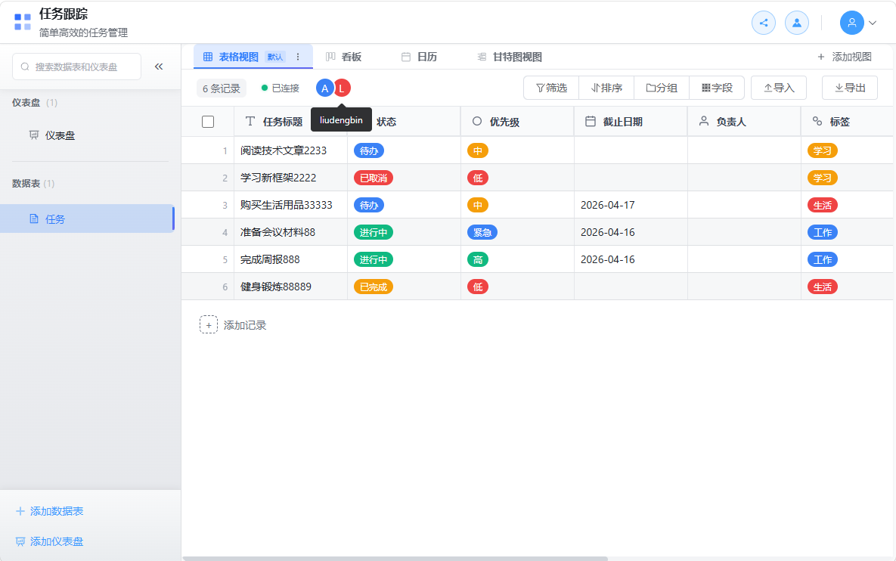

# Smart Table

中文 | [English](README.en.md)

一个基于 Vue 3 + TypeScript + Pinia 的智能多维表格系统，支持纯前端（IndexedDB）和后端（PostgreSQL/SQLite）两种部署模式，类似于 Airtable 或飞书多维表格。

## ✨ 功能特性

### 🎯 核心功能

- **多维表格管理** - 创建、编辑、删除、收藏多维表格，支持成员管理和分享协作
- **数据表管理** - 支持多个数据表，拖拽排序、重命名、删除、复制
- **字段管理** - 支持 **26 种字段类型**，包含字段配置、排序、显示隐藏、默认值设置
- **记录管理** - 增删改查、批量操作、记录详情抽屉、变更历史追踪
- **视图管理** - **6 种视图类型**，支持筛选、排序、分组、视图切换、列冻结

### 📝 支持的字段类型（26 种）

| 类别 | 字段类型 | 说明 | 状态 |
| ---- | ---- | ---- | -- |
| **文本类型** | 单行文本 | 短文本输入，支持验证规则 | ✅ |
| **文本类型** | 多行文本 | 长文本输入，支持多行编辑 | ✅ |
| **文本类型** | 富文本 | HTML富文本编辑器，支持格式化 | ✅ |
| **数值类型** | 数字 | 整数/小数，支持格式化（数字/货币/百分比） | ✅ |
| **日期类型** | 日期 | 日期选择器，支持多种日期格式 | ✅ |
| **日期类型** | 日期时间 | 日期时间选择器，精确到秒 | ✅ |
| **选择类型** | 单选 | 下拉单选，支持自定义选项和颜色 | ✅ |
| **选择类型** | 多选 | 标签式多选，支持自定义选项 | ✅ |
| **选择类型** | 复选框 | 布尔值开关 | ✅ |
| **人员类型** | 成员 | 用户选择，支持当前用户默认值 | ✅ |
| **联系方式** | 电话 | 电话号码输入和格式化显示 | ✅ |
| **联系方式** | 邮箱 | 邮箱地址输入和验证 | ✅ |
| **联系方式** | 链接 (URL) | URL链接，支持点击跳转 | ✅ |
| **媒体类型** | 附件 | 文件上传下载，支持图片预览和缩略图 | ✅ |
| **计算类型** | 公式 | 43个内置函数，支持字段引用和嵌套计算 | ✅ |
| **关联类型** | 关联 (Link) | 表间关联，支持一对一/一对多/多对多关系 | ✅ |
| **查找类型** | 查找 (Lookup) | 跨表查询，支持聚合计算（求和/平均值/计数等） | ✅ |
| **系统类型** | 创建人 | 自动记录记录创建者 | ✅ |
| **系统类型** | 创建时间 | 自动记录创建时间戳 | ✅ |
| **系统类型** | 更新人 | 自动记录最后修改者 | ✅ |
| **系统类型** | 更新时间 | 自动记录最后修改时间 | ✅ |
| **系统类型** | 自动编号 | 自增编号，支持前缀/后缀/日期格式/补零 | ✅ |
| **其他** | 评分 | 星级评分组件 | ✅ |
| **其他** | 进度 | 进度条/百分比显示 | ✅ |

### 🎨 支持的视图类型（6 种）

| 视图类型 | 功能描述 | 状态 |
| ---- | ---- | -- |
| **表格视图** | 经典表格展示，支持虚拟滚动、列冻结、字段筛选 | ✅ |
| **看板视图** | 卡片式展示，支持拖拽排序和分组 | ✅ |
| **日历视图** | 时间维度展示，按日期分组显示 | ✅ |
| **甘特图视图** | 项目进度时间线展示，支持任务依赖 | ✅ |
| **表单视图** | 数据收集表单，支持公开分享和自定义配置 | ✅ |
| **画廊视图** | 图片卡片网格展示，适合媒体内容 | ✅ |

### 🚀 高级功能

#### 数据处理
- **数据筛选** - 多条件组合筛选，支持 AND/OR 逻辑，20+ 种操作符
- **数据排序** - 多字段排序，支持升序/降序，拖拽调整优先级
- **数据分组** - 按字段分组展示，支持多级分组（最多 3 级）、分组统计
- **公式引擎** - **43 个内置函数**，支持数学、文本、日期、逻辑、统计计算
- **数据导入** - 支持 Excel、CSV、JSON 格式，支持多 Sheet，可导入创建新表
- **数据导出** - 支持 Excel、CSV、JSON 格式，自定义导出字段

#### 协作与分享
- **Base 分享** - 多维表级别分享，支持链接分享和权限控制
- **表单分享** - 表单视图公开分享，支持配置提交选项
- **仪表盘分享** - 仪表盘公开分享，支持实时数据展示
- **成员管理** - Base 级别成员列表、添加成员、角色分配
- **实时协作** - 基于 WebSocket 的多人实时协作（可选启用）
  - 在线状态显示
  - 视图同步（滚动位置、视图切换）
  - 单元格锁定（防止冲突编辑）
  - 冲突检测与解决（基于乐观锁）
  - 离线队列（断线自动缓存，重连自动重放）
  - 优雅降级（实时不可用时自动切换为普通模式）

#### 权限与安全
- **用户认证** - JWT Token 认证，支持刷新 Token、邮箱验证、密码重置
- **角色权限** - 基于角色的访问控制（RBAC）
  - 所有者（Owner）- 完全控制权限
  - 管理员（Admin）- 管理权限（除删除外）
  - 编辑者（Editor）- 编辑权限
  - 评论者（Commenter）- 评论和查看权限
  - 查看者（Viewer）- 只读权限
- **安全防护** - XSS 防护、CSRF 保护、安全响应头、API 速率限制、文件上传安全验证
- **操作日志** - 完整的操作审计日志

#### 用户体验
- **拖拽排序** - 表格、字段、视图、看板卡片拖拽排序
- **收藏功能** - 快速访问常用的表格和仪表盘
- **搜索功能** - 快速搜索表格名称和记录内容
- **Element Plus 图标** - 统一的图标系统，提升视觉一致性
- **快捷键支持** - 常用操作的键盘快捷键

#### 仪表盘系统
- **多种图表组件** - 数字卡片、时钟组件、日期组件、KPI 卡片、跑马灯、实时图表等
- **仪表盘模板** - 支持保存和复用仪表盘配置模板
- **网格布局** - 灵活的网格布局系统，支持自定义行列配置
- **实时数据** - 支持实时数据更新和动态图表
- **分享功能** - 仪表盘公开分享，支持嵌入外部网站

#### 邮件系统（可选）
- **SMTP 配置** - 支持自定义 SMTP 服务器
- **邮件模板** - 可自定义邮件模板（注册验证、密码重置等）
- **邮件队列** - 异步邮件发送队列，支持重试机制
- **邮件日志** - 完整的邮件发送日志和统计
- **管理员面板** - 邮件配置管理和监控界面

## 📸 功能预览

| 功能 | 预览图 | 功能 | 预览图 |
| ---- | ---- | ---- | ---- |
| 登录 |  | 注册 |  |
| 首页 |  | 全部首页 |  |
| 表格视图 |  | 分组表格 |  |
| 表格字段 |  | 看板视图 |  |
| 日历视图 |  | 甘特图视图 |  |
| 表单视图 |  | 仪表盘 |  |
| 分享功能 |  | - | - |

## 🛠️ 技术栈

### 前端技术栈

| 类别 | 技术 | 版本 | 说明 |
| ---- | ---- | ---- | ---- |
| 前端框架 | Vue 3 | ^3.5.30 | Composition API |
| 语言 | TypeScript | ~5.9.3 | 类型安全 |
| 状态管理 | Pinia | ^2.3.1 | 轻量级状态管理 |
| 路由 | Vue Router | ^4.6.4 | SPA 路由 |
| UI 组件库 | Element Plus | ^2.13.6 | 企业级 UI 组件 |
| 表格组件 | vxe-table | ^4.18.7 | 高性能虚拟滚动表格 |
| 图表库 | echarts + vue-echarts | ^5.6.0 / ^6.7.3 | 数据可视化 |
| 日期处理 | dayjs | ^1.11.20 | 轻量级日期库 |
| 拖拽排序 | sortablejs | ^1.15.7 | 拖拽功能 |
| HTTP 客户端 | axios | ^1.14.0 | HTTP 请求 |
| 本地数据库 | Dexie | ^3.2.7 | IndexedDB 封装 |
| WebSocket | socket.io-client | ^4.8.3 | 实时通信 |
| 工具库 | lodash-es, @vueuse/core | - | 工具函数集 |
| 富文本 | dompurify | ^3.4.0 | XSS 防护 |
| 电子表格 | xlsx | ^0.18.5 | Excel 解析生成 |
| 构建工具 | Vite | ^8.0.1 | 极速构建工具 |
| 测试框架 | Vitest | ^3.2.4 | 单元测试 |

### 后端技术栈（可选）

| 类别 | 技术 | 版本 | 说明 |
| ---- | ---- | ---- | ---- |
| 框架 | Flask | 3.0.0 | Python Web 框架 |
| 数据库 | SQLite (默认) / PostgreSQL | 3.x / 16+ | 关系型数据库 |
| ORM | SQLAlchemy | 2.0.23 | Python ORM |
| 数据库迁移 | Alembic (Flask-Migrate) | 4.0.5 | 数据库版本管理 |
| 认证 | JWT (Flask-JWT-Extended) | 4.6.0 | Token 认证 |
| 密码加密 | Flask-Bcrypt, bcrypt | 1.0.1 / 4.1.2 | 密码哈希 |
| 表单验证 | Flask-WTF | 1.2.1 | CSRF 保护 |
| CORS | Flask-CORS | 4.0.0 | 跨域支持 |
| 缓存 | Flask-Caching (+ Redis 可选) | 2.1.0 | 缓存加速 |
| WebSocket | Flask-SocketIO | 5.3.6 | 实时通信 |
| 异步支持 | eventlet | 0.36.1 | 异步处理 |
| 数据序列化 | marshmallow | 3.20.1 | 数据验证序列化 |
| 导入导出 | pandas, openpyxl, xlrd | 2.1.4 / 3.1.2 / 2.0.1 | 数据处理 |
| 图片处理 | Pillow | 10.4.0 | 图片缩略图 |
| 对象存储 | MinIO (可选) | - | 文件对象存储 |
| 加密 | cryptography | 42.0.5 | 加密算法 |
| API 文档 | Flasgger | 0.9.7b2 | Swagger UI |
| WSGI 服务器 | Gunicorn | 21.2.0 | 生产服务器 |
| 部署 | Docker, Nginx | - | 容器化部署 |

### 数据存储方案

| 模式 | 技术 | 说明 |
| ---- | ---- | ---- |
| **纯前端模式** | Dexie (IndexedDB) | 数据存储在浏览器本地，无需服务端，适合个人使用或离线场景 |
| **后端模式** | SQLite + Flask | 默认使用 SQLite，轻量级无需额外安装数据库 |
| **生产模式** | PostgreSQL + Flask | 支持 PostgreSQL，适合多用户并发和生产环境 |

## 🚀 快速开始

### 环境要求

- Node.js >= 18
- npm >= 9
- Python >= 3.9 （仅后端模式需要）

### 一键启动（推荐）

使用项目根目录的启动脚本：

```bash
# Windows PowerShell
.\start.ps1

# Linux/macOS
./start.sh
```

脚本会自动：
1. 安装前端依赖并启动开发服务器（端口 5173）
2. 安装后端依赖并启动 Flask 服务器（端口 5000）
3. 打开浏览器访问 http://localhost:5173

### 前端开发

#### 安装依赖

```bash
cd smart-table
npm install
```

#### 开发模式

```bash
npm run dev
```

访问 http://localhost:5173

#### 构建生产版本

```bash
npm run build
```

#### 预览生产版本

```bash
npm run preview
```

#### 运行测试

```bash
# 运行所有测试
npm run test

# 监听模式运行测试（开发时使用）
npm run test:watch

# 生成测试覆盖率报告
npm run test:coverage
```

### 后端服务（可选）

#### 使用 Docker Compose（推荐）

```bash
cd smarttable-backend

# 复制环境变量配置文件
cp .env.example .env
# 编辑 .env 文件配置数据库连接等（默认使用 SQLite）

# 启动所有服务（SQLite 模式）
docker-compose up -d

# 或使用 PostgreSQL + Redis（适合生产环境）
docker-compose -f docker-compose.dev.yml up -d

# 执行数据库迁移
docker-compose exec backend flask db upgrade

# 查看日志
docker-compose logs -f backend

# 访问 API 文档
# http://localhost:5000/api/docs  (Swagger UI)
# http://localhost:5000/api/apidoc  (ReDoc)
```

#### 本地开发

```bash
cd smarttable-backend

# 创建虚拟环境
python -m venv venv

# 激活虚拟环境
# Windows:
venv\Scripts\activate
# Linux/macOS:
source venv/bin/activate

# 安装依赖
pip install -r requirements.txt

# 复制环境变量配置文件
cp .env.example .env
# 默认使用 SQLite，无需修改 DATABASE_URL

# 初始化数据库
flask db upgrade

# 启动开发服务器（默认不启用实时协作）
flask run --reload

# 或使用 run.py 启动（支持更多选项）
python run.py

# 启用实时协作功能
python run.py --enable-realtime
# 或使用短参数
python run.py -r
```

#### 后端特性

✅ **默认数据库**: SQLite（轻量级，无需额外安装）  
✅ **可选数据库**: PostgreSQL（通过环境变量 `DATABASE_URL` 配置）  
✅ **认证系统**: JWT Token 认证，支持刷新 Token、邮箱验证  
✅ **权限管理**: 基于角色的权限控制（RBAC）  
✅ **数据迁移**: Alembic 数据库迁移工具  
✅ **API 文档**: 完整的 Swagger/OpenAPI 文档（Flasgger）  
✅ **实时协作**: 可选的 WebSocket 实时协作功能（通过 `--enable-realtime` 启用）  
✅ **邮件系统**: 可选的 SMTP 邮件发送功能  
✅ **对象存储**: 可选的 MinIO 文件存储  
✅ **安全防护**: XSS 防护、速率限制、安全响应头  

## 📁 项目结构

### 前端项目结构

```
smart-table/
├── src/
│   ├── assets/                    # 静态资源
│   │   └── styles/               # SCSS 样式文件（全局样式、变量、混入）
│   ├── components/                # Vue 组件
│   │   ├── common/               # 通用组件
│   │   │   ├── AppHeader.vue     # 应用头部（导航、用户信息、协作状态）
│   │   │   ├── AppSidebar.vue    # 应用侧边栏
│   │   │   ├── Toast.vue         # 消息提示
│   │   │   ├── Loading.vue       # 加载状态
│   │   │   └── ...
│   │   ├── collaboration/        # 协作组件
│   │   │   ├── OnlineUsers.vue           # 在线用户列表
│   │   │   ├── CellEditingIndicator.vue  # 单元格编辑指示器
│   │   │   ├── ConflictDialog.vue        # 冲突解决对话框
│   │   │   ├── ConnectionStatusBar.vue   # 连接状态栏
│   │   │   └── CollaborationToast.vue    # 协作提示消息
│   │   ├── dialogs/              # 对话框组件
│   │   │   ├── FieldDialog.vue          # 字段配置对话框
│   │   │   ├── FilterDialog.vue         # 筛选对话框
│   │   │   ├── SortDialog.vue           # 排序对话框
│   │   │   ├── GroupDialog.vue          # 分组对话框
│   │   │   ├── ImportDialog.vue         # 导入对话框
│   │   │   ├── ExportDialog.vue         # 导出对话框
│   │   │   ├── RecordDetailDrawer.vue   # 记录详情抽屉
│   │   │   ├── RecordHistoryDrawer.vue  # 变更历史抽屉
│   │   │   ├── ExcelImportCreateDialog.vue  # Excel导入创建表
│   │   │   └── ...
│   │   ├── fields/               # 26 种字段类型组件
│   │   │   ├── SingleLineTextField.vue   # 单行文本
│   │   │   ├── LongTextField.vue         # 多行文本
│   │   │   ├── RichTextField.vue         # 富文本
│   │   │   ├── NumberField.vue           # 数字
│   │   │   ├── DateField.vue             # 日期
│   │   │   ├── DateTimeField.vue         # 日期时间 ⭐
│   │   │   ├── SingleSelectField.vue     # 单选
│   │   │   ├── MultiSelectField.vue      # 多选
│   │   │   ├── CheckboxField.vue         # 复选框
│   │   │   ├── MemberField.vue           # 成员
│   │   │   ├── PhoneField.vue            # 电话
│   │   │   ├── EmailField.vue            # 邮箱
│   │   │   ├── URLField.vue              # URL链接
│   │   │   ├── AttachmentField.vue       # 附件
│   │   │   ├── FormulaField.vue          # 公式
│   │   │   ├── LinkField.vue             # 关联
│   │   │   ├── LookupField.vue           # 查找
│   │   │   ├── CreatedByField.vue        # 创建人
│   │   │   ├── CreatedTimeField.vue      # 创建时间
│   │   │   ├── UpdatedByField.vue        # 更新人
│   │   │   ├── UpdatedTimeField.vue      # 更新时间
│   │   │   ├── AutoNumberField.vue       # 自动编号 ⭐
│   │   │   ├── RatingField.vue           # 评分
│   │   │   ├── ProgressField.vue         # 进度
│   │   │   ├── FieldComponentFactory.vue # 字段工厂
│   │   │   └── FieldConfigPanel.vue      # 字段配置面板
│   │   ├── filters/              # 筛选功能组件
│   │   │   ├── FilterPanel.vue           # 筛选面板
│   │   │   ├── FilterCondition.vue       # 筛选条件
│   │   │   └── FilterValueInput.vue      # 筛选值输入
│   │   ├── groups/               # 分组功能组件
│   │   │   ├── GroupPanel.vue            # 分组面板
│   │   │   └── GroupedTableView.vue      # 分组表格视图
│   │   ├── sorts/                # 排序功能组件
│   │   │   └── SortPanel.vue            # 排序面板
│   │   ├── views/                # 6 种视图组件
│   │   │   ├── TableView/                # 表格视图
│   │   │   │   ├── TableView.vue         # 主视图
│   │   │   │   ├── TableHeader.vue       # 表头
│   │   │   │   ├── TableRow.vue          # 行组件
│   │   │   │   └── TableCell.vue         # 单元格
│   │   │   ├── KanbanView/               # 看板视图
│   │   │   │   ├── KanbanView.vue        # 主视图
│   │   │   │   ├── KanbanColumn.vue      # 看板列
│   │   │   │   └── KanbanCard.vue        # 看板卡片
│   │   │   ├── CalendarView/             # 日历视图
│   │   │   ├── GanttView/                # 甘特图视图
│   │   │   ├── FormView/                 # 表单视图
│   │   │   │   ├── FormView.vue          # 主视图
│   │   │   │   ├── FormViewConfig.vue    # 表单配置
│   │   │   │   └── FormShareDialog.vue   # 表单分享
│   │   │   ├── GalleryView/              # 画廊视图
│   │   │   └── ViewSwitcher.vue          # 视图切换器
│   │   ├── dashboard/            # 仪表盘组件
│   │   │   ├── KpiWidget.vue             # KPI卡片
│   │   │   ├── ClockWidget.vue           # 时钟组件
│   │   │   ├── DateWidget.vue            # 日期组件
│   │   │   ├── RealtimeChartWidget.vue   # 实时图表
│   │   │   ├── MarqueeWidget.vue         # 跑马灯
│   │   │   └── index.ts
│   │   ├── auth/                 # 认证组件
│   │   │   ├── LoginForm.vue             # 登录表单
│   │   │   └── RegisterForm.vue          # 注册表单
│   │   └── base/                 # Base 组件
│   │       ├── MemberList.vue            # 成员列表
│   │       └── AddMemberDialog.vue       # 添加成员对话框
│   ├── composables/                # 组合式函数
│   │   ├── useEntityOperations.ts        # 实体操作（CRUD）
│   │   └── useRealtimeCollaboration.ts   # 实时协作
│   ├── db/                         # 数据库层（IndexedDB）
│   │   ├── services/               # 数据服务
│   │   │   ├── baseService.ts             # Base 服务
│   │   │   ├── tableService.ts            # 表格服务
│   │   │   ├── fieldService.ts            # 字段服务
│   │   │   ├── recordService.ts           # 记录服务
│   │   │   ├── viewService.ts             # 视图服务
│   │   │   ├── dashboardService.ts        # 仪表盘服务
│   │   │   ├── attachmentService.ts       # 附件服务
│   │   │   ├── templateService.ts         # 模板服务
│   │   │   └── dashboardShareService.ts   # 仪表盘分享服务
│   │   ├── schema.ts               # Dexie 数据库定义
│   │   └── __tests__/              # 测试文件
│   ├── layouts/                    # 布局组件
│   │   ├── MainLayout.vue          # 主布局
│   │   └── BlankLayout.vue         # 空白布局
│   ├── router/                     # Vue Router 配置
│   │   ├── index.ts                # 路由定义
│   │   └── guards.ts               # 路由守卫
│   ├── services/api/               # API 服务层
│   │   ├── authService.ts          # 认证 API
│   │   ├── authApiService.ts       # 认证 API 服务
│   │   ├── baseApiService.ts       # Base API
│   │   ├── tableApiService.ts      # 表格 API
│   │   ├── fieldApiService.ts      # 字段 API
│   │   ├── recordApiService.ts     # 记录 API
│   │   ├── viewApiService.ts       # 视图 API
│   │   ├── dashboardApiService.ts  # 仪表盘 API
│   │   ├── attachmentApiService.ts # 附件 API
│   │   ├── shareApiService.ts      # 分享 API
│   │   ├── importExportApiService.ts # 导入导出 API
│   │   ├── adminApiService.ts      # 管理 API
│   │   ├── emailApiService.ts      # 邮件 API
│   │   └── linkApiService.ts       # 关联 API
│   ├── services/realtime/          # 实时协作服务层
│   │   ├── socketClient.ts         # Socket.IO 客户端
│   │   ├── eventTypes.ts           # 事件类型定义
│   │   └── eventEmitter.ts         # 事件总线
│   ├── stores/                     # Pinia 状态管理
│   │   ├── authStore.ts            # 认证状态
│   │   ├── auth/authStore.ts       # 认证状态（新版）
│   │   ├── baseStore.ts            # Base 状态
│   │   ├── tableStore.ts           # 表格状态
│   │   ├── viewStore.ts            # 视图状态
│   │   ├── collaborationStore.ts   # 协作状态
│   │   ├── adminStore.ts           # 管理状态
│   │   ├── settingsStore.ts        # 设置状态
│   │   ├── loadingStore.ts         # 加载状态
│   │   ├── userCacheStore.ts       # 用户缓存
│   │   ├── keyboardShortcuts.ts    # 快捷键配置
│   │   └── theme.ts                # 主题配置
│   ├── types/                      # TypeScript 类型定义
│   │   ├── fields.ts               # 字段类型定义
│   │   ├── views.ts                # 视图类型定义
│   │   ├── filters.ts              # 筛选类型定义
│   │   ├── attachment.ts           # 附件类型定义
│   │   └── link.ts                 # 关联类型定义
│   ├── utils/                      # 工具函数
│   │   ├── formula/                # 公式引擎
│   │   │   ├── engine.ts           # 公式解析引擎
│   │   │   ├── functions.ts        # 43 个内置函数
│   │   │   └── index.ts
│   │   ├── export/                 # 导出功能
│   │   ├── attachment/             # 附件工具
│   │   │   ├── validators.ts       # 验证器
│   │   │   ├── thumbnail.ts        # 缩略图生成
│   │   │   └── errors.ts           # 错误处理
│   │   ├── filter.ts               # 筛选逻辑
│   │   ├── sort.ts                 # 排序逻辑
│   │   ├── group.ts                # 分组逻辑
│   │   ├── validation.ts           # 数据验证
│   │   ├── importExport.ts         # 导入导出逻辑
│   │   ├── cache.ts                # 缓存工具
│   │   ├── debounce.ts             # 防抖函数
│   │   ├── helpers.ts              # 通用辅助函数
│   │   ├── history.ts              # 历史记录
│   │   ├── id.ts                   # ID 生成
│   │   ├── logger.ts               # 日志工具
│   │   ├── message.ts              # 消息工具
│   │   ├── performance.ts          # 性能优化
│   │   ├── sanitize.ts             # HTML 消毒
│   │   ├── tableTemplates.ts       # 表格模板
│   │   ├── templateGenerator.ts    # 模板生成器
│   │   ├── recordValueSerializer.ts # 记录值序列化
│   │   ├── viewConfigSerializer.ts # 视图配置序列化
│   │   ├── dashboardDataProcessor.ts # 仪表盘数据处理
│   │   ├── dashboardLayoutEngine.ts  # 仪表盘布局引擎
│   │   └── dashboardWidgetRegistry.ts # 仪表盘组件注册
│   ├── views/                      # 页面视图
│   │   ├── Home.vue                # 首页
│   │   ├── Base.vue                 # Base 主页面
│   │   ├── Dashboard.vue            # 仪表盘页面
│   │   ├── DashboardShare.vue       # 仪表盘分享页
│   │   ├── FormShare.vue            # 表单分享页
│   │   ├── BaseShare.vue            # Base 分享页
│   │   ├── Settings.vue             # 设置页面
│   │   ├── auth/                   # 认证页面
│   │   │   ├── Login.vue           # 登录
│   │   │   ├── Register.vue        # 注册
│   │   │   ├── ForgotPassword.vue  # 忘记密码
│   │   │   ├── ResetPassword.vue   # 重置密码
│   │   │   └── VerifyEmail.vue     # 邮箱验证
│   │   ├── admin/                  # 管理后台
│   │   │   ├── UserManagement.vue  # 用户管理
│   │   │   ├── SystemSettings.vue  # 系统设置
│   │   │   ├── EmailTemplates.vue  # 邮件模板
│   │   │   ├── EmailLogs.vue       # 邮件日志
│   │   │   ├── EmailStats.vue      # 邮件统计
│   │   │   └── OperationLogs.vue   # 操作日志
│   │   └── base/                   # Base 相关
│   │       └── MemberManagement.vue # 成员管理
│   ├── App.vue                     # 根组件
│   ├── main.ts                     # 入口文件
│   ├── style.css                   # 全局样式
│   ├── auto-imports.d.ts           # 自动导入类型
│   └── components.d.ts             # 组件类型
├── tests/                          # 测试目录
├── package.json
├── vite.config.ts                  # Vite 配置
├── tsconfig.json                   # TypeScript 配置
├── vitest.config.ts                # Vitest 配置
└── README.md
```

### 后端项目结构

```
smarttable-backend/
├── app/
│   ├── __init__.py                 # 应用工厂
│   ├── config.py                   # 配置文件
│   ├── extensions.py               # 扩展初始化
│   ├── db_types.py                 # 数据库类型定义
│   ├── models/                     # 数据模型
│   │   ├── user.py                 # 用户模型
│   │   ├── base.py                 # Base 模型
│   │   ├── table.py                # 表格模型
│   │   ├── field.py                # 字段模型
│   │   ├── record.py               # 记录模型
│   │   ├── view.py                 # 视图模型
│   │   ├── dashboard.py            # 仪表盘模型
│   │   ├── dashboard_share.py      # 仪表盘分享模型
│   │   ├── attachment.py           # 附件模型
│   │   ├── base_share.py           # Base 分享模型
│   │   ├── form_share.py           # 表单分享模型
│   │   ├── form_submission.py      # 表单提交模型
│   │   ├── link_relation.py        # 关联关系模型
│   │   ├── collaboration_session.py # 协作会话模型
│   │   ├── email_log.py            # 邮件日志模型
│   │   ├── email_template.py       # 邮件模板模型
│   │   ├── operation_history.py    # 操作历史模型
│   │   ├── log.py                  # 日志模型
│   │   └── config.py               # 配置模型
│   ├── services/                   # 业务逻辑层
│   │   ├── auth_service.py         # 认证服务
│   │   ├── base_service.py         # Base 服务
│   │   ├── table_service.py        # 表格服务
│   │   ├── field_service.py        # 字段服务
│   │   ├── record_service.py       # 记录服务
│   │   ├── view_service.py         # 视图服务
│   │   ├── formula_service.py      # 公式服务
│   │   ├── dashboard_service.py    # 仪表盘服务
│   │   ├── dashboard_share_service.py # 仪表盘分享服务
│   │   ├── attachment_service.py   # 附件服务
│   │   ├── collaboration_service.py # 协作服务
│   │   ├── share_service.py        # 分享服务
│   │   ├── form_share_service.py   # 表单分享服务
│   │   ├── permission_service.py   # 权限服务
│   │   ├── import_export_service.py # 导入导出服务
│   │   ├── link_service.py        # 关联服务
│   │   ├── admin_service.py       # 管理服务
│   │   ├── email_sender_service.py # 邮件发送服务
│   │   ├── email_config_service.py # 邮件配置服务
│   │   ├── email_queue_service.py  # 邮件队列服务
│   │   ├── email_retry_service.py  # 邮件重试服务
│   │   └── email_template_service.py # 邮件模板服务
│   ├── routes/                     # 路由层（RESTful API）
│   │   ├── auth.py                 # 认证路由 (/api/auth/*)
│   │   ├── auth_captcha.py         # 验证码路由 (/api/auth/captcha)
│   │   ├── bases.py                # Base 路由 (/api/bases/*)
│   │   ├── tables.py               # 表格路由 (/api/bases/{base_id}/tables/*)
│   │   ├── fields.py               # 字段路由 (/api/fields/*)
│   │   ├── records.py              # 记录路由 (/api/records/*)
│   │   ├── views.py                # 视图路由 (/api/views/*)
│   │   ├── dashboards.py           # 仪表盘路由 (/api/dashboards/*)
│   │   ├── dashboards_share.py     # 仪表盘分享路由
│   │   ├── attachments.py          # 附件路由 (/api/attachments/*)
│   │   ├── shares.py               # 分享路由 (/api/shares/*)
│   │   ├── form_shares.py          # 表单分享路由 (/api/form-shares/*)
│   │   ├── import_export.py        # 导入导出路由 (/api/import-export/*)
│   │   ├── email.py                # 邮件路由 (/api/email/*)
│   │   ├── admin.py                # 管理路由 (/api/admin/*)
│   │   ├── users.py                # 用户路由 (/api/users/*)
│   │   ├── realtime.py             # 实时协作状态 API (/api/realtime/*)
│   │   └── socketio_events.py      # Socket.IO 事件处理
│   ├── schemas/                    # 数据验证模式
│   │   ├── user_schema.py          # 用户验证
│   │   ├── record_schema.py        # 记录验证
│   │   └── admin_schema.py         # 管理验证
│   ├── utils/                      # 工具模块
│   │   ├── captcha.py              # 验证码生成
│   │   ├── constants.py            # 常量定义
│   │   ├── decorators.py           # 装饰器
│   │   ├── exception_handler.py    # 异常处理
│   │   ├── response.py             # 响应格式化
│   │   ├── validators.py           # 验证器
│   │   └── init_email_templates.py # 初始化邮件模板
│   ├── errors/                     # 错误处理
│   │   └── handlers.py             # 错误处理器
│   ├── middleware/                  # 中间件
│   │   └── security_headers.py     # 安全响应头
│   └── data/                       # 数据文件
│       └── default_email_templates.py # 默认邮件模板
├── migrations/                     # 数据库迁移（Alembic）
│   ├── versions/                   # 迁移版本
│   │   ├── 20250403_0001_initial_migration.py
│   │   ├── 20250405_0002_add_dashboard_is_default.py
│   │   ├── 20250406_0002_add_admin_management_models.py
│   │   ├── 20250406_0003_add_base_sharing.py
│   │   ├── 20250409_0004_add_link_relations.py
│   │   ├── 20250412_0005_add_form_share_tables.py
│   │   ├── 20250414_0006_add_email_tables.py
│   │   ├── 20250414_0007_add_user_email_verification.py
│   │   └── 20250416_0008_add_collaboration_sessions.py
│   ├── env.py                      # 迁移环境
│   └── script.py.mako              # 迁移脚本模板
├── tests/                          # 测试目录
│   ├── conftest.py                 # 测试配置
│   ├── test_auth.py                # 认证测试
│   ├── test_base.py                # Base 测试
│   ├── test_table.py               # 表格测试
│   ├── test_field.py               # 字段测试
│   ├── test_record.py              # 记录测试
│   ├── test_view.py                # 视图测试
│   ├── test_dashboard.py           # 仪表盘测试
│   ├── test_attachment.py          # 附件测试
│   ├── test_formula_service.py     # 公式服务测试
│   ├── test_import_export.py       # 导入导出测试
│   ├── test_auto_number.py         # 自动编号测试
│   ├── test_member_sharing.py      # 成员分享测试
│   ├── test_create_base.py         # 创建 Base 测试
│   ├── test_realtime_enabled.py    # 实时协作测试（启用）
│   ├── test_realtime_disabled.py   # 实时协作测试（禁用）
│   ├── test_logout_all.py          # 登出测试
│   ├── test_validators.py          # 验证器测试
│   ├── test_startup_params.py      # 启动参数测试
│   ├── test_email_integration.py   # 邮件集成测试
│   └── test_email_services.py      # 邮件服务测试
├── requirements.txt                # Python 依赖
├── requirements-dev.txt            # 开发依赖
├── requirements-minimal.txt        # 最小依赖
├── run.py                          # 应用入口
├── init_db.py                      # 数据库初始化
├── init_link_tables.py             # 关联表初始化
├── gunicorn.conf.py                # Gunicorn 配置
├── alembic.ini                     # Alembic 配置
├── Dockerfile                      # Docker 镜像
├── Dockerfile.dev                  # 开发镜像
├── docker-compose.yml              # Docker 编排（SQLite）
├── docker-compose.dev.yml          # Docker 编排（PostgreSQL）
├── .env.example                    # 环境变量示例
└── README.md
```

## 🗄️ 数据模型

### 核心实体关系

```
User (用户)
  ├── owns many Base (多维表格)
  ├── is member of many Base (通过 BaseMember)
  └── has many OperationLog (操作日志)

Base (多维表格)
  ├── has many Table (数据表)
  ├── has many Dashboard (仪表盘)
  ├── has many BaseShare (分享链接)
  ├── has many BaseMember (成员)
  └── has many CollaborationSession (协作会话)

Table (数据表)
  ├── has many Field (字段)
  ├── has many Record (记录)
  ├── has many View (视图)
  ├── has many LinkRelation (关联关系)
  └── belongs to Base

Field (字段)
  ├── has options (字段配置)
  └── belongs to Table

Record (记录)
  ├── has many RecordHistory (变更历史)
  ├── has values for each Field
  └── belongs to Table

View (视图)
  ├── has filter/sort/group configs
  └── belongs to Table
```

### 主要模型说明

#### User（用户）
- 用户认证信息（用户名、邮箱、密码哈希）
- 邮箱验证状态
- 角色权限（普通用户/管理员）
- 头像和个人资料

#### Base（多维表格）
- 多维表格基础单元
- 支持收藏、自定义图标和颜色
- 成员管理和权限控制
- 分享设置（公开/私有/密码保护）

#### Table（数据表）
- 包含字段定义和记录数据
- 支持拖拽排序、收藏
- 关联关系配置

#### Field（字段）
- 定义数据列的类型和属性
- 支持 26 种字段类型
- 丰富的字段选项（验证规则、默认值、格式化等）

#### Record（记录）
- 数据行，存储各字段的值
- 支持增删改查、批量操作
- 完整的变更历史追踪

#### View（视图）
- 数据展示方式（6 种视图类型）
- 独立的筛选、排序、分组配置
- 视图级别字段控制（隐藏、冻结、宽度）

#### CollaborationSession（协作会话）
- 实时协作会话追踪
- 记录用户加入/离开、活跃状态
- 仅在启用实时协作功能时使用

## 🔢 公式引擎

### 公式使用方法

```javascript
// 数学计算
{单价} * {数量}

// 折扣计算
{原价} * (1 - {折扣})

// 条件判断（嵌套 IF）
IF({成绩} >= 90, "优秀", IF({成绩} >= 60, "及格", "不及格"))

// 文本拼接
CONCAT({姓}, {名})

// 日期计算
DATEDIF({开始日期}, {结束日期}, "D")

// 统计计算
SUMIF({部门}, "销售部", {销售额})

// 查找引用
LOOKUP({关联表.相关记录}, {目标字段})
```

### 支持的函数（43 个）

#### 📊 数学函数（11 个）

| 函数 | 说明 | 示例 |
| ---- | ---- | ---- |
| `SUM` | 求和 | `SUM({字段1}, {字段2})` |
| `AVG` | 平均值 | `AVG({分数})` |
| `MAX` | 最大值 | `MAX({年龄})` |
| `MIN` | 最小值 | `MIN({价格})` |
| `ROUND` | 四舍五入 | `ROUND({数值}, 2)` |
| `CEILING` | 向上取整 | `CEILING({数值})` |
| `FLOOR` | 向下取整 | `FLOOR({数值})` |
| `ABS` | 绝对值 | `ABS({差值})` |
| `MOD` | 取余 | `MOD({数值}, 2)` |
| `POWER` | 幂运算 | `POWER({底数}, 2)` |
| `SQRT` | 平方根 | `SQRT({数值})` |

#### 📝 文本函数（10 个）

| 函数 | 说明 | 示例 |
| ---- | ---- | ---- |
| `CONCAT` | 连接文本 | `CONCAT({姓}, {名})` |
| `LEFT` | 左侧截取 | `LEFT({文本}, 3)` |
| `RIGHT` | 右侧截取 | `RIGHT({文本}, 3)` |
| `LEN` | 文本长度 | `LEN({描述})` |
| `UPPER` | 转大写 | `UPPER({文本})` |
| `LOWER` | 转小写 | `LOWER({文本})` |
| `TRIM` | 去除空格 | `TRIM({文本})` |
| `SUBSTITUTE` | 替换文本 | `SUBSTITUTE({文本}, "旧", "新")` |
| `REPLACE` | 替换位置 | `REPLACE({文本}, 1, 3, "新")` |
| `FIND` | 查找位置 | `FIND("子串", {文本})` |

#### 📅 日期函数（10 个）

| 函数 | 说明 | 示例 |
| ---- | ---- | ---- |
| `TODAY` | 今天日期 | `TODAY()` |
| `NOW` | 当前时间 | `NOW()` |
| `YEAR` | 提取年份 | `YEAR({日期})` |
| `MONTH` | 提取月份 | `MONTH({日期})` |
| `DAY` | 提取日期 | `DAY({日期})` |
| `HOUR` | 提取小时 | `HOUR({时间})` |
| `MINUTE` | 提取分钟 | `MINUTE({时间})` |
| `SECOND` | 提取秒数 | `SECOND({时间})` |
| `DATEDIF` | 日期差 | `DATEDIF({开始}, {结束}, "D")` |
| `DATEADD` | 日期加减 | `DATEADD({日期}, 7, "D")` |

#### 🧠 逻辑函数（7 个）

| 函数 | 说明 | 示例 |
| ---- | ---- | ---- |
| `IF` | 条件判断 | `IF({条件}, "真值", "假值")` |
| `AND` | 逻辑与 | `AND({条件1}, {条件2})` |
| `OR` | 逻辑或 | `OR({条件1}, {条件2})` |
| `NOT` | 逻辑非 | `NOT({条件})` |
| `IFERROR` | 错误处理 | `IFERROR({公式}, "默认值")` |
| `IFS` | 多条件判断 | `IFS({条件1}, {值1}, {条件2}, {值2})` |
| `SWITCH` | 多值匹配 | `SWITCH({字段}, "A", 1, "B", 2)` |

#### 📈 统计函数（5 个）

| 函数 | 说明 | 示例 |
| ---- | ---- | ---- |
| `COUNT` | 计数 | `COUNT({字段})` |
| `COUNTA` | 非空计数 | `COUNTA({字段})` |
| `COUNTIF` | 条件计数 | `COUNTIF({字段}, ">100")` |
| `SUMIF` | 条件求和 | `SUMIF({类别}, "A", {金额})` |
| `AVERAGEIF` | 条件平均 | `AVERAGEIF({部门}, "研发", {薪资})` |

## 🌐 RESTful API 接口

### API 基础信息

- **Base URL**: `http://localhost:5000/api`
- **认证方式**: Bearer Token (JWT)
- **数据格式**: JSON
- **API 文档**: 
  - Swagger UI: `http://localhost:5000/api/docs`
  - ReDoc: `http://localhost:5000/api/apidoc`

### 认证接口 (`/api/auth`)

| 方法 | 端点 | 说明 | 认证 |
| ---- | ---- | ---- | ---- |
| POST | `/api/auth/register` | 用户注册 | ❌ |
| POST | `/api/auth/login` | 用户登录 | ❌ |
| POST | `/api/auth/logout` | 登出（注销所有Token） | ✅ |
| POST | `/api/auth/refresh` | 刷新 Token | ✅ |
| GET | `/api/auth/me` | 获取当前用户信息 | ✅ |
| POST | `/api/auth/forgot-password` | 忘记密码 | ❌ |
| POST | `/api/auth/reset-password` | 重置密码 | ❌ |
| GET | `/api/auth/verify-email` | 验证邮箱 | ❌ |
| GET | `/api/auth/captcha` | 获取验证码图片 | ❌ |

### Base 接口 (`/api/bases`)

| 方法 | 端点 | 说明 | 认证 |
| ---- | ---- | ---- | ---- |
| GET | `/api/bases` | 获取 Base 列表 | ✅ |
| POST | `/api/bases` | 创建 Base | ✅ |
| GET | `/api/bases/{base_id}` | 获取 Base 详情 | ✅ |
| PUT | `/api/bases/{base_id}` | 更新 Base | ✅ |
| DELETE | `/api/bases/{base_id}` | 删除 Base | ✅ |
| POST | `/api/bases/{base_id}/star` | 收藏/取消收藏 | ✅ |
| GET | `/api/bases/{base_id}/members` | 获取成员列表 | ✅ |
| POST | `/api/bases/{base_id}/members` | 添加成员 | ✅ |
| PUT | `/api/bases/{base_id}/members/{user_id}` | 更新成员角色 | ✅ |
| DELETE | `/api/bases/{base_id}/members/{user_id}` | 移除成员 | ✅ |
| POST | `/api/bases/{base_id}/share` | 创建分享链接 | ✅ |
| GET | `/api/bases/{base_id}/shares` | 获取分享列表 | ✅ |

### 表格接口 (`/api/bases/{base_id}/tables`)

| 方法 | 端点 | 说明 | 认证 |
| ---- | ---- | ---- | ---- |
| GET | `/api/tables` | 获取表格列表 | ✅ |
| POST | `/api/tables` | 创建表格 | ✅ |
| GET | `/api/tables/{table_id}` | 获取表格详情 | ✅ |
| PUT | `/api/tables/{table_id}` | 更新表格 | ✅ |
| DELETE | `/api/tables/{table_id}` | 删除表格 | ✅ |
| POST | `/api/tables/{table_id}/duplicate` | 复制表格 | ✅ |
| PUT | `/api/tables/{table_id}/sort` | 更新排序 | ✅ |
| POST | `/api/tables/{table_id}/star` | 收藏/取消收藏 | ✅ |

### 字段接口 (`/api/fields`)

| 方法 | 端点 | 说明 | 认证 |
| ---- | ---- | ---- | ---- |
| GET | `/api/fields?table_id={id}` | 获取字段列表 | ✅ |
| POST | `/api/fields` | 创建字段 | ✅ |
| PUT | `/api/fields/{field_id}` | 更新字段 | ✅ |
| DELETE | `/api/fields/{field_id}` | 删除字段 | ✅ |
| PUT | `/api/fields/{field_id}/sort` | 更新字段排序 | ✅ |
| PUT | `/api/fields/batch-sort` | 批量更新排序 | ✅ |

### 记录接口 (`/api/records`)

| 方法 | 端点 | 说明 | 认证 |
| ---- | ---- | ---- | ---- |
| GET | `/api/records?table_id={id}` | 获取记录列表 | ✅ |
| POST | `/api/records` | 创建记录 | ✅ |
| GET | `/api/records/{record_id}` | 获取记录详情 | ✅ |
| PUT | `/api/records/{record_id}` | 更新记录 | ✅ |
| DELETE | `/api/records/{record_id}` | 删除记录 | ✅ |
| POST | `/api/records/batch-delete` | 批量删除 | ✅ |
| GET | `/api/records/{record_id}/history` | 获取变更历史 | ✅ |

### 视图接口 (`/api/views`)

| 方法 | 端点 | 说明 | 认证 |
| ---- | ---- | ---- | ---- |
| GET | `/api/views?table_id={id}` | 获取视图列表 | ✅ |
| POST | `/api/views` | 创建视图 | ✅ |
| PUT | `/api/views/{view_id}` | 更新视图 | ✅ |
| DELETE | `/api/views/{view_id}` | 删除视图 | ✅ |
| PUT | `/api/views/{view_id}/config` | 更新视图配置 | ✅ |

### 仪表盘接口 (`/api/dashboards`)

| 方法 | 端点 | 说明 | 认证 |
| ---- | ---- | ---- | ---- |
| GET | `/api/dashboards` | 获取仪表盘列表 | ✅ |
| POST | `/api/dashboards` | 创建仪表盘 | ✅ |
| GET | `/api/dashboards/{dashboard_id}` | 获取仪表盘详情 | ✅ |
| PUT | `/api/dashboards/{dashboard_id}` | 更新仪表盘 | ✅ |
| DELETE | `/api/dashboards/{dashboard_id}` | 删除仪表盘 | ✅ |
| POST | `/api/dashboards/{dashboard_id}/star` | 收藏/取消收藏 | ✅ |
| POST | `/api/dashboards/{dashboard_id}/share` | 创建分享链接 | ✅ |

### 附件接口 (`/api/attachments`)

| 方法 | 端点 | 说明 | 认证 |
| ---- | ---- | ---- | ---- |
| POST | `/api/attachments/upload` | 上传附件 | ✅ |
| GET | `/api/attachments/{attachment_id}` | 获取附件信息 | ✅ |
| GET | `/api/attachments/{attachment_id}/download` | 下载附件 | ✅ |
| DELETE | `/api/attachments/{attachment_id}` | 删除附件 | ✅ |
| GET | `/api/attachments/{attachment_id}/thumbnail` | 获取缩略图 | ✅ |

### 导入导出接口 (`/api/import-export`)

| 方法 | 端点 | 说明 | 认证 |
| ---- | ---- | ---- | ---- |
| POST | `/api/import-export/import` | 导入数据（Excel/CSV/JSON） | ✅ |
| POST | `/api/import-export/create-table-from-excel` | 从 Excel 创建新表 ⭐ | ✅ |
| GET | `/api/import-export/export` | 导出数据（Excel/CSV/JSON） | ✅ |
| GET | `/api/import-export/templates` | 获取导入模板 | ✅ |

### 分享接口 (`/api/shares`, `/api/form-shares`)

| 方法 | 端点 | 说明 | 认证 |
| ---- | ---- | ---- | ---- |
| GET | `/api/shares/my-shares` | 我的分享 | ✅ |
| GET | `/api/shares/shared-with-me` | 分享给我 | ✅ |
| POST | `/api/form-shares` | 创建表单分享 | ✅ |
| GET | `/api/form-shares/{share_token}` | 获取表单分享信息 | ❌ |
| POST | `/api/form-shares/{share_token}/submit` | 提交表单数据 | ❌ |

### 邮件接口 (`/api/email`) [管理员]

| 方法 | 端点 | 说明 | 认证 |
| ---- | ---- | ---- | ---- |
| GET | `/api/email/config` | 获取邮件配置 | ✅ Admin |
| PUT | `/api/email/config` | 更新邮件配置 | ✅ Admin |
| GET | `/api/email/templates` | 获取邮件模板列表 | ✅ Admin |
| PUT | `/api/email/templates/{template_id}` | 更新邮件模板 | ✅ Admin |
| GET | `/api/email/logs` | 获取邮件日志 | ✅ Admin |
| GET | `/api/email/stats` | 获取邮件统计 | ✅ Admin |
| POST | `/api/email/test` | 发送测试邮件 | ✅ Admin |

### 管理接口 (`/api/admin`) [管理员]

| 方法 | 端点 | 说明 | 认证 |
| ---- | ---- | ---- | ---- |
| GET | `/api/admin/users` | 获取用户列表 | ✅ Admin |
| PUT | `/api/admin/users/{user_id}` | 更新用户 | ✅ Admin |
| DELETE | `/api/admin/users/{user_id}` | 删除用户 | ✅ Admin |
| PUT | `/api/admin/users/{user_id}/reset-password` | 重置密码 | ✅ Admin |
| GET | `/api/admin/settings` | 获取系统设置 | ✅ Admin |
| PUT | `/api/admin/settings` | 更新系统设置 | ✅ Admin |
| GET | `/api/admin/operation-logs` | 获取操作日志 | ✅ Admin |

### 实时协作接口 (`/api/realtime`)

| 方法 | 端点 | 说明 | 认证 |
| ---- | ---- | ---- | ---- |
| GET | `/api/realtime/status` | 查询实时协作服务状态 | ✅ |

> ⚠️ **注意**: 实时协作功能默认关闭，需通过启动参数 `--enable-realtime` 或环境变量 `ENABLE_REALTIME=true` 启用

## ⚡ 实时协作配置

实时协作功能基于 WebSocket (Socket.IO) 实现，支持多人同时编辑同一表格。

### 启动参数

```bash
# 启用实时协作
python run.py --enable-realtime
# 或使用短参数
python run.py -r

# 不启用实时协作（默认行为）
python run.py
```

### 环境变量

```env
# 启用实时协作
ENABLE_REALTIME=true

# SocketIO 消息队列（使用 Redis 时推荐，用于多进程部署）
SOCKETIO_MESSAGE_QUEUE=redis://localhost:6379/1

# SocketIO 心跳配置
SOCKETIO_PING_TIMEOUT=60
SOCKETIO_PING_INTERVAL=25
```

### Docker 部署

在 `docker-compose.yml` 或 `.env` 文件中添加：

```yaml
environment:
  - ENABLE_REALTIME=true
  - SOCKETIO_MESSAGE_QUEUE=redis://redis:6379/1
```

### 功能特性

| 功能 | 说明 |
| ---- | ---- |
| **在线状态** | 显示当前正在编辑同一表格的用户及其光标位置 |
| **视图同步** | 实时同步其他用户的视图切换和滚动位置 |
| **单元格锁定** | 正在编辑的单元格自动锁定，防止多人同时编辑冲突 |
| **冲突检测** | 基于乐观锁的冲突检测机制，返回 409 Conflict 状态码 |
| **离线队列** | 断网时操作自动缓存在本地，重新连接后自动按顺序重放 |
| **优雅降级** | 当 WebSocket 连接不可用时，自动降级为普通的 HTTP 轮询模式 |

### Socket.IO 事件

| 事件类别 | 事件名称 | 说明 |
| ---- | ---- | ---- |
| **房间管理** | `room:join` / `room:leave` | 加入/离开协作房间 |
| **在线状态** | `presence:view_changed` | 视图切换通知 |
| | `presence:cell_selected` | 单元格选中通知 |
| | `presence:user_joined` | 用户加入通知 |
| | `presence:user_left` | 用户离开通知 |
| **单元格锁定** | `lock:acquire` / `lock:release` | 获取/释放单元格锁 |
| | `lock:acquired` / `lock:released` | 锁定/解锁广播通知 |
| **数据同步** | `data:record_updated` | 记录更新推送 |
| | `data:record_created` | 记录创建推送 |
| | `data:record_deleted` | 记录删除推送 |
| | `data:field_updated` | 字段更新推送 |
| | `data:view_updated` | 视图更新推送 |
| | `data:table_updated` | 表格更新推送 |
| | `data:table_created` | 表格创建推送 |
| | `data:table_deleted` | 表格删除推送 |

## 🐳 Docker 部署

### 快速部署（一键启动）

```bash
# 克隆项目
git clone <repository-url>
cd smart-table-spec

# 复制环境变量配置
cp .env.example .env
# 编辑 .env 文件，根据实际情况修改配置

# 一键启动所有服务（前端 + 后端 + 数据库）
docker-compose up -d

# 查看服务状态
docker-compose ps

# 查看日志
docker-compose logs -f
```

访问地址：
- 前端应用: http://localhost
- 后端 API: http://localhost:5000/api
- API 文档: http://localhost:5000/api/docs

### 生产环境部署（PostgreSQL + Redis）

```bash
# 使用生产环境配置
docker-compose -f docker-compose.full.yml up -d

# 或分别启动
docker-compose -f docker-compose.dev.yml up -d
```

### Docker Compose 服务架构

```
smart-table-spec/
├── docker-compose.yml              # 开发环境（SQLite）
├── docker-compose.full.yml         # 生产环境（PostgreSQL + Redis + MinIO）
├── docker-compose.dev.yml          # 开发环境（PostgreSQL + Redis）
├── Dockerfile                      # 前端构建 + Nginx
├── smarttable-backend/
│   ├── Dockerfile                  # 后端应用
│   └── docker-compose.yml          # 后端独立编排
└── docker/
    ├── nginx/
    │   └── nginx.conf              # Nginx 配置
    └── supervisor/
        └── supervisord.conf        # 进程管理配置
```

### 环境变量配置说明

详见 [.env.example](.env.example) 和 [smarttable-backend/.env.example](smarttable-backend/.env.example)

关键配置项：

| 变量名 | 说明 | 默认值 | 必填 |
| ---- | ---- | ---- | ---- |
| `SECRET_KEY` | Flask 密钥 | - | ✅ 生产环境 |
| `JWT_SECRET_KEY` | JWT 密钥 | - | ✅ 生产环境 |
| `DATABASE_URL` | 数据库连接 | sqlite:///smarttable.db | ❌ |
| `REDIS_URL` | Redis 地址 | redis://localhost:6379/0 | ❌ |
| `ENABLE_REALTIME` | 启用实时协作 | false | ❌ |
| `MAIL_SERVER` | SMTP 服务器 | - | ❌（邮件功能需要） |
| `MINIO_ENDPOINT` | MinIO 地址 | - | ❌（对象存储需要） |

## 🌍 浏览器支持

| 浏览器 | 最低版本 |
| ---- | ---- |
| Chrome | >= 90 |
| Firefox | >= 88 |
| Safari | >= 14 |
| Edge | >= 90 |

> 💡 **提示**: 推荐使用最新版本的 Chrome 或 Edge 以获得最佳体验

## 📋 开发计划 & 版本历史

### v1.2.0 - 最新版本（开发中）

#### 最近 10 天重要更新（2026-04-16 ~ 2026-04-26）

##### ✨ 新功能

- **⭐ 日期时间字段** - 新增 DateTimeField，支持日期和时间组合选择
- **⭐ 文本字段重构** - 将原"文本"字段拆分为三种独立类型：
  - 单行文本 (SingleLineText) - 短文本输入
  - 多行文本 (LongText) - 长文本/段落输入
  - 富文本 (RichText) - HTML 格式化文本编辑器
- **⭐ 自动编号字段** - 新增 AutoNumberField，支持：
  - 自定义前缀/后缀
  - 日期前缀（YYYYMMDD、YYYYMM 等格式）
  - 自动补零（指定位数）
  - 序列号自增
- **⭐ Excel 导入创建表** - 新增从 Excel 文件直接导入并创建新数据表的功能
- **⭐ API 文档系统** - 集成 Flasgger，提供完整的 Swagger/OpenAPI 文档
  - 所有 API 端点的详细文档
  - Swagger UI 交互式界面 (`/api/docs`)
  - ReDoc 文档界面 (`/api/apidoc`)
- **⭐ Element Plus 图标系统** - 全面替换自定义 SVG 图标为 Element Plus 图标组件
  - 统一的视觉风格
  - 更好的可维护性
- **⭐ 成员选择组件** - 新增 MemberSelect 组件，支持：
  - 用户搜索和选择
  - 当前用户默认值设置
  - FormView 中成员字段自动填充当前用户
- **⭐ 仪表盘模板** - 支持保存仪表盘为模板并复用
- **⭐ 附件功能增强** - 实现后端文件上传与前端代理访问
  - MinIO 对象存储支持
  - 图片缩略图生成
  - 文件类型验证和安全检查

##### 🔧 Bug 修复

- **RecordDetailDrawer** - 保存记录后自动关闭抽屉，改善用户体验
- **RecordHistoryDrawer** - 修复抽屉关闭行为异常问题
- **表格视图** - 修复记录创建时的重复添加问题，强制刷新记录列表
- **AppHeader** - 增强表格和仪表盘状态显示逻辑
- **导入导出** - 优化字段类型处理逻辑，提高兼容性
- **Excel 导入** - 优化导入进度显示和状态管理

##### 🎨 界面优化

- **协作组件重构** - 将协作组件从 Base 页面移动到 AppHeader，全局显示在线状态
- **Base 页面** - 将统计信息从顶部移至底部并优化样式
- **表格视图** - 添加记录按钮并优化操作按钮分组布局
- **侧边栏按钮** - 为所有按钮添加标题提示文本（Tooltip），增强可用性
- **字段图标** - 使用 Element Plus 图标组件统一视觉风格

##### 🔒 安全增强

- **XSS 防护** - 集成 DOMPurify 进行 HTML 内容消毒
- **安全响应头** - 添加安全相关的 HTTP 响应头中间件
- **API 速率限制** - 实现基于 IP 的 API 请求频率限制
- **文件上传安全** - 增强文件上传的安全验证（MIME 类型、扩展名、大小限制）
- **密码重置** - 修复密码重置路由的验证绕过漏洞
- **日志安全** - 实现生产环境的敏感信息脱敏
- **异常处理** - 规范化异常信息的返回，防止信息泄露

##### 📧 邮件系统

- **SMTP 集成** - 完整的 SMTP 邮件发送功能
- **邮件模板** - 可自定义的邮件模板系统
- **邮件队列** - 异步邮件发送队列，支持失败重试
- **邮件日志** - 完整的发送日志记录和统计分析
- **管理员面板** - 邮件配置管理、模板编辑、日志查看界面

##### 🔄 实时协作完善

- **WebSocket 增强** - 改进连接稳定性和错误处理
- **调试日志** - 添加详细的调试日志便于排查问题
- **用户姓名** - 协作功能支持显示用户姓名字段
- **认证增强** - 强化 WebSocket 连接的认证机制

### v1.1.0 - 已发布版本

#### 已实现的核心功能 ✅

##### 数据管理

- [x] 多维表格 CRUD（创建、编辑、删除、收藏、图标、颜色）
- [x] 数据表 CRUD（创建、编辑、删除、复制、拖拽排序、收藏）
- [x] 字段管理（26 种类型，支持配置、排序、显示隐藏、默认值、验证规则）
- [x] 记录管理（增删改查、批量操作、详情抽屉、变更历史）
- [x] 成员管理（Base 级别成员列表、添加成员、角色分配）
- [x] 分享管理（Base 分享、表单分享、仪表盘分享）

##### 视图系统

- [x] 6 种视图支持（表格、看板、日历、甘特图、表单、画廊）
- [x] 视图切换与配置持久化
- [x] 视图级别字段控制（隐藏、冻结、宽度调整）
- [x] 表格视图高级功能（虚拟滚动、列冻结、字段筛选）
- [x] 表单视图分享（支持公开链接、配置提交选项、收集填写人信息）
- [x] 看板视图拖拽排序和分组

##### 数据处理

- [x] 数据筛选（多条件组合，AND/OR 逻辑，20+ 操作符）
- [x] 数据排序（多字段排序，升序/降序，拖拽调整优先级）
- [x] 数据分组（多级分组，最多 3 级，分组统计汇总）
- [x] 公式引擎（43 个内置函数，支持字段引用、嵌套计算、跨表查询）
- [x] 数据导入（Excel/CSV/JSON，支持多 Sheet，可导入创建新表）
- [x] 数据导出（Excel/CSV/JSON，自定义字段选择）

##### 用户体验

- [x] 拖拽排序（表格、字段、视图、看板卡片）
- [x] 收藏功能（表格、仪表盘快速访问）
- [x] 搜索功能（表格名称、记录内容全文搜索）
- [x] Element Plus 图标系统（统一的视觉风格）
- [x] 快捷键支持（常用操作键盘快捷键）
- [ ] 主题切换（明暗主题）🚧 开发中
- [ ] 响应式设计（适配移动端）🚧 开发中

##### 权限与安全

- [x] 用户认证系统（JWT Token、刷新 Token、邮箱验证、密码重置）
- [x] 角色权限（Owner/Admin/Editor/Commenter/Viewer 五级权限）
- [x] 分享权限设置（公开/私有/密码保护、权限级别控制）
- [x] 安全防护（XSS 防护、CSRF 保护、速率限制、安全响应头）
- [x] 操作审计日志（完整的用户操作记录）
- [ ] 字段级权限控制 🚧 开发中

##### 协作功能

- [x] Base 级别分享（链接分享、权限控制）
- [x] 表单视图公开分享（数据收集、提交选项配置）
- [x] 仪表盘公开分享（实时数据展示、嵌入支持）
- [x] 分享菜单（我的分享 / 分享给我）
- [x] 实时协作（WebSocket，在线状态、单元格锁定、冲突解决、离线队列）
- [x] 操作历史记录（记录级别的变更追踪）
- [ ] 评论批注功能 🚧 开发中

##### 仪表盘系统

- [x] 仪表盘基础功能（创建、编辑、删除、复制）
- [x] 多种图表组件（数字卡片、时钟、日期、KPI、跑马灯、实时图表等）
- [x] 仪表盘模板（保存为模板、从模板创建、模板管理）
- [x] 网格布局（灵活的行列配置、组件拖拽调整）
- [x] 实时数据更新（动态数据源、定时刷新）
- [x] 仪表盘分享（公开链接、嵌入代码）

##### 邮件系统（可选）

- [x] SMTP 配置（自定义邮件服务器）
- [x] 邮件模板（注册验证、密码重置等）
- [x] 邮件队列（异步发送、失败重试）
- [x] 邮件日志（发送记录、统计分析）
- [x] 管理员面板（配置管理、模板编辑、日志查看）

### 🚧 待实现功能（Roadmap）

#### 近期计划（v1.3.0）

- [ ] **AI 功能集成**
  - [ ] AI 表单搭建（自然语言描述自动生成业务表格）
  - [ ] AI 辅助填写（智能建议和数据补全）
  - [ ] AI 数据问答（自然语言查询数据分析）
  - [ ] AI 数据可视化（智能推荐图表类型）

- [ ] **流程自动化**
  - [ ] 流程设计器（可视化的业务流程设计）
  - [ ] 自动化工作流（触发器 + 动作 + 条件）
  - [ ] 定时任务（定时执行自动化流程）

- [ ] **插件系统**
  - [ ] 插件市场（第三方插件分发）
  - [ ] 插件 SDK（插件开发工具包）
  - [ ] 脚本扩展（JavaScript/Python 脚本执行）

#### 中期计划（v2.0.0）

- [ ] **开放平台**
  - [ ] REST API 完善（更细粒度的 API 控制）
  - [ ] MCP 接口（Model Context Protocol 集成）
  - [ ] Webhook（事件触发回调）
  - [ ] OAuth 2.0 第三方授权

- [ ] **文档功能**
  - [ ] 文档 CRUD（Wiki 式文档管理）
  - [ ] 富文本编辑器增强（协作编辑、版本对比）
  - [ ] 文档分享与版本管理
  - [ ] 文档与表格联动

- [ ] **移动端适配**
  - [ ] 响应式设计优化
  - [ ] 移动端原生 App（iOS/Android）
  - [ ] 离线模式增强（PWA 支持）

#### 长期愿景

- [ ] **企业版功能**
  - [ ] SSO 单点登录（LDAP/OAuth/SAML）
  - [ ] 数据备份与恢复
  - [ ] 多租户隔离
  - [ ] 合规性报告（GDPR 等）
  - [ ] 审计日志增强（操作回放）

- [ ] **生态建设**
  - [ ] 模板市场（行业解决方案模板）
  - [ ] 集成市场（第三方服务集成）
  - [ ] 开发者社区（API 文档、SDK、示例）
  - [ ] 国际化（i18n 多语言支持）

## 📚 详细文档

- [智能表格用户手册](./doc/Smart-Table-User-Manual.md) - 完整的用户操作指南
- [技术架构设计](./doc/技术架构设计.md) - 系统架构和技术选型说明
- [产品规划文档](./doc/产品规划文档.md) - 产品路线图和功能规划
- [开发任务清单](./doc/开发任务清单.md) - 开发进度跟踪
- [API 文档](./doc/doc-b/API文档.md) - 后端 API 详细文档
- [管理员指南](./doc/doc-b/ADMIN_GUIDE.md) - 系统管理操作手册
- [部署指南](./doc/doc-b/部署指南.md) - 部署和运维指南
- [Docker 部署文档](./doc/docker/DOCKER_DEPLOYMENT.md) - Docker 部署详解
- [安全审计报告](./doc/doc-f/Code-Quality-Security-Audit-Report.md) - 代码安全和质量审计
- [发布说明](./RELEASE_NOTES.md) - 版本更新日志

## 🤝 贡献指南

欢迎提交 Issue 和 Pull Request！

### 开发流程

1. Fork 本仓库
2. 创建特性分支 (`git checkout -b feature/AmazingFeature`)
3. 进行开发和测试
4. 提交更改 (`git commit -m 'feat: Add some AmazingFeature'`)
5. 推送到分支 (`git push origin feature/AmazingFeature`)
6. 创建 Pull Request 并填写详细的描述

### Commit Message 规范

我们使用 [Conventional Commits](https://www.conventionalcommits.org/) 规范：

- `feat`: 新功能
- `fix`: Bug 修复
- `docs`: 文档更新
- `style`: 代码格式调整（不影响功能）
- `refactor`: 代码重构（既不是新功能也不是修复）
- `perf`: 性能优化
- `test`: 测试相关
- `chore`: 构建/工具/辅助工具的变动

### 代码规范

- 前端遵循 ESLint + Prettier 配置
- 后端遵循 PEP 8 规范
- 提交前确保通过所有测试：`npm run test` (前端) / `pytest` (后端)
- 确保 TypeScript 类型检查通过：`vue-tsc --noEmit`

## 📄 许可证

本项目采用 [MIT License](LICENSE) 开源协议。

```
MIT License

Copyright (c) 2026 Smart Table Contributors

Permission is hereby granted, free of charge, to any person obtaining a copy
of this software and associated documentation files (the "Software"), to deal
in the Software without restriction, including without limitation the rights
to use, copy, modify, merge, publish, distribute, sublicense, and/or sell
copies of the Software, and to permit persons to whom the Software is
furnished to do so, subject to the following conditions:

The above copyright notice and this permission notice shall be included in all
copies or substantial portions of the Software.

THE SOFTWARE IS PROVIDED "AS IS", WITHOUT WARRANTY OF ANY KIND, EXPRESS OR
IMPLIED, INCLUDING BUT NOT LIMITED TO THE WARRANTIES OF MERCHANTABILITY,
FITNESS FOR A PARTICULAR PURPOSE AND NONINFRINGEMENT. IN NO EVENT SHALL THE
AUTHORS OR COPYRIGHT HOLDERS BE LIABLE FOR ANY CLAIM, DAMAGES OR OTHER
LIABILITY, WHETHER IN AN ACTION OF CONTRACT, TORT OR OTHERWISE, ARISING FROM,
OUT OF OR IN CONNECTION WITH THE SOFTWARE OR THE USE OR OTHER DEALINGS IN THE
SOFTWARE.
```

---

## 🙏 致谢

感谢所有为本项目做出贡献的开发者和用户！

特别感谢：
- Vue.js 团队提供优秀的前端框架
- Element Plus 团队提供完善的 UI 组件库
- Flask 社区提供灵活的后端框架
- 所有 Issue 提交者和 Pull Request 贡献者

---

## 📞 联系我们

- 📧 Email: [ldengbin@126.com](mailto:ldengbin@126.com)
- 💬 Issues: [GitHub Issues](https://github.com/ldbinac/smart_table/issues)
- 📖 Documentation: [User-Manual](https://github.com/ldbinac/smart_table/blob/main/doc/Smart-Table-User-Manual.md)

---

**⭐ 如果这个项目对你有帮助，请给我们一个 Star！⭐**

**Made with ❤️ by Smart Table Team**
