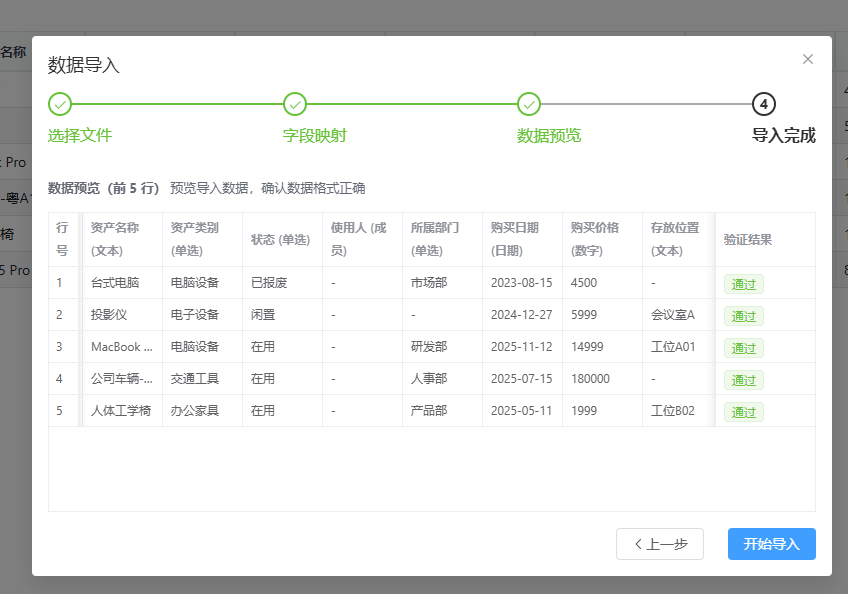
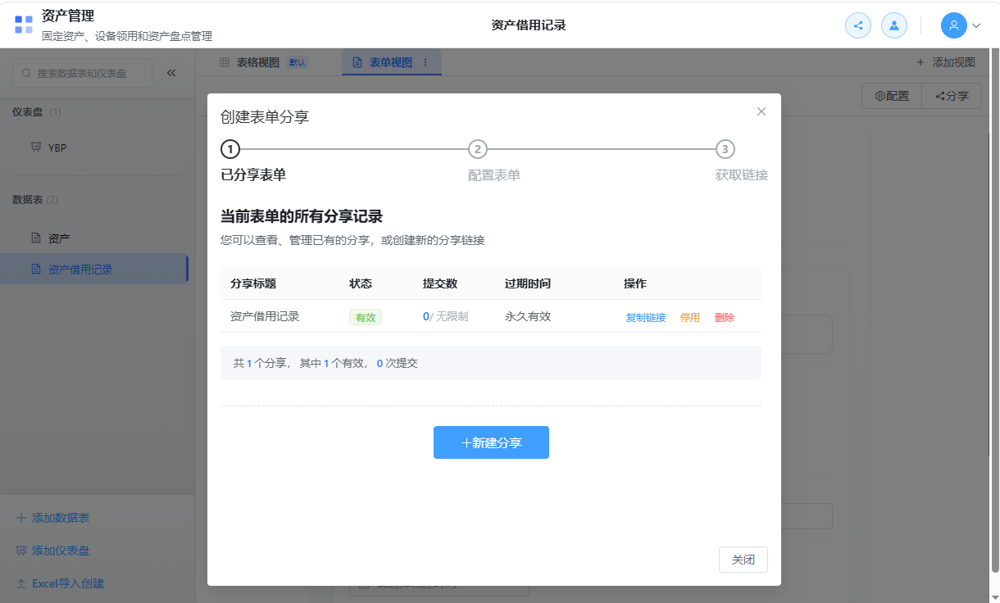
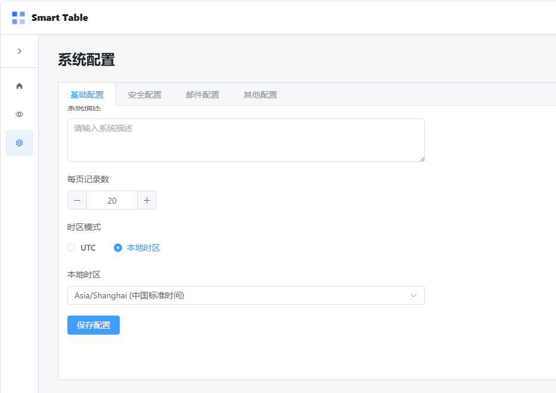
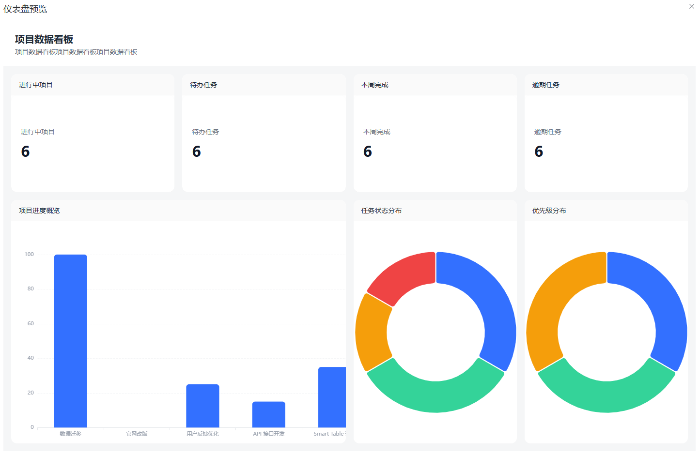
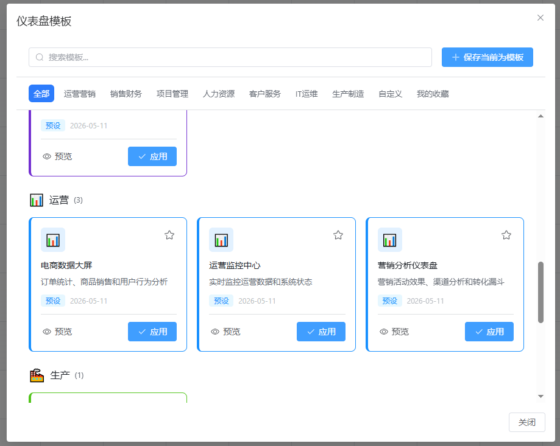

***

## typora-copy-images-to: ..\img

# SmartTable v1.3.2更新：全栈开源的「飞书多维表格」更加稳定易用了

# 小白用户的福音：一键运行、即刻使用！

你是否之前一直想试用SmartTable，但是苦于技术门槛而导致劝退的情况？最新版的一键运行试用包来啦，完美解决你的问题。

新的一键运行试用发行包不再需要你本地安装Nodejs、Python、Redis等各类运行支撑环境；也不需要你翻墙倒柜去折腾Docker如何来跑；更不需要你花钱购买云服务器来苦哈哈的部署啦！

真正的一键运行包来啦，只要你从GitHub上（国内用户无需魔法，访问Gitee即可下载）下载SmartTable官方的一键运行包，解压之后，双击start.bat运行即可即刻试用尝鲜啦！

**无需注册、无需安装任何依赖，真正的一键运行试用！**

> 注：
>
> ⚠️1、该一键启动包无需依赖任何外部环境，双击即可启动，启动后会自动打开浏览器，然后试用控制台打印的**账号邮箱和密码**\*\*登录即可试用。
>
> 2、受限于官方程序员的自有环境限制，目前一键试用包仅支持Windows版本，其他版本敬请期待。
>
> ⚠️⚠️⚠️3、若应用于生产，请注意务必按照ReadMe.md文件当中说明的方式修改默认密钥。

# 功能增强与优化升级

做表格工具的人大概都有过这些经历：导入 Excel 数据的时候，字段类型对不上，导完之后还要一条条改；多人同时编辑一个表，改着改着发现别人的修改把自己的覆盖了；分享出去的表单，填完后不知道提交的人到底是谁；跨时区协作的时候，时间显示总是差那么几个小时。

SmartTable 1.3.2 主要就是冲着这些问题来的。

## 数据导入

之前导入 Excel 是两步：上传文件，然后配置字段。问题是配置完了才发现有些列的类型识别错了，得重新来过。

现在多了一步预览。上传文件之后，会先展示前 20 行数据的解析结果，你在这个阶段就能看到每一列被识别成了什么类型、主字段选的是哪个。有问题当场调整，不用等全部导完再返工。

还有一个细节：导入带选项的字段（比如单选、多选）时，系统会自动去匹配已有选项的 ID 和名称。以前选项值一样但 ID 不同的话，导入后关联关系就乱了。现在这个问题解决了，匹配结果会在日志里逐条记录，命中了多少、新建了多少、跳过了哪些，一目了然。

## 关联字段的交互增强

以前点开关联记录选择器，弹出来一个小窗口，空间有限，各种操作都不太方便。

现在换成了右侧抽屉的形式。抽屉里面是目标表的完整视图，可以筛选、排序、分组，甚至能直接在抽屉里查看关联记录的详情。另外加了一个字段缓存机制，打开选择器的速度比之前快了不少——实测提升 60% 以上。

## 表单分享易用性优化

之前发个表单收集数据，发出去之后就基本失联了。有多少人填了、谁填的、链接还有没有效，都得回系统里翻半天。

1.3.2 加了一个独立的表单分享管理界面。所有创建过的分享链接都在这里，状态一目了然：启用的、禁用的、过期的，每个链接的总提交数和今日提交数都有统计。复制链接、编辑设置、启用禁用、删除，操作都在一个页面完成。

另外，表单里的成员字段现在支持在线搜索用户了。填表的时候输入名字或邮箱就能搜到人，不用从长长的列表里一个个翻。

## 全局时区配置

新加了时区管理功能。管理员可以在系统参数里配置时区，配置之后全站的时间显示都会自动转换到你设定的时区。跨国团队协作的时候，不用每个人自己心算"这个时间是 UTC 还是北京时间"了。

## 更多的多维表格模板

新增了 6 个常用场景的多维表模板：

- **会议管理** — 记录会议议题、参会人员、纪要
- **学习计划** — 跟踪课程进度、笔记整理
- **Bug 追踪** — 缺陷记录、优先级、修复进度
- **招聘管理** — 职位发布、候选人跟进、面试流程
- **资产管理** — 固定资产登记、领用归还、盘点
- **OKR 目标** — 目标拆解、关键结果追踪、进度对齐

不需要从零开始建表结构，选一个模板进来改改就能用。

另外，每个数据表现在都有了专属路由地址，格式是 `/base/:baseId/table/:tableId`。想分享某个具体的表给同事，直接把 URL 发过去就行，对方点开就是这个表，不用先进入 Base 再一层层切换。

## 协作体验优化增强

多人同时编辑同一个表的时候，有几个情况以前处理得不够好：

**单元格锁定等待**：以前别人正在编辑某个单元格，你去点一下会直接报错提示被锁定了。现在不会直接失败，而是进入等待队列，对方编辑完之后按顺序获得编辑权。等待的时候能看到排队位置和倒计时，也可以取消等待去编辑别的单元格。

**字段变更同步**：以前有人新建、修改、删除或者调整了字段顺序，其他人的界面不一定能及时反映出来。现在这些操作会实时同步给所有在线用户，并且以 Toast 提示的方式通知一声。

## 仪表盘配置优化增强

仪表盘加了一个全局预览模式。配置组件的时候可以先预览效果，不用保存之后才能看到样子。KPI 数字卡片、时钟、日期这类组件，即使没有绑定真实数据源，配置阶段也能看到最终呈现的效果。不用反复"保存→看效果→不满意→回来改"了。

模板库也扩充了一些行业分类的仪表板模板（销售漏斗、客服工单、库存预警等），点击模板卡片还能弹出完整预览。

## 其他优化改进

- **Store 架构拆分**：原来的 baseStore 拆成了 memberStore（成员管理）和 shareStore（分享管理），职责更清晰，页面切换流畅度提升了约 15%
- **字段服务缓存**：相同字段的重复请求减少了 80%，切换数据表的时候字段加载快了很多
- **跨平台打包**：Windows 平台已验证通过，Linux 和 macOS 理论可行（待测试）
- **SQL 注入防护**：修复了搜索功能中 LIKE 通配符未转义的问题
- **30+ 项 Bug 修复**：包括离线队列溢出、冲突弹窗残留、内存泄漏、自动编号竞态条件等

## 怎么升级

如果你已经在用 SmartTable，可以直接拉取最新代码更新。具体操作方式参考项目文档。

如果你还没用过但觉得上面说的某些功能正好是你需要的，可以去 GitHub 或 Gitee 看看，项目是开源的。

*如果你之前还没有试用过SmartTable*，可以**直接下载官方的一键运行包，一键运行试用！**
