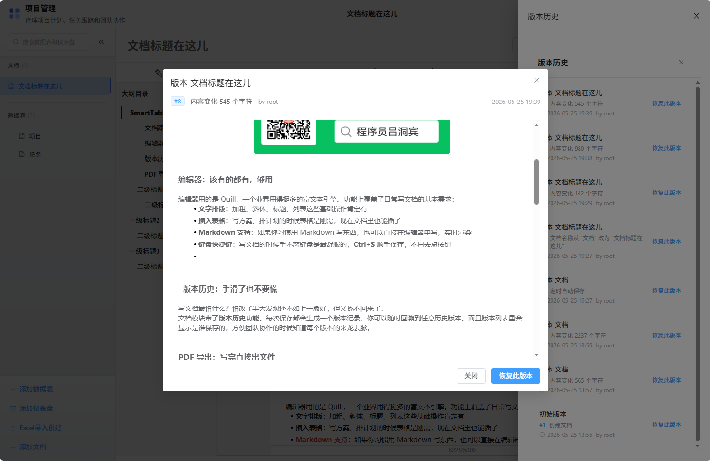
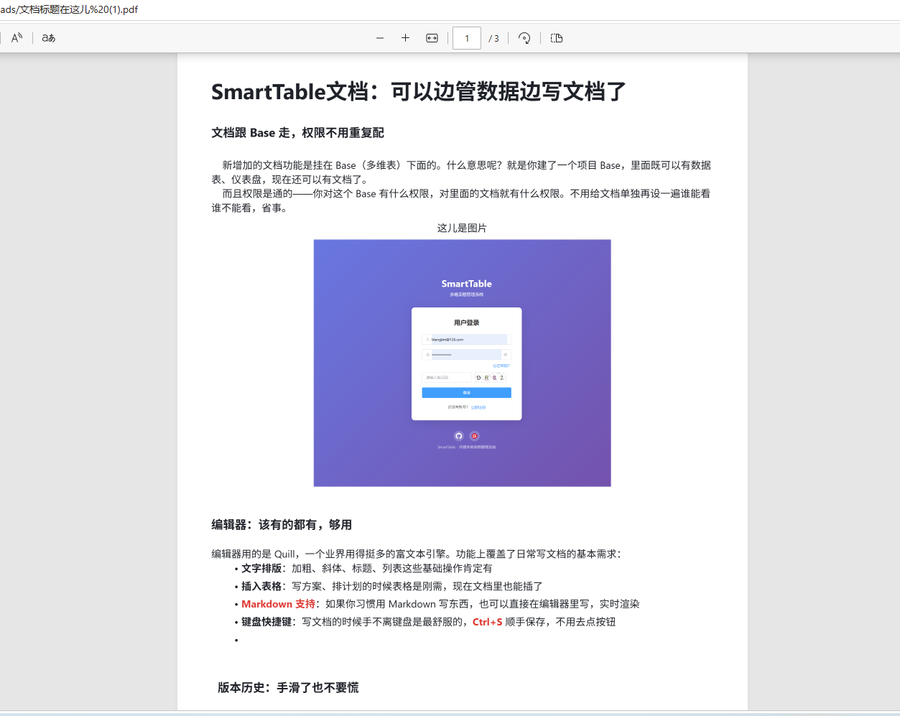

# 开源多维表格SmartTable v1.4.0 来啦！这次带来了文档功能

**发布日期：2026-05-25**

---

## 写在前面

距离上个版本发布才过去一周多，开源类“飞书多维表格”系统SmartTable 又迎来了 v1.4.0。

这次更新的核心就一个字——**写**。

之前 SmartTable 能帮你管数据、做表单、建仪表盘，但一直缺一个正经的"写文档"的地方。很多用户反馈说，数据表里记录的是结构化数据，但项目里总有些需要长篇大论说明的东西，比如需求文档、会议纪要、项目方案……这些内容放表格里不合适，不放又没地方放。

所以，v1.4.0 我们把**文档管理模块**给安排上了。

下面一个一个来说。

---

## 一、文档管理：边管数据边写文档

### 文档跟 Base 走，权限不用重复配

新增加的文档功能是挂在 Base（多维表）下面的。什么意思呢？就是你建了一个项目 Base，里面既可以有数据表、仪表盘，现在还可以有文档了。

而且权限是通的——你对这个 Base 有什么权限，对里面的文档就有什么权限。不用给文档单独再设一遍谁能看谁不能看，省事。

 

### 编辑器：该有的都有，够用

编辑器用的是华为团队开源的基于Quill的富文本编辑器[TinyEditor](https://github.com/opentiny/tiny-editor/)，一个业界用得挺多的富文本引擎（感谢TinyEditor团队的贡献）。功能上覆盖了日常写文档的基本需求：

- **文字排版**：加粗、斜体、标题、列表这些基础操作肯定有
- **插入表格**：写方案、排计划的时候表格是刚需，现在文档里也能插了
- **插入图片**：在文档当中插入图片
- **Markdown 支持**：如果你习惯用 Markdown 写东西，也可以直接在编辑器里写，实时渲染
- **文档标题实时预览**：支持在文档的时候，实时预览文档的标题大纲，并可以**快速点击导航定位**，方便阅读文档指定章节信息
- **键盘快捷键**：写文档的时候手不离键盘是最舒服的，**Ctrl+S** 顺手保存，不用去点按钮

 

### 版本历史：手滑了也不要慌

写文档最怕什么？怕改了半天发现还不如上一版好，但又找不回来了。

文档模块带了**版本历史**功能。每次保存都会生成一个版本记录，你可以随时回溯到任意历史版本。而且版本列表里会显示是谁保存的，方便团队协作的时候知道每个版本的来龙去脉。

 

### PDF 导出：写完直接出文件

文档写好了，有时候需要发给别人看或者打印出来。现在直接点一下就能导出成 PDF 文件，排版样式基本能保持跟编辑器里看到的一致。

 

---

## 二、Docker 部署大简化：一个容器全搞定

老用户应该知道，之前用 Docker 部署 SmartTable 需要启动两个容器——一个跑应用，一个跑 Redis。虽然也不算多复杂，但对于只是想快速体验一下的人来说，还是有点门槛。

这次我们把 Redis 直接**内嵌到了应用容器里**，现在只需要一个容器就能跑起来了。

```bash
docker run -d \
  --name smarttable \
  -p 80:80 \
  -v smarttable_data:/app/data \
  -v smarttable_uploads:/app/uploads \
  -v smarttable_redis:/data/redis \
  ygbinac/smarttable:latest
```

一行命令，搞定。

对于想快速搭起来试试看的朋友，这个改动应该能省不少事。
* 或者使用 docker compose ，只需创建以下 docker-compose.yml ：：
```bash
services:
  smarttable:
    image: ygbinac/smarttable:latest
    container_name: smarttable
    ports:
      - "80:80"
    volumes:
      - smarttable_data:/app/data
      - smarttable_uploads:/app/uploads
      - smarttable_redis:/data/redis
    restart: unless-stopped

volumes:
  smarttable_data:
  smarttable_uploads:
  smarttable_redis:
```

---

## 三、一些不那么显眼但很有用的改进

除了上面两个大块，这次还顺手修了一些东西：

- **时区处理优化**：修了几个时区不一致导致的 bug，特别是文档版本创建时间的显示问题。另外，为了方便用户在不同时区直接使用，我们实现了**前端页面根据用户时区自动调整时间显示**的功能。
- **API 文档补齐了**：文档模块的所有接口都加上了 Swagger 注释，现在在 `/apidocs` 页面能看到完整的接口说明，前后端联调的时候方便不少。
- **修了几个小 bug**：列表选中状态异常、乐观锁校验逻辑错误、PDF 导出图片 URL 路径不对……该修的都修了。

---
---

## 四、SmartTable 是个什么项目？

看到这里，可能有些朋友是第一次听说 SmartTable，这里简单介绍一下。

**SmartTable 是一个开源的多维表格管理系统**，说白了就是一个可以自己搭的"类 Airtable、飞书多维表格"系统。它把数据表格、表单收集、仪表盘分析、文档管理这些功能整合到了一起，适合用来做：

- 项目管理
- 数据收集和汇总
- 团队协作
- 企业级应用
    - 轻量级 CRM
    - 轻量级 MES
    - 轻量级 WMS
    - 轻量级 ERP
- 个人知识管理

### 核心特性一览

**数据管理**
- 26+ 种字段类型：文本、数字、日期、单选、多选、附件、关联、自动编号、评分等
- 6+ 种视图：表格、看板、日历、甘特图、画廊、表单
- Excel 智能导入创建表
- 数据导入导出

**表单与分享**
- 公开表单分享（匿名提交、验证码保护）
- 数据收集与统计分析

**仪表盘**
- 可视化图表展示
- 多种行业模板
- 实时数据组件

**文档管理（v1.4.0 新增）**
- 富文本编辑、Markdown 支持
- PDF 导出、版本历史
- 与 Base 权限打通

**协作与安全**
- 实时多人在线协作
- JWT 认证、API 限流
- XSS/SQL 注入防护
- 敏感信息日志脱敏

**部署**
- 支持 Docker 单容器部署
- 小白用户友好的一键运行包（支持Windows/Linux/macOS 等环境下一键运行，无需安装依赖）

### 技术栈

| 层面   | 技术                                       |
| ---- | ---------------------------------------- |
| 后端   | Python 3.11+、Flask 3.0、SQLAlchemy 2.0、PostgreSQL、Redis |
| 前端   | Vue 3、TypeScript、Element Plus、Pinia、Vue Router |
| 部署   | Docker、PyInstaller、Nuitka                |

---

## 五、关注作者

SmartTable 是一个个人开源项目，作者是**程序员吕洞宾**。项目完全开源，代码都在 GitHub 和 Gitee 上，欢迎 star、fork、提 issue，一起参与建设。

如果你觉得这个项目对你有帮助，或者想了解更多关于 SmartTable 的开发故事、技术分享，可以关注作者在这些平台上的账号：

| 平台                   | 账号 / 地址                                  |
| -------------------- | ---------------------------------------- |
| 🌐 **GitHub**（主仓库）   | [https://github.com/ldbinac/smart_table](https://github.com/ldbinac/smart_table) |
| 🇨🇳 **Gitee**（国内镜像） | [https://gitee.com/binac/smart_table](https://gitee.com/binac/smart_table) |
| 💻 **CSDN**          | 程序员吕洞宾                                   |
| ⛏ **稀土掘金**           | 程序员吕洞宾                                   |
| 📝 **知乎**            | 程序员吕洞宾                                   |
| 📮 **微信公众号**         | 程序员吕洞宾                                   |

 

关注不迷路，持续更新中～

---

*SmartTable v1.4.0，让数据管理和文档编写合二为一。*