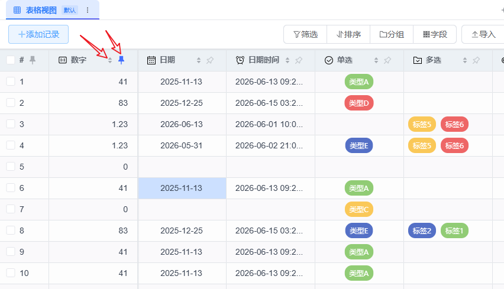
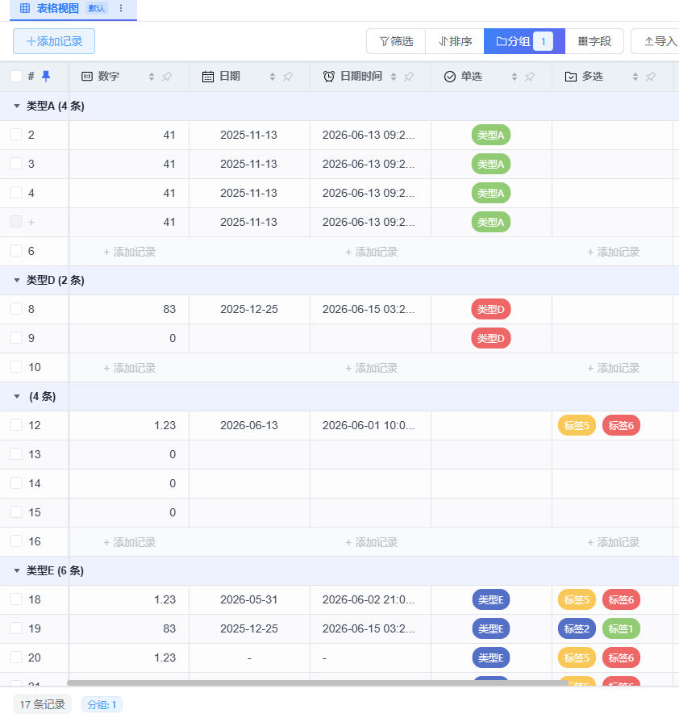

# SmartTable v1.5 发布 ——表格引擎更换，性能大提升

***

> **一句话总结**：这次更新把表格底层全换了，跑得更快、交互更好；编辑器全都翻新了一遍

***

## 一、这次搞了什么大事？

v1.5 是 SmartTable 发布以来改动最大的一次，主要干了这么几件事：

- **换了表格渲染引擎** —— 从旧的表格组件换成了 VTable，整个表格的交互体验完全不一样了
- **所有字段的编辑器全部翻新** —— 单选、多选、日期、成员……每一个都重做了
- **性能和缓存深度优化** —— 大表格也能流畅跑，之前打开千条以上的数据都很卡，现在可以顺滑支持万条以上数据了
- **附件管理完善** —— 上传、预览、编辑一条龙

下面一个一个说。

***

## 二、VTable 新引擎：这可能是你看过最顺滑的表格

这是本次更新最大的变化。SmartTable 把底层的表格渲染全部换成了 **@visactor/vtable**，你可以理解为——给表格换了个"心脏"。

换完之后的效果：

### 单元格内数据编辑更顺滑了

以前表格的行内编辑有很多的限制，整体体验也不太好，现在可以很顺滑的对所有的类型的字段在行内编辑了（双击单元格进入编辑状态），包括多行文本、富文本、单选、多选、附件等等字段，编辑完成之后，鼠标焦点离开即刻保存


> 🖼️ \[截图位置：展示图]

### 表格内容复制粘贴（以前 copy 不了）

点击表格里任意一行记录、一个单元格，均可以直接使用快捷键复制（CTRL+C），复制之后的内容，可以选择想要粘贴的单元格（一个或多个），直接CTRL+V粘贴，还有成功提示


### 列排序、列冻结快捷操作

表头上有列排序和列冻结的快捷操作，可以一键点击实现冻结列、列数据排序




### 原生分组视图

以前的"分组"是 SmartTable 自己凑合实现的，现在 VTable 自带分组能力。分组内外观更整齐，还能在分组里直接添加记录、折叠展开、看统计数据。



### 一些细节也到位了

- 输入非法数据，单元格会标红
- 列名太长会自动出 tooltip
- 表头上能看到每个字段的**类型图标**，一看就知道这列存的是啥类型
- 视觉风格统一

***

## 三、所有字段编辑器全翻新了

这次把每种字段类型的编辑器全都拆开重做了一遍。光说文字你可能没感觉，直接看表：

| 字段类型     | 编辑器改了啥                              |
| -------- | ----------------------------------- |
| **单选**   | 从旧方案换成了自定义的 SingleSelectEditor，更好用了 |
| **多选**   | 彻底重构，样式和功能都优化了                      |
| **日期**   | 自己写的日期/日期时间编辑器，时区问题也修了              |
| **成员**   | 重构了，现在支持搜索，还能用缓存加载                  |
| **评分**   | 以前是用文本"星星"展示，现在换了真正的矢量图形            |
| **进度条**  | 加了完整的样式和格式化选项                       |
| **复选框**  | 换成了开关组件，状态持久化也处理好了                  |
| **多行文本** | 编辑器重写了                              |
| **自动编号** | 加了样式支持                              |
| **字段图标** | 统一用 SVG 实现，支持自定义颜色                  |

> 🖼️ \[截图位置：字段编辑器效果一览（可以拼图展示多个编辑器）]

***

## 四、性能优化：大表的痛终于治了

之前的版本表格数据一多就容易卡，这次重点搞了性能：

- **记录转换缓存** —— 重复转换的问题解决了，省 CPU
- **数据源 LRU 缓存** —— 同样的请求不用重复发
- **流式加载优化** —— 大表格滚动更流畅了
- **批量查询优化** —— 关联字段查得快多了
- **支持懒加载** —— 超过 15000 条记录的大表也能跑起来
- **加了加载进度条**，等数据的时候心里有数

> 🖼️ \[截图位置：大表格加载性能对比或加载进度展示]

***

## 五、其他值得一提的

- **富文本字段** —— 基于 TinyEditor编辑器，表格里能写富文本了
- **附件管理完善** —— 上传、预览、编辑，附件浮窗还能跟着位置走
- **URL 字段单击跳转、双击编辑** —— 更符合直觉
- **首页增强** —— 可以从现有 Base 复制一份出来，方便做模板
- **实时协作完善**——Docker、Windows环境下实时协作可能不生效的问题也解决了

> 🖼️ \[截图位置：富文本编辑效果 / 附件管理展示]

***

## 六、特别感谢 @visactor/vtable 团队

这次换引擎是 v1.5 最大的改动，也是评估了很久之后做的决定。

说实话，之前用的旧表格方案在功能上越来越不够用了——分组是自己凑的、右键菜单是没有的、性能瓶颈也明显。我们调研了市面上好几款表格库，最后选了 **@visactor/vtable**。

他们的 canvas 渲染方案性能确实强，API 设计也很完善。而且 VTable 本身是开源项目，社区活跃，文档质量也高。这次能顺利把整个表格底层换掉，很大程度上要感谢 VTable 团队的优秀工作。

后续也计划将vtable里的很多特性，结合SmartTable的情况持续优化应用，让SmartTable更加易用。

如果你也在做表格类的项目，强烈推荐去看看 [@visactor/vtable](https://github.com/VisActor/VTable)，真的能省很多事。

***

## 七、关于 SmartTable

SmartTable 是一个**开源的多维表格系统**，功能上有点像 Airtable 或者飞书的多维表格。

### 核心特性

- **支持 22+种字段类型**：文本、数字、日期、单选、多选、成员、附件、公式、关联……基本你能想到的字段类型都有了
- **7 种视图**：表格视图、分组视图、看板视图、日历视图、甘特图视图、表单视图、画廊视图
- **43 个内置公式函数**：数学、文本、日期、逻辑、统计，能做不少复杂的计算
- **实时协作**：多人同时编辑，冲突自动处理
- **多个 Base 模板**：会议管理、学习计划、Bug 追踪、招聘管理、资产管理、OKR......
- **仪表盘系统**：支持 KPI 卡片、图表、实时数据展示
- **文档管理**：富文本编辑、Markdown、PDF 导出、版本历史
- **一键启动**：下载 release 包双击就能用，不需要折腾环境
- **Docker 部署**：一条命令启动，内嵌 Redis
- **支持 SQLite 和 PostgreSQL**：个人用 SQLite 就够了，团队用可以上 PostgreSQL

### 快速体验

```bash
# 下载最新 release 包，解压后双击 start.bat 即可
# 或者用 Docker 一键启动
docker run -d -p 80:80 ygbinac/smarttable:latest
```

### 关注作者

如果你觉得 SmartTable 对你有帮助，欢迎关注作者，第一时间获取项目更新动态和技术干货：

| 平台             | 账号 / 链接                                  |
| -------------- | ---------------------------------------- |
| 🌐 **GitHub**  | [github.com/ldbinac/smart\_table](https://github.com/ldbinac/smart_table) |
| 🇨🇳 **Gitee** | [gitee.com/binac/smart\_table](https://gitee.com/binac/smart_table) |
| 💬 **微信公众号**   | 程序员吕洞宾                                   |
| 📝 **CSDN**    | 程序员吕洞宾                                   |
| 📘 **稀土掘金**    | 程序员吕洞宾                                   |
| 🧠 **知乎**      | 程序员吕洞宾                                   |

> 👉 **老铁们，GitHub 点个 Star 就是最大的支持！**

***

