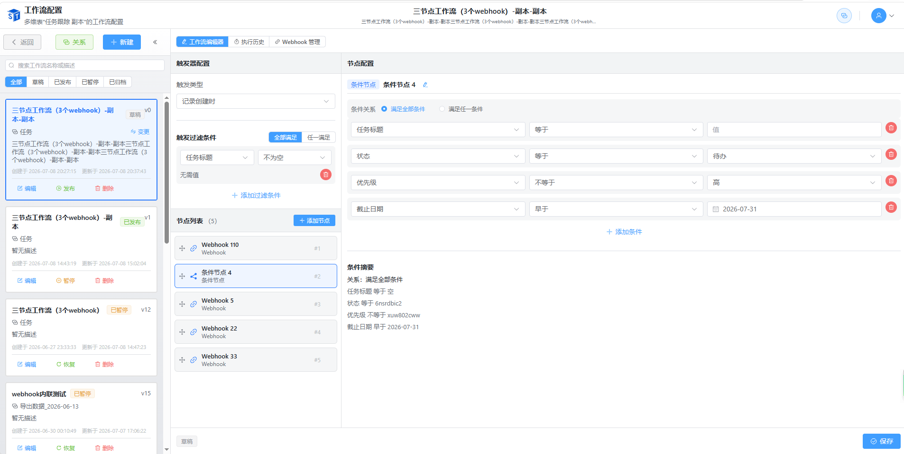
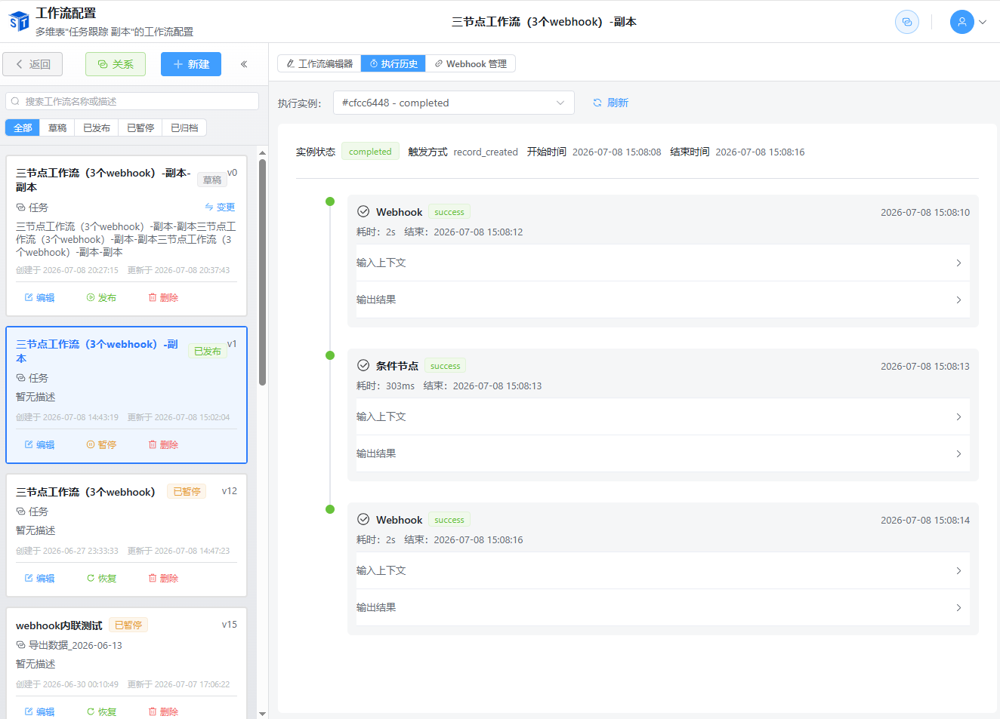
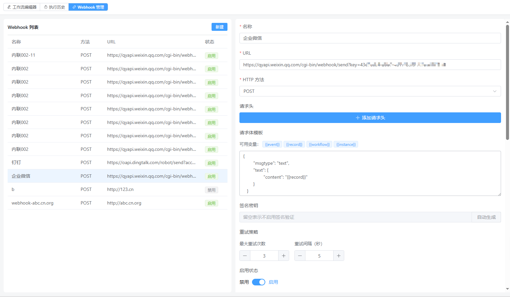
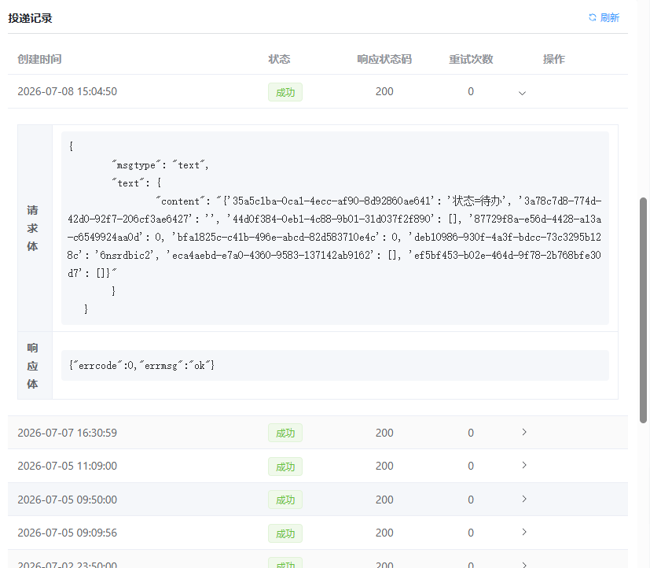

# 开源多维表格SmartTable V1.6版本：自动化工作流来了，把重复操作交给系统即可

用表格管理数据的人，大概都遇到过这类事情：

- 新客户登记进来，得发个通知给销售组，并同步创建一个用户信息数据
- 每周一要生成一份上周的数据汇总
- 状态变成"已完成"的记录，要顺手更新一下完成时间

这些事不难，但就是得有人盯着、记得做。一忙起来容易忘，周末或者节假日更是没人管。

SmartTable 1.6 的自动化工作流gong'n主要就是来解决这类问题的。

## 一、工作流：设好规则，剩下的交给系统



这次新增的工作流引擎，核心思路很简单：**当某个条件满足时，自动执行一系列操作**。

### 1、怎么触发？

有三种方式：

**定时触发**

比如每天早上 9 点、每周一、每月 1 号，或者某个具体的时间点。设置了之后，到点就自动跑。

还可以设截止日期——比如"每天早上 9 点触发，持续到 12 月 31 日"。过了这个日期就不再触发了。

**记录创建时触发**

有新记录进来的时候自动触发。比如客户信息表新增了一条记录，自动给销售负责人发个通知。

还可以加过滤条件：比如"只有来源是'官网'的新记录才触发"。条件可以设"全部满足"或"任意满足"。

**记录更新时触发**

记录被修改的时候触发。比如订单状态从"待处理"变成"已发货"，自动给客户发一条发货通知。

可以监听全部字段变化，也可以只监听某几个字段。比如只关心"状态"字段的变化，"备注"改了不触发。

### 2、触发之后做什么？

触发之后可以按顺序执行一系列"节点"：

**创建记录**

在某个表里新建一条记录。比如工单提交后，在"处理记录"表里自动创建一条待办。

字段值可以写死（比如状态默认填"待处理"），也可以引用触发源记录的字段（比如把工单的标题填进去）。

**更新记录**

修改源记录的字段值。比如状态变成"已完成"时，自动把"完成时间"填上当前时间。

**发 Webhook**

往外部系统发个 HTTP 请求。比如订单确认后，调一下仓库系统的接口，通知备货。

可以在节点里直接配置 Webhook，也可以引用系统中已有的 Webhook 配置。

**条件分支**

根据条件走不同的分支。比如"金额大于 10000 走审批流程，否则直接处理"。

条件可以组合：全部满足走分支 A，任意满足走分支 B。



### 3、怎么管理？

工作流可以暂停、继续、编辑、删除。

每次修改都会生成一个新版本，可以在版本历史里看到之前的配置是什么样的、谁改的、什么时候改的。如果新配置出了问题，还能回退到旧版本。

侧边栏可以折叠，列表支持搜索。工作流多了也不会找不到。

入口在 Base 页面顶部的"自动化"菜单里，不用到处找。

## 二、Webhook：和外部系统打通



如果你有其他系统（比如**企业微信、钉钉、飞书、ERP、OA、自建后台**等），可以通过 Webhook 把 SmartTable 和它们连起来。

### 1、配置一个 Webhook

填好 URL、HTTP 方法（GET/POST 等）、请求头、请求体模板。请求体里可以插入变量，比如 `{{record_id}}`、`{{field_name}}`。

还可以配置重试策略：失败了几次重试、每次间隔多久。

配置完了点"测试"，看看能不能连通。别等真正跑的时候才发现地址填错了。

### 2、投递记录



每次触发 Webhook 都会留下记录：什么时间发的、请求内容是什么、对方返回了什么状态码和响应体。

如果发现某次投递失败了，可以在记录里看到失败原因。后续版本会支持手动重新投递。

## 三、实际能用在哪？

举几个场景：

**1、客户跟进**

新客户登记进来 → 自动在"跟进记录"表创建一条待办 → 给销售发消息通知。

**2、订单处理**

订单状态变成"已支付" → 调仓库系统接口通知备货 → 订单状态变成"已发货"时给客户发短信。

**3、定期任务**

每天早上 8 点 → 扫一遍昨天的数据 → 生成汇总记录到"日报表"。

**4、数据同步**

记录更新时 → 把关键字段同步到另一个系统的接口。

## 四、怎么用？

1.6 版本已经在 GitHub 和 Gitee 上发布。已有用户更新到最新版本即可。

新用户可以直接下载Windows一键运行包或者拉取docker镜像试用。

***

## 五、关于 SmartTable

SmartTable 是一个**开源的多维表格系统**，功能上类似 Airtable 或飞书多维表格。

### 核心特性

- **26 种字段类型**：文本、数字、日期、单选、多选、成员、附件、公式、关联……基本能想到的字段都有
- **7 种视图**：表格视图、分组视图、看板视图、日历视图、甘特图视图、表单视图、画廊视图
- **43 个内置公式函数**：数学、文本、日期、逻辑、统计
- **实时协作**：多人同时编辑
- **6 个 Base 模板**：会议管理、学习计划、Bug 追踪、招聘管理、资产管理、OKR
- **仪表盘系统**：KPI 卡片、图表、实时数据展示
- **文档管理**：富文本、Markdown、PDF 导出、版本历史
- **一键启动**：下载 release 包双击即可
- **Docker 一键部署**：内嵌 Redis
- **支持 SQLite 和 PostgreSQL**
- **自动化工作流**：当某个条件满足时，自动执行一系列操作（V1.6版本新增）

### 快速体验

```bash
# 下载 release 包解压后双击 start.bat
# 或 Docker 一键启动
docker run -d -p 80:80 ygbinac/smarttable:latest
```

### 关注作者

如果 SmartTable 对你有帮助，欢迎关注作者，第一时间获取更新动态和技术干货：

| 平台             | 账号 / 链接                                  |
| -------------- | ---------------------------------------- |
| 🌐 **GitHub**  | [github.com/ldbinac/smart\_table](https://github.com/ldbinac/smart_table) |
| 🇨🇳 **Gitee** | [gitee.com/binac/smart\_table](https://gitee.com/binac/smart_table) |
| 💬 **微信公众号**   | 程序员吕洞宾                                   |
| 📝 **CSDN**    | 程序员吕洞宾                                   |
| 📘 **稀土掘金**    | 程序员吕洞宾                                   |
| 🧠 **知乎**      | 程序员吕洞宾                                   |

> 👉 **老铁们，GitHub 点个 Star 就是最大的支持！**

